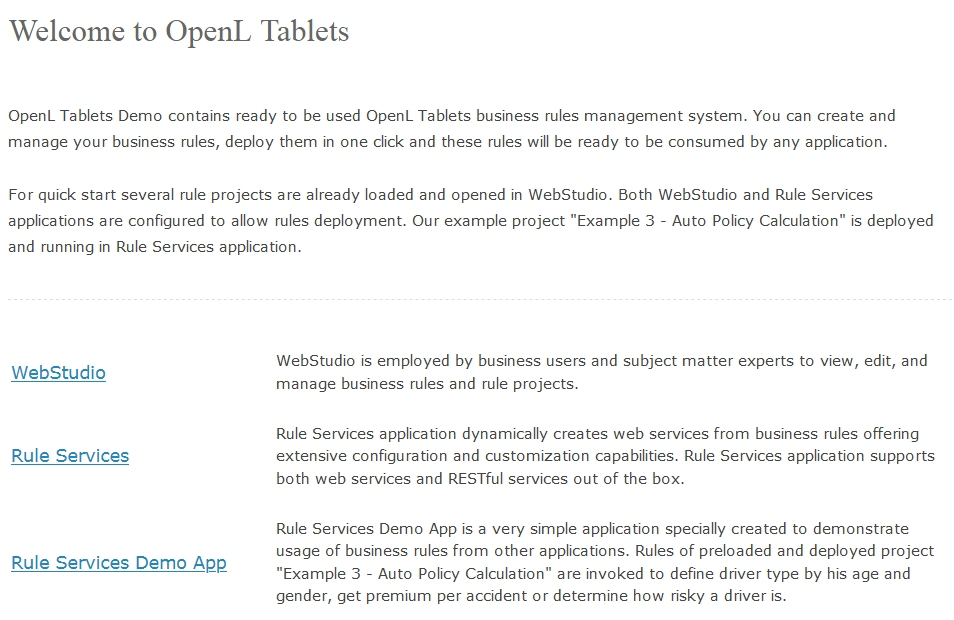

# OpenL Tablets BRMS Demo Package Guide

```
Release 5.26
OpenL Tablets Documentation is licensed under a Creative Commons Attribution 3.0 United States License.
```

## Preface

This preface is an introduction to the *OpenL Tablets Demo Package Guide*.

The following topics are included in this preface:

-   [Audience](#_Audience)
-   [Typographic Conventions](#typographic-conventions)

### Audience

This guide describes a complete OpenL Tablets Demo package which contains configured and ready to demonstrate infrastructure for the OpenL Tablets product. The Demo package enables a user to develop business rules and manage business rule sets in OpenL Tablets WebStudio, and then execute these rules as web services ready to be used by solution applications.

### Typographic Conventions

The following styles and conventions are used in this guide:

| Convention                 | Description                                                                                                                                                                                                                                                                                                                         |
|----------------------------|-------------------------------------------------------------------------------------------------------------------------------------------------------------------------------------------------------------------------------------------------------------------------------------------------------------------------------------|
| **Bold**                   | Represents user interface items such as check boxes, command buttons, dialog boxes, drop-down list values, field names, menu commands, <br/>menus, option buttons, perspectives, tabs, tooltip labels, tree elements, views, and windows. Represents keys, such as **F9** or **CTRL+A**. <br/>Represents a term the first time it is defined. |
| `Courier`                  | Represents file and directory names, code, system messages, and command-line commands.                                                                                                                                                                                                                                              |
| Courier Bold               | Represents emphasized text in code.                                                                                                                                                                                                                                                                                                 |
| Select **File \> Save As** | Represents a command to perform, such as opening the **File** menu and selecting **Save As**.                                                                                                                                                                                                                                       |
| *Italic*                   | Represents any information to be entered in a field. Represents documentation titles.                                                                                                                                                                                                                                               |
| \< \>                      | Represents placeholder values to be substituted with user specific values.                                                                                                                                                                                                                                                          |
| Hyperlink                  | Represents a hyperlink. Clicking a hyperlink displays the information topic or external source.                                                                                                                                                                                                                                     |
| **[name of guide]**        | Reference to another guide that contains additional information on a specific feature.                                                                                                                                                                                                                                              |

## OpenL Tablets Demo Package

To make work with OpenL Tablets WebStudio more comfortable and quicker to start, several rule projects are already loaded in the user workspace. As a result, the user can work on projects already created from OpenL Tablets templates or, when necessary, create their own projects via Repository in OpenL Tablets WebStudio. In addition, to demonstrate usage of rules in applications, a user can also invoke rules of the preloaded project via the OpenL Tablets Rule Services Demo Client application deployed in the Demo package by default.

The Demo package is a ZIP file that can be downloaded at <https://openl-tablets.org/downloads>, **Demo** (ZIP) link. After unzipping this file, the Demo package consists of the Apache Tomcat web server version 8.5.23, with four web applications located in the `\apache-tomcat-8.5.23\webapps\ `folder.

**Note:** There is no need to set up `JDK`. The Demo package also works with only `JRE` installed.

These applications are as follows:

-   `webstudio.war`
-   `webservice.war`

For Windows, to start OpenL Tablets Demo package, locate the `<unzipped Demo package folder>\apache-tomcat-8.5.23\start.cmd` file and run it by double-clicking or via console window commands. For Linux, run the \<unzipped Demo package folder\>\\apache-tomcat-8.5.23\\start file. Then open the browser and use the following link to **OpenL Tablets Demo welcome page**:

`http://localhost:8080/`

However, there are some specifics of launching OpenL Tablets Demo package under Linux and Mac OS. A working directory for OpenL Tablets Demo package is located at `<unzipped Demo package folder>\apache-tomcat-8.5.23\openl-demo\`.` `After unzipping the `OpenL Tablets Demo Package` file, a user must change access rights to the `sudo chmod 775 -R /<unzipped Demo package folder>` folder.

For more information on deployment, see [OpenL Tablets Installation Guide > Deploying OpenL Tablets WebStudio](https://openldocs.readthedocs.io/en/latest/documentation/guides/installation_guide/#deploying-openl-tablets-webstudio).

After starting Demo, OpenL Tablets WebStudio installation wizard does not appear. OpenL Tablets WebStudio is preconfigured in a single user mode. A user sees the OpenL Tablets Demo welcome page at startup.



*OpenL Tablets Demo welcome page*

Use the following links to the applications available at the OpenL Tablets Demo welcome page:

|  Demo application       | URL                                            |
|-------------------------|------------------------------------------------|
|  WebStudio              | `http://localhost:8080/webstudio`              |
|  Rule Services          | `http://localhost:8080/webservice`             |
|  Rule Services Demo App | `http://localhost:8080/webservice-client.html` |

The following sections provide more details on Demo package work:

-   [OpenL Tablets WebStudio in a Demo Package](#_OpenL_Tablets_WebStudio)
-   [OpenL Tablets Rule Services in a Demo Project](#_OpenL_Tablets_Web)
-   [OpenL Tablets Rule Services Demo Client in a Demo Package](#openl-tablets-rule-services-demo-client-in-a-demo-package)
-   [OpenL Tablets Demo Package as Common Deployment Pattern](#openl-tablets-demo-package-as-common-deployment-pattern)
-   [Demo Package Security Policy](#demo-package-security-policy)

### OpenL Tablets WebStudio in a Demo Package

OpenL Tablets WebStudio is preconfigured in a single user mode. A user is automatically signed in and sees the welcome start page.

The following topics are included:

-   [Rules Editor](#rules-editor)
-   [Repository Editor](#repository-editor)
-   [Administration](#administration)

#### Rules Editor

Several examples and tutorials are already in the **No Changes** status, therefore available in **Rules Editor** by default. For more information on how to manage rules in Rules Editor, see [OpenL Tablets WebStudio Guide](https://openldocs.readthedocs.io/en/latest/documentation/guides/webstudio_user_guide/#webstudio-user-guide-guide), *Using Rules Editor.*


*Projects in Rules Editor available for editing*

#### Repository Editor

Users can work with projects loaded in Repository in the Demo package and create their own new projects. For more information on how to manage projects in Repository, see [OpenL Tablets WebStudio Guide](https://openldocs.readthedocs.io/en/latest/documentation/guides/webstudio_user_guide/#webstudio-user-guide-guide), *Using Repository Editor*.

The “Example 3 – Auto Policy Calculation” project is already deployed using the deploy configuration “Example 3 – Auto Policy Calculation” and can be used via OpenL Tablets Rule Services as described in [OpenL Tablets Rule Services in a Demo Project](#openl-tablets-rule-services-in-a-demo-project) in OpenL Tablets Web Services Demo Client as described in [OpenL Tablets Rule Services Demo Client in a Demo Package](#openl-tablets-rule-services-demo-client-in-a-demo-package).

As OpenL Tablets WebStudio is preconfigured in a single user mode, and all projects in Repository are created and modified by the “DEFAULT” user.


*The whole list of rules projects in Repository of the Demo package*

#### Administration

By default, user workspace, history, and design repository are configured as local and located in the `openl-demo` folder of the `<unzipped Demo package folder>\apache-tomcat-8.5.23\` directory.` `This setting simplifies configuration and usage of the Demo package.` `Note that a default directory can be changed to another one. For more information on how to change a default directory, see [OpenL Tablets WebStudio Guide](https://openldocs.readthedocs.io/en/latest/documentation/guides/webstudio_user_guide/#webstudio-user-guide-guide), *Managing System Settings*.


*Common system settings in Administration*

Deployment Repository is set to use the remote – RMI connection. An appropriate URL `//localhost:1099/deployment-repository` is configured by default and defined in the OpenL Tablets WebStudio `rules-production.properties `file in the` <unzipped Demo package folder>\apache-tomcat-8.5.23\webapps\webstudio\WEB-INF\conf\ `folder.


*Settings of Design and Deployment repositories in Administration*

### OpenL Tablets Rule Services in a Demo Project

By default, a project from the “Example 3 – Auto Policy Calculation” template is deployed to Deployment Repository. To deploy the project on startup, ensure the project is packed in the `WEB-INF\lib\*-datasource.jar` file and the following property are added to the rule service:

`ruleservice.datasource.deploy.classpath.jars = true`

To use this project as an example of project deployments as described in [OpenL Tablets Rule Services Demo Client in a Demo Package](#openl-tablets-rule-services-demo-client-in-a-demo-package), several settings are defined in Rules Configuration of the project. It is set up that only \*DriverRisk\*, \*DriverAgeType\*, \*AccidentPremium\* are wildcards, and rules are included and can be used from the OpenL Tablets Rule Services Demo Client application.


*OpenL Tablets Rule Services main page and the project deployed on it*

The demo does not restrict any deployments of other projects nor has any other limitations so the users can deploy their own projects in Demo setup. If a user deploys anything else, a full list of deployed projects appears on this page including user’s projects.

**Swagger** is a third party tool used for testing services. For more information on Swagger and its usage in OpenL, see [OpenL Tablets Rule Services Usage and Customization Guide](https://openldocs.readthedocs.io/en/latest/documentation/guides/rule_services_usage_and_customization_guide/#rule-services-usage-and-customization-guide), *Appendix D: OpenAPI Support*.

### OpenL Tablets Rule Services Demo Client in a Demo Package

OpenL Tablets Rule Services Demo Client application is an application specially created to demonstrate usage of OpenL Tablets rules via OpenL Tablets Rule Services. OpenL Tablets Rule Services Demo Client is a simple application that must be used to check that rules are easily accessible from other applications via web services.

**Note:**  OpenL Tablets Rule Services Demo Client invokes only several methods of a particular predeployed “Example 3 – Auto Policy Calculation” project. It means that other projects deployed by a user cannot be used from within the OpenL Tablets Rule Services Demo Client application.

OpenL Tablets Rule Services Demo Client application allows to define a driver type by age and gender, get premium per accident, or determine how risky a driver is according to business rules specified in the “Example 3 – Auto Policy Calculation” project.


*Executing DriverAgeType rule and getting results via OpenL Tablets Rule Services Demo Client*

A user can change the values of input parameters in the fields and click the **Execute** button. The corresponding result is displayed below the list of rules to call.

In OpenL Tablets Rule Services Demo Client application, a dynamic client is used. A dynamic client does not require generating static interface for rules and dependencies on OpenL Tablets JAR modules. It is an example of how to create a simple client with minimum dependencies.

### OpenL Tablets Demo Package as Common Deployment Pattern

The easiest way to get introduced to using OpenL Tablets rules as OpenL Tablets Rule Services in the application is to explore the OpenL Tablets Demo package. This Demo configuration represents a general usage scenario of the OpenL Tablets product.

Common deployment scenario is as follows:

-   Deploy OpenL Tablets Rule Services, OpenL Tablets WebStudio, and Rules Repository, such as Jackrabbit JCR, to the web server.
-   Configure JCR, such as Jackrabbit settings, repository configurations in OpenL Tablets WebStudio, and OpenL Tablets Rule Services.

Ensure the ‘deployment’ repository is configured the same way in both applications, see configurations in Demo.

-   Put pre-initialized Rules Repository on the file system, such as Jackrabbit repository, according to the settings for JCR.
-   Run web server and ensure that the JCR application is started first.

    **Note:**  Pre-initialized Jackrabbit repository is required because Jackrabbit cannot initialize a repository in the remote mode. As an alternative option, run OpenL Tablets WebStudio with Jackrabbit configured as local and take the fresh repository it creates.

### Demo Package Security Policy

To avoid the situation when OpenL saves its data to inappropriate directories of other applications or throws an exception on attempt of accessing such directories, security policy is introduced. The `apache-tomcat-8.5.28\demo-java.policy` file contains instructions for Java identifying the folders that can be accessed by OpenL and listing permissions required for access.

In particular, the demo package security policy limits rules file editing. The OpenL rules Excel file cannot be modified directly by opening it. To edit the rules, save the Excel file on the local drive, make the necessary updates, and then upload it using the **Upload** functionality.

Deleting the `demo-java.policy` file and restarting Tomcat disables security policy described in this section and enables direct modification of the Excel rules file.
