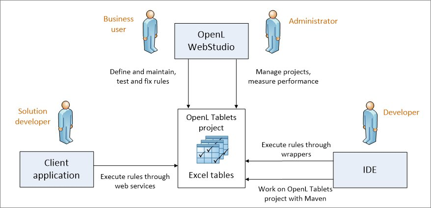
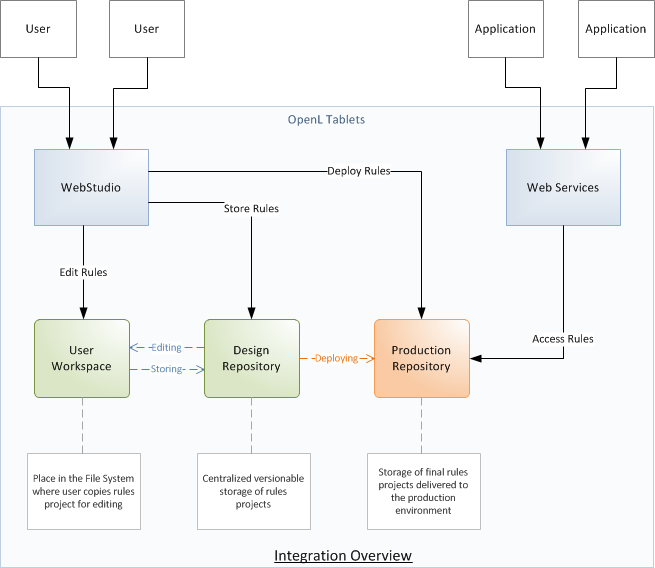
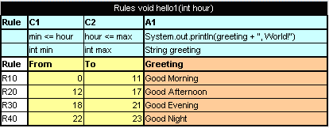
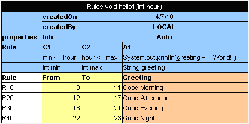
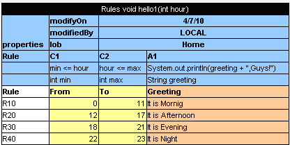
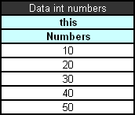
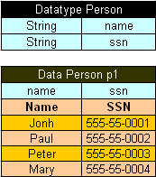
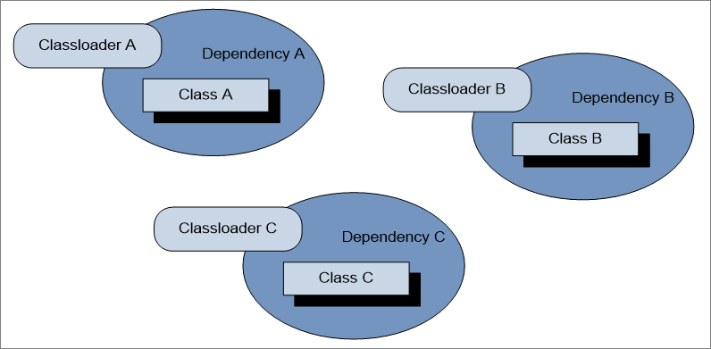
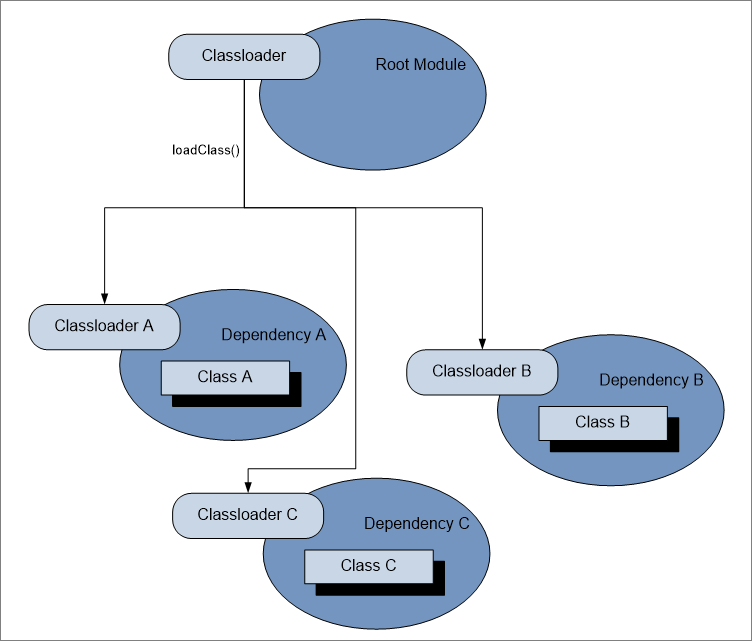
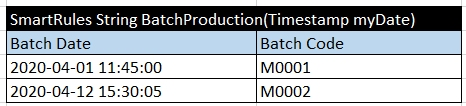

# OpenL Tablets BRMS Developers Guide

```
Release 5.26
OpenL Tablets Documentation is licensed under a Creative Commons Attribution 3.0 United States License.
```

## Preface
This preface is an introduction to the *OpenL Tablets Developer's Guide*.

The following topics are included in this preface:

-   [Audience](#audience)
-   [Related Information](#related-information)
-   [Typographic Conventions](#typographic-conventions)

### Audience
This guide is mainly intended for developers who create applications employing the table based decision making mechanisms offered by the OpenL Tablets technology. However, business analysts and other users can also benefit from this guide by learning the basic OpenL Tablets concepts described herein.

Basic knowledge of Java, Ant, and Microsoft Excel is required to use this guide effectively.

### Related Information
The following table lists sources of information related to contents of this guide:

| Title                                                                                                                                                       | Description                                                                                                               |
|-------------------------------------------------------------------------------------------------------------------------------------------------------------|---------------------------------------------------------------------------------------------------------------------------|
| [OpenL Tablets WebStudio Guide](https://openldocs.readthedocs.io/en/latest/documentation/guides/webstudio_user_guide) | Document describing OpenL Tablets WebStudio, a web application for managing OpenL Tablets projects through a web browser. |
| [https://openl-tablets.org/](https://openl-tablets.org/)                                                                                                  | OpenL Tablets open source project website.                                                                                |

### Typographic Conventions
The following styles and conventions are used in this guide:

| Convention                 | Description                                                                                                                                                                                                                                                                                                                         |
|----------------------------|-------------------------------------------------------------------------------------------------------------------------------------------------------------------------------------------------------------------------------------------------------------------------------------------------------------------------------------|
| **Bold**                   | Represents user interface items such as check boxes, command buttons, dialog boxes, drop-down list values, field names, menu commands, <br/>menus, option buttons, perspectives, tabs, tooltip labels, tree elements, views, and windows. Represents keys, such as **F9** or **CTRL+A**. <br/>Represents a term the first time it is defined. |
| `Courier`                  | Represents file and directory names, code, system messages, and command-line commands.                                                                                                                                                                                                                                              |
| `Courier Bold`             | Represents emphasized text in code.                                                                                                                                                                                                                                                                                                 |
| Select **File \> Save As** | Represents a command to perform, such as opening the **File** menu and selecting **Save As**.                                                                                                                                                                                                                                       |
| *Italic*                   | Represents any information to be entered in a field. Represents documentation titles.                                                                                                                                                                                                                                               |
| < >                      | Represents placeholder values to be substituted with user specific values.                                                                                                                                                                                                                                                          |
| Hyperlink                  | Represents a hyperlink. Clicking a hyperlink displays the information topic or external source.                                                                                                                                                                                                                                     |
| **[name of guide]**        | Reference to another guide that contains additional information on a specific feature.                                                                                                                                                                                                                                              |

## Introducing OpenL Tablets
This chapter introduces OpenL Tablets and describes its main concepts.

The following topics are included in this chapter:

-   [What Is OpenL Tablets?](#what-is-openl-tablets)
-   [Basic Concepts](#basic-concepts)
-   [System Overview](#system-overview)
-   [Quick Start with OpenL Tablets](#quick-start-with-openl-tablets)

### What Is OpenL Tablets?
**OpenL Tablets** is a business rules management system and business rules engine based on tables presented in Excel documents. Using unique concepts, OpenL Tablets facilitates treating business documents containing business logic specifications as executable source code. Since the format of tables used by OpenL Tablets is familiar to business users, OpenL Tablets bridges a gap between business users and developers, thus reducing costly enterprise software development errors and dramatically shortening the software development cycle.

In a very simplified overview, OpenL Tablets can be considered as a table processor that extracts tables from Excel documents and makes them accessible from the application.

The major advantages of using OpenL Tablets are as follows:

-   OpenL Tablets removes the gap between software implementation and business documents, rules, and policies.
-   Business rules become transparent to developers.

For example, decision tables are transformed into Java methods or directly into web service methods. The transformation is performed automatically.

-   OpenL Tablets verifies syntax and type errors in all project document data, providing convenient and detailed error reporting. OpenL Tablets can directly point to a problem in an Excel document.
-   OpenL Tablets provides calculation explanation capabilities, enabling expansion of any calculation result by pointing to source arguments in the original documents.
-   OpenL Tablets enables users to create and maintain tests to insure reliable work of all rules.
-   OpenL Tablets provides cross-indexing and search capabilities within all project documents.
-   OpenL Tablets provides full rules lifecycle support through its business rules management applications.
-   OpenL Tablets supports the `.xls` and `.xlsx` file formats.

### Basic Concepts
This section describes the basic concepts of OpenL Tablets and includes the following topics:

-   [Rules](#rules)
-   [Tables](#tables)
-   [Projects](#projects)
-   [Wrapper](#wrapper)
-   [Execution Mode for OpenL Project](#execution-mode-for-openl-project)

#### Rules
In OpenL Tablets, a **rule** is a logical statement consisting of conditions and actions. If a rule is called and all its conditions are true, then the corresponding actions are executed. Basically, a rule is an IF-THEN statement. The following is an example of a rule expressed in human language:

*If a service request costs less than 1,000 dollars and takes less than 8 hours to execute, then the service request must be approved automatically*.

Instead of executing actions, rules can also return data values to the calling program.

#### Tables
Basic information OpenL Tablets deals with, such as rules and data, is presented in **tables**. Different types of tables serve different purposes. For more information on table types, see [OpenL Tablets Reference Guide](https://openldocs.readthedocs.io/en/latest/documentation/guides/reference_guide/), the *Table Types* section.

#### Projects
An OpenL Tablets **project** is a container of all resources required for processing rule related information. Usually, a project contains Excel files and Java code. For more information on projects, see [OpenL Tablets Reference Guide](https://openldocs.readthedocs.io/en/latest/documentation/guides/reference_guide/), chapter *Working with Projects*.

There can be situations where OpenL Tablets projects are used in the development environment but not in production, depending on the technical aspects of a solution.

#### Wrapper
A **wrapper** is a Java object that exposes rule tables via Java methods and data tables as Java objects and allows developers to access table information from code. Wrappers are essential for solutions where compiled OpenL Tablets project code is embedded in solution applications. If tables are accessed through web services, client applications are not aware of wrappers but they are still used on the server.

For more information on wrappers, see [Using OpenL Tablets Rules from Java Code](#using-openl-tablets-rules-from-java-code).

#### Execution Mode for OpenL Project
Execution mode for OpenL project is a light weight compilation mode that enables only evaluating of rules; but editing, tracing and search are not available. Since the Engine will not load test tables and keep debug information in memory in this mode, memory consumption is up to 5 times less than for debug mode.

By default, the execution mode (`exectionMode=true`) is used in OpenL Tablets Rule Services.

The debug mode (`exectionMode=false`) is used by default in OpenL Tablets WebStudio.

Flag indicating required mode is introduced in runtime API and in wrappers.

To compile an OpenL Tablets project in execution mode, proceed as follows:

-   If the OpenL Tablets high level API (instantiation strategies) is used, define an execution mode in a constructor of the particular instantiation strategy.
-   If the low level API (Engine factories) is used, set an execution mode flag using the `setExecutionMode(boolean)` method.

### System Overview
The following diagram displays how OpenL Tablets is used by different types of users:


*OpenL Tablets overview*

A typical lifecycle of an OpenL Tablets project is as follows:

1.  A business analyst creates a new OpenL Tablets project in OpenL Tablets WebStudio.
	Optionally, development team may provide the analyst with a project in case of complex configuration.
	The business analyst also creates correctly structured tables in Excel files based on requirements and includes them in the project. Typically, this task is performed through Excel or OpenL Tablets WebStudio in a web browser.
2.  The business analyst performs unit and integration tests by creating test tables and performance tests on rules through OpenL Tablets WebStudio.
	As a result, fully working rules are created and ready to be used.
3.  A developer adds configuration to the project according to application needs.
	Alternatively, they can create a new OpenL Tablets project in their IDE via OpenL Maven Archetype and adjust it to use business user input.
4.  A developer employs business rules directly through the OpenL Tablets engine or remotely through web services.
5.  Whenever required, the business user updates or adds new rules to project tables.

OpenL Tablets business rules management applications, such as OpenL Tablets WebStudio, Rules Repository, and Rule Services Core, can be set up to provide self-service environment for business user changes.

### Quick Start with OpenL Tablets
OpenL Tablets provide a few ways to create a project. We recommend using Simple Project Maven Archetype approach for creating a project for the first time or create it via OpenL Tablets WebStudio. For more information on approaches for creating a project with detailed descriptions, see [How to Start with OpenL Rules Project](#how-to-start-with-openl-rules-project).

After a project is created, a zip or Excel file for importing the project to OpenL Tablets WebStudio can be used. For more information on importing an existing project into OpenL Tablets WebStudio, see [OpenL Tablets WebStudio Guide](https://openldocs.readthedocs.io/en/latest/documentation/guides/webstudio_user_guide).

OpenL Tablets WebStudio provides convenient UI to work with rules. However, its usage can be avoided by working with rules from IDE only using the OpenL Tablets Maven plugin. The plugin provides compilation and testing of rules and wrapper generation support.

Also, OpenL Tablets has OpenL Tablet Demo Package available at <https://openl-tablets.org/>. A demo is a zip file that contains a Tomcat with configured OpenL Tablets WebStudio and OpenL Tablets Rule Services projects. It can be used to effectively start using OpenL Tablets products.

## OpenL Tablets Rules Projects
This chapter describes how to create and use OpenL Tablets Rules projects.

The following topics are included in this chapter:

-   [OpenL Rules Project](#openl-rules-project)
-   [Rules Project Descriptor](#rules-project-descriptor)
-   [Project Resolving](#project-resolving)
-   [How to Start with OpenL Rules Project](#how-to-start-with-openl-rules-project)
-   [Customizing Table Properties](#customizing-table-properties)
-   [Tables Validation](#tables-validation)
-   [Module Dependencies: Classloaders](#module-dependencies-classloaders)
-   [Peculiarities of OpenL Tablets Implementation](#peculiarities-of-openl-tablets-implementation)

### OpenL Rules Project
**OpenL Rules project** is a project that contains Excel files with OpenL Tablets rules and may contain a rules project descriptor. The rules project descriptor is an XML file that defines project configuration and allows setting project dependencies.

OpenL Rules project can easily use rules from other projects via dependency functionality.

### Rules Project Descriptor
A rules project descriptor is an XML file that contains information about the project and configuration details used by OpenL to load and compile the rules project. The predefined name that is used for a rules project descriptor is *rules.xml.*

This section includes the following topics:

-   [Quick Overview](#quick-overview)
-   [Descriptor Elements](#descriptor-elements)

#### Quick Overview
The following code fragment is an example of the rules project descriptor:

```
<project>
	<!-- Project name. -->
	<name>Project name</name>
	<!-- Optional. Comment string to project. -->
	<comment>comment</comment>

	<!-- OpenL project includes one or more rules modules.  -->
	<modules>

		<module>
			<name>MyModule1</name>
						
<!-- 
				Rules document which is usually an excel file in the project. 
			-->
			<rules-root path="MyModule1.xls"/>

		</module>	
		
		<module>
			<name>MyModule2</name>
			
<!-- 
				Rules document which is usually an excel file in the project. 
			-->
			<rules-root path="MyModule2.xls"/>
			<method-filter>
				<includes>
					<value> * </value>
				</includes>
			</method-filter>
		</module>	
	</modules>

<dependencies>
		<dependency>
			<name>projectName</name>
			<autoIncluded>false</autoIncluded>
		</dependency>
	</dependencies>
	<properties-file-name-pattern>{lob}</properties-file-name-pattern>
	<properties-file-name-processor>default.DefaultPropertiesFileNameProcessor</properties-file-name-processor>
	<!-- Project's classpath (list of all source dependencies). -->
	<classpath>
		<entry path="path1"/>
		<entry path="path2"/>
	</classpath>
	
</project>
```

#### Descriptor Elements
The descriptor file contains several sections that describe project configuration:

-   [Project Configurations](#project-configurations)
-   [Module Configurations](#module-configurations)
-   [Dependency Configurations](#dependency-configurations)
-   [Classpath Configurations](#classpath-configurations)

##### Project Configurations
The project configurations are as follows:

| Tag                            | Required | Description                                                                                                                                |
|--------------------------------|----------|--------------------------------------------------------------------------------------------------------------------------------------------|
| name                           | yes      | Project name. It is a string value which defines a user-friendly project name.                                                             |
| comment                        | no       | Comment for project.                                                                                                                       |
| dependency                     | no       | Dependencies to projects.                                                                                                                  |
| modules                        | yes      | Project modules. A project can have one or several modules.                                                                                |
| classpath                      | no       | Project relative classpath.                                                                                                                |
| properties-file-name-pattern   | no       | File name pattern to be used by the file name processor. <br/>The file name processor adds extracted module properties from a module file name. |
| properties-file-name-processor | no       | Custom implementation of `org.openl.rules.project.PropertiesFileNameProcessor` used instead of default implementation.                     |

##### Module Configurations
The module configurations are as follows:

| Tag          | Required | Description                                                                                                                                                                                                                                         |
|--------------|----------|-----------------------------------------------------------------------------------------------------------------------------------------------------------------------------------------------------------------------------------------------------|
| name         | yes/no   | Module name. It is a string value which defines a user-friendly module name.  <br/>**Note:** It is used by OpenL Tablets WebStudio application as a module display name. It is not required for modules defined via wildcard.                            |
| type         | yes      | Module instantiation type. Possible values are case-insensitive and can be **dynamic**, **api**, or **static** (deprecated). <br/>It defines the way of OpenL project instantiation.                                                                     |
| classname    | yes/no   | Name of rules interface. It is used together with *type*. It is not required for the **api** type.                                                                                                                                                  |
| method-filer | no       | Filter that defines tables to be used for interface generation. Java regular expression can be used to define a filter for multiple methods.                                                                                                        |
| rules-root   | yes/no   | Path to the main file of a rules module. It is used together with **type**. Ant pattern can be used to define multiple modules via wildcard. <br/>For more information on Ant patterns, see [Ant patterns](https://ant.apache.org/manual/dirtasks.html). |

##### Dependency Configurations
The dependency configurations are as follows:

| Tag          | Required | Description                                                                                                                                                                                                                                                                                               |
|--------------|----------|-----------------------------------------------------------------------------------------------------------------------------------------------------------------------------------------------------------------------------------------------------------------------------------------------------------|
| name         | yes      | Dependency project name.                                                                                                                                                                                                                                                                                  |
| autoIncluded | yes      | Identifier, which, if set to **true**, that all modules from the dependency project will be used in this project module. <br/>If it is set to **false**, modules from the dependency project can be used in this project as dependencies, <br/>and each module will define its own list of used dependency modules. |

##### Classpath Configurations
The classpath configurations are as follows:

| Tag   | Required | Description                                                 |
|-------|----------|-------------------------------------------------------------|
| entry | no       | Path for the classpath entry, that is, classes or jar file. |

### Project Resolving
The `org.openl.rules.project.resolving.ProjectResolver` resolves OpenL Tablets projects in folders sent to the method for scanning and tries to detect OpenL Tablets projects by predefined strategies. To use ProjectResolver, call the `instance` static method that returns an instance of ProjectResolver.

Resolving strategies are defined via `org.openl.rules.project.resolving.ResolvingStrategy` SPI.

Resolving strategies used by default are as follows:

| Number | Strategy                              | Description                                                                                                                                                              |
|--------|---------------------------------------|--------------------------------------------------------------------------------------------------------------------------------------------------------------------------|
| 1.     | Project descriptor resolving strategy | The strictest resolving strategy. It is based on the descriptor file as described previously in this section.                                                            |
| 2.     | Excel file resolving strategy         | A resolving strategy for the simplest OpenL project. <br/>It contains only Excel files in root folder without wrappers and descriptor. <br/>Each Excel file represents a module. |

### How to Start with OpenL Rules Project
Firstly, an OpenL Tablets project must be created. It can be done in the following ways:

-   using Maven archetype
-   using OpenL Tablets WebStudio
-   manually

See the following sections for detailed information:

-   [Creating a Project Using the Maven Archetype](#creating-a-project-using-the-maven-archetype)
-   [Creating a Project in OpenL Tablets WebStudio](#creating-a-project-in-openl-tablets-webstudio)
-   [Creating a Project Manually](#creating-a-project-manually)
-   [Editing Rules](#editing-rules)
-   [Using OpenL Tablets Rules from Java Code](#using-openl-tablets-rules-from-java-code)
-   [Handling Data and Data Types in OpenL Tablets](#handling-data-and-data-types-in-openl-tablets)

#### Creating a Project Using the Maven Archetype
OpenL Tablets provides the Maven archetype which can be used to create a simple OpenL Rules project.

To create a project using the Maven archetype, proceed as follows:

1.  Execute the following command in command line:
	`mvn archetype:generate`
	Maven runs the archetype console wizard.
1.  Select the **openl-simple-project-archetype** menu item.
	As an alternative way is using the following command:  
	`mvn archetype:generate 
	–DarchetypeGroupId=org.openl.rules 
	–DarchetypeArtifactId=openl-simple-project-archetype
	\-DarchetypeVersion=5.X.X`
1.  Follow with the Maven creation wizard.
	After all steps are completed, a new Maven based project appears in the file system. It is an OpenL Rules project which has one module with simple rules in it.
1.  Execute the following command in the command line from the root of the project folder to compile the project:
	```
	mvn install
	```
	After executing this command, the following files can be found in the target folder:
1.  zip file with "-deployable" suffix for importing the project to OpenL Tablets WebStudio.
	For more information, see [OpenL Tablets WebStudio Guide](https://openldocs.readthedocs.io/en/latest/documentation/guides/webstudio_user_guide).
1.  zip file (with "-runnable" suffix) that can be executed after extracting it.
	It demonstrates how OpenL Tablets rules can be invoked from Java code.
1.  jar file that contains only compiled Java classes.
	This jar can be put in classpath of the project and used as a depended library.

#### Creating a Project in OpenL Tablets WebStudio
OpenL Tablets WebStudio allows users to create new rule projects in the Repository in one of the following ways:

-   creating a rule project from template
-   creating a rule project from Excel files
-   creating a rule project from zip archive
-   importing a rule project from workspace

The following diagram explains how projects are stored in OpenL Tablets WebStudio and then deployed and used by OpenL Tablets Rule Services:



*OpenL Tablets WebStudio and OpenL Tablets Rule Services Integration*

When a user starts editing a project, it is extracted from Design Repository and placed in the file system, in a user workspace. The project becomes locked in Design Repository for editing by other users. After editing is finished, the user saves the project. An updated version of the project is saved to Design Repository and becomes available for editing by other users.

OpenL Tablets Rule Services use separate repository instance, Production Repository. OpenL Tablets WebStudio can be configured to deploy complete and tested rules projects to that repository.

For more information, see [OpenL Tablets WebStudio Guide](https://openldocs.readthedocs.io/en/latest/documentation/guides/webstudio_user_guide).

#### Creating a Project Manually
OpenL does not oblige a user to use predefined ways of project creation and enables using the user’s own project structure. The [Project Resolving](#project-resolving) mechanism can be used as a base for the project structure definition. Depending on the resolving strategy, more or less files and folders are to be created, but several project elements definition is mandatory. For more information on manually creating a project, see [OpenL Rules Project](#openl-rules-project).

#### Editing Rules
When a project is created, business rules must be defined. It can be done using OpenL Tablets WebStudio or manually using MS Excel. If the simple rules project is used, there are several simple predefined rules that can be used as an example.

#### Using OpenL Tablets Rules from Java Code
For access to rules and data in Excel tables, OpenL Tablets API is used. OpenL Tablets provides a wrapper to facilitate easier usage.
This section illustrates the creation of a wrapper for a **Simple** project in IDE. There is only one rule **hello1** in the **Simple** project by default.



*The hello1 rule table*

Proceed as follows:

1.  In the project `src` folder, create an interface as follows:
	```
	public interface Simple {
			void hello1(int i);
	}
	```
1.  Create a wrapper object as follows:
	```
	import static java.lang.System.out;
	import org.openl.rules.runtime.RulesEngineFactory;
	
	public class Example {
	
			public static void main(String[] args) {
				//define the interface
				RulesEngineFactory<Simple > rulesFactory = 
					new RulesEngineFactory<Simple>("TemplateRules.xls", 
										Simple.class);
	
				Simple rules = (Simple) rulesFactory.newInstance();
				rules.hello1(12);
			
			}
	}
	```
When the class is run, it executes and displays **Good Afternoon, World!**

The interface can be generated by OpenL Tablets in runtime if the developer does not define it when initializing the rule engine factory. In this case, rules can be executed via reflection.

The following example illustrates using a wrapper with a generated interface in runtime:
```
public static void callRulesWithGeneratedInterface(){
	// Creates new instance of OpenL Rules Factory
	RulesEngineFactory<?> rulesFactory = 
new RulesEngineFactory<Object>("TemplateRules.xls");
				//Creates new instance of dynamic Java Wrapper for our lesson
Object rules = rulesFactory.newInstance();
        
       //Get current hour
	Calendar = Calendar.getInstance();
	int hour = calendar.get(Calendar.HOUR_OF_DAY);

	Class<?> clazz = rulesFactory.getInterfaceClass();

try{
Method method = clazz.getMethod("hello1”, int.class);
out.println("* Executing OpenL rules...\n");
method.invoke(rules, hour);
}catch(NoSuchMethodException e){
}catch (InvocationTargetException e) {
}catch (IllegalAccessException e) {
}
}
```

This section includes the following topics:

- [Using OpenL Tablets Rules with the Runtime Context](#using-openl-tablets-rules-with-the-runtime-context)
- [Using OpenL Tablets Projects from Java Code](#using-openl-tablets-projects-from-java-code)
- [Accessing a Test Table from Java Code](#accessing-a-test-table-from-java-code)
- [Generating Java Classes from Datatype Tables](#generating-java-classes-from-datatype-tables)

##### Using OpenL Tablets Rules with the Runtime Context
This section describes using runtime context for dispatching versioned rules by dimension properties values.
For example, two rules are overloaded by dimension properties. Both rules have the same name.
The first rule, covering an Auto line of business, is as follows:



*The Auto rule*
Pay attention to the rule line with the LOB property.

The second rule, covering a Home line of business, is as follows:



*The Home rule*

A wrapper enables the user to define which of these rules must be executed:
```
// Getting runtime environment which contains context
IRuntimeEnv env = ((IEngineWrapper) rules).getRuntimeEnv();

// Creating context
IRulesRuntimeContext context = new DefaultRulesRuntimeContext();
env.setContext(context);
// define context
context.setLob("Home”);
```

As a result, the code of the wrapper with the run-time context resembles the following:
```
import static java.lang.System.out;

import org.openl.rules.context.DefaultRulesRuntimeContext;
import org.openl.rules.context.IRulesRuntimeContext;
import org.openl.rules.runtime.RulesEngineFactory;
import org.openl.runtime.IEngineWrapper;
import org.openl.vm.IRuntimeEnv;
public class ExampleOfUsingRuntimeContext {

		public static void main(String[] args) {
			//define the interface
			RulesEngineFactory<simple> rulesFactory = new RulesEngineFactory<Simple>("TemplateRules.xls", Simple.class);
			Simple rules = (Simple) rulesFactory.newInstance();
			// Getting runtime environment which contains context 
	        	IRuntimeEnv env = ((IEngineWrapper) rules).getRuntimeEnv();
	        	// Creating context (most probably in future, the code will be different)
			IRulesRuntimeContext context = RulesRuntimeContextFactory. buildRulesRuntimeContext();			env.setContext(context);
			context.setLob("Home");
			rules.hello1(12);
		
	}
}
```

Run this class. In the console, ensure that the rule with **lob = Home** was executed. With the input parameter **int = 12**, the **It is Afternoon, Guys** phrase is displayed.

##### Using OpenL Tablets Projects from Java Code
OpenL Tablets projects can be instantiated via SimpleProjectEngineFactory. This factory is designed to be created via SimpleProjectEngineFactoryBuilder. A builder has to be configured. The main builder method is setProject(String location). The project location folder has to be specified via this method.

The following example instantiates the OpenL Tablets project:

```
ProjectEngineFactory<Object> projectEngineFactory = new SimpleProjectEngineFactory.SimpleProjectEngineFactoryBuilder<Object>().setProject(<project location>) .build();
Object instance = projectEngineFactory.newInstance();
```
The above example instantiates the OpenL Tablets project generated in runtime interface. A method from instantiated project can be invoked via reflection mechanism. `ProjectEngineFactory` returns generated interface via the getInterfaceClass() method.

If a static interface must be used, the interface must be specified in SimpleProjectEngineFactoryBuilder. The following example illustrates how to instantiate a project with a static interface.

```
SimpleProjectEngineFactory<SayHello> simpleProjectEngineFactory = new SimpleProjectEngineFactoryBuilder<SayHello>().setProject<project location>)
                .setInterfaceClass(SayHello.class)
                .build();
SayHello instance = simpleProjectEngineFactory.newInstance();
```

SimpleProjectEngineFactoryBuilder has additional methods to configure an engine factory. Examples are as follows:

-   The setWorkspace()method defines a project workspace for dependent projects resolving.
-   The execution mode can be changed via the setExecutionMode() method.

By default, runtime execution mode is enabled.

-   The `setProvideRuntimeContext(true) `method is used to provide runtime context for an instance class.
-   The `setProvideVariations(true)` method is used to enable variation support for an instance class, which is disabled by default.
-   The `setModule(String moduleName)` method is used to compile a single module from a project.
-   The `setClassLoader(ClassLoader classLoader)` method is used to set up a custom class loader to be used as a primary one in the OpenL Tablets engine.

##### Accessing a Test Table from Java Code
Test results can be accessed through the test table API. For example, the following code fragment executes all test runs in a test table called **insuranceTest** and displays the number of failed test runs:

```
RulesEngineFactory<?> rulesFactory = new RulesEngineFactory<?>("Tutorial_1.xls");
IOpenClass openClass = rulesFactory.getCompiledOpenClass();
IRuntimeEnv env = SimpleVMFactory.buildSimpleVM().getRuntimeEnv();
Object target = openClass.newInstance(env);
IOpenMethod method = openClass.getMatchingMethod("testMethodName", testMethodParams);
TestUnitsResults res = (TestUnitsResults) testMethod.invoke(engine, new Object[0], env);
```

##### Generating Java Classes from Datatype Tables
Some rules require complex data models as input parameters. Developers have to generate classes for each datatype defined in an Excel file for using them in a static interface as method arguments. The static interface can be used in engine factory. For more information on how to create and use a wrapper, see [Using OpenL Tablets Rules from Java Code](#using-openl-tablets-rules-from-java-code).

**Note:** Datatype is an OpenL table of the Datatype type created by a business user. It defines a custom data type. Using these data types inside the OpenL Tablets rules is recommended as the best practice. For more information on datatypes, see [OpenL Tablets Reference Guide](https://openldocs.readthedocs.io/en/latest/documentation/guides/reference_guide), the **Datatype Table** section.

To generate datatype classes, proceed as follows:

1.  For Maven, configure the OpenL Maven plugin as described in [Configuring the OpenL Maven Plugin](#configuring-the-openl-maven-plugin) and run the Maven script.
2.  For Ant, configure the Ant task file as described in [Configuring the Ant Task File](#configuring-the-ant-task-file) and execute the Ant task file.

###### Configuring the OpenL Maven Plugin
To generate an interface for rules and datatype classes defined in the MS Excel file, add the following Maven configuration to the `pom.xml` file:

```
<build>
  [...]
  <plugins>
      [...]
      <plugin>
          <groupId>org.openl.rules</groupId>
          <artifactId>openl-maven-plugin</artifactId>
          <version>${openl.rules.version}</version>
          <configuration>
              <generateInterfaces>
                  <generateInterface>
                      <srcFile>src/main/openl/rules/TemplateRules.xls</srcFile>
                      <targetClass>
                        org.company.gen.TemplateRulesInterface
                      </targetClass>
                  </generateInterface>
              </generateInterfaces>
          </configuration>
          <executions>
              <execution>
                  <goals>
                      <goal>generate</goal>
                  </goals>
              </execution>
          </executions>
      </plugin>

  </plugins>
  [...]
</build>
```

In this case, classes and rules project descriptor, `rules.xml`, is generated on each Maven run on generate-sources phase.

Each `<generateInterface>` section has a number of parameters described in the following table.

| Name                   | Type      | Required | Description                                                                                                                                                                                                                                                                                 |
|------------------------|-----------|----------|---------------------------------------------------------------------------------------------------------------------------------------------------------------------------------------------------------------------------------------------------------------------------------------------|
| `srcFile`              | `String`  | `true`   | Reference to the Excel file for which an interface class must be generated.                                                                                                                                                                                                              |
| `targetClass`          | `String`  | `true`   | Full name of the interface class to be generated. <br/>OpenL Tablets WebStudio recognizes modules in projects by interface classes and uses their names in UI. <br/>If there are multiple wrappers with identical names, only one is recognized as a module in OpenL Tablets WebStudio. |
| `displayName`          | `String`  | `false`  | End user-oriented title of the file that appears in OpenL Tablets WebStudio. <br/>A default value is Excel file name without extension.                                                                                                                                                      |
| `targetSrcDir`         | `String`  | `false`  | Folder where the generated interface class must be placed. An example is src/main/java. <br/>The default value is ${project.build.sourceDirectory}.                                                                                                                                         |
| `openlName`            | `String`  | `false`  | OpenL Tablets configuration to be used. For OpenL Tablets, the org.openl.xls value must always be used.<br/>The default value is org.openl.xls.                                                                                                                                             |
| `userHome`             | `String`  | `false`  | Location of user-defined resources relative to the current OpenL Tablets project. The default value is ..                                                                                                                                                                                 |
| `userClassPath`        | `String`  | `false`  | Reference to the folder with additional compiled classes imported by the module when the interface is generated. <br/>The default value is null.                                                                                                                                    |
| `ignoreTestMethods`    | `boolean` | `false`  | If true, test methods are not added to interface class. It is used only in JavaInterfaceAntTask. <br/>The default value is true.                                                                                                                                                             |
| `generateUnitTests`    | `boolean` | `false`  | Parameter that overwrites the base generateUnitTests value.                                                                                                                                                                                                                               |
| `unitTestTemplatePath` | `String`  | `false`  | Parameter that overwrites the base unitTestTemplatePath value.                                                                                                                                                                                                                            |
| `overwriteUnitTests`   | `boolean` | `false`  | Parameter that overwrites the base overwriteUnitTests value.                                                                                                                                                                                                                              |

For more configuration options, see [OpenL Tablets Maven Plugin Guide](https://openldocs.readthedocs.io/en/latest/documentation/guides/maven_plugin_guide/).

###### Configuring the Ant Task File
An example of the build file is as follows:

```
<project name="GenJavaWrapper" default="generate" basedir="../">
<taskdef name="openlgen" classname="org.openl.conf.ant.JavaWrapperAntTask"/>

<target name="generate">
<echo message="Generating wrapper classes..."/>

<openlgen openlName="org.openl.xls" userHome="." 
srcFile="rules/Rules.xls"
targetClass="com.exigen.claims.RulesWrapper"
displayName="Rule datatypes"
targetSrcDir="gen"
>
</openlgen>

<openlgen openlName="org.openl.xls" userHome="." 
srcFile="rules/Data.xls"
targetClass=" com.exigen.claims.DataWrapper"
displayName="Data datatypes"
targetSrcDir="gen"
>
</openlgen>	

</target>
</project>
```

When the file is executed, it automatically creates Java classes for datatypes for specified Excel files. The Ant task file must be adjusted to match contents of the specific project.

For each Excel file, an individual `<openlgen>` section must be added between the `<target>` and `</target>` tags.

Each `<openlgen>` section has a number of parameters that must be adjusted as described in the following table:

| Parameter      | Description                                                                                               |
|----------------|-----------------------------------------------------------------------------------------------------------|
| `openlName`    | OpenL Tablets configuration to be used. For OpenL Tablets, the `org.openl.xls` value must always be used. |
| `userHome`     | Location of user-defined resources relative to the current OpenL Tablets project.                         |
| `srcFile`      | Reference to the Excel file for which a wrapper class must be generated.                                  |
| `targetClass`  | Full name of the wrapper class to be generated.                                                           |
| `displayName`  | End user-oriented title of the file that appears in OpenL Tablets WebStudio.                              |
| `targetSrcDir` | Folder where the generated wrapper class must be placed.                                                  |

#### Handling Data and Data Types in OpenL Tablets
This section includes the following `topics` about data and data types handling in OpenL Tablets:

-   [Datatype Lifecycle](#datatype-lifecycle)
-   [Inheritance in Datatypes](#inheritance-in-datatypes)
-   [Byte Code Generation at Runtime](#byte-code-generation-at-runtime)
-   [Java Files Generation](#java-files-generation)
-   [OpenL Internals: Accessing a Datatype at Runtime and After Building an OpenL Wrapper](#openl-internals-accessing-a-datatype-at-runtime-and-after-building-an-openl-wrapper)
-   [Data Table](#data-table)

##### Datatype Lifecycle
Datatype lifecycle is as follows:

1.  A Datatype table is created in the rules file.
	At runtime, Java class is generated for each datatype as described in [Byte Code Generation at Runtime](#byte-code-generation-at-runtime).
1.  If Java classes are generated from a Datatype table as described in [Generating Java Classes from Datatype Tables](#generating-java-classes-from-datatype-tables), the appropriate generated Java classes must be included in classpath as described in [Java Files Generation](#java-files-generation).

##### Inheritance in Datatypes
In OpenL Tablets, one datatype can be inherited from another one. The new data type inherited from another one has access to all fields defined in the parent data type. If a child datatype contains fields defined in the parent datatype, and the field is declared with different types in the child and the parent datatype, warnings or errors appear.

The constructor with all fields of the child datatype contains all fields from the parent datatype, and the `toString`, `equals` and `hashCode` methods use all fields form the parent datatype.

##### Byte Code Generation at Runtime
At runtime, when OpenL Tablets engine instance is being built, for each datatype component, Java byte code is generated as described in [Java Files Generation](#java-files-generation) in case there are no previously generated Java files on classpath. It represents a simple Java bean for this datatype. This byte code is loaded to classloader so the object of type `Class<?>` can be accessed. When using this object through reflections, new instances are created and fields of datatypes are initialized. For more information, see the `DatatypeOpenClass` and `DatatypeOpenField` classes.

**Attention!** If Java class files for the datatypes on classpath are previously generated, they are used at runtime, regardless of changes made in Excel. To apply these changes, remove Java files and generate Java classes from the Datatype tables as described in [Generating Java Classes from Datatype Tables](#generating-java-classes-from-datatype-tables).

##### Java Files Generation
As generation of datatypes is performed at runtime and developers cannot access these classes in their code, the mechanism described at [Generating Java Classes from Datatype Tables](#generating-java-classes-from-datatype-tables) is introduced. It allows generating Java files and putting them on the file system so users can use these data types in their code.

##### OpenL Internals: Accessing a Datatype at Runtime and After Building an OpenL Wrapper
After parsing, each data type is put to compilation context and becomes accessible for rules during binding. All data types are placed to `IOpenClass` of the whole module and are accessible from `CompiledOpenClass#getTypes` when the OpenL Tablets wrapper is generated.

Each `TableSyntaxNode` of the `xls.datatype` type contains an object of data type as its member.

##### Data Table
A **data table** contains relational data that can be referenced as follows:

-   from other tables within OpenL Tablets
-   from Java code through wrappers as Java arrays
-   through the OpenL Tablets runtime API as a field of the `Rules` class instance



*Simple data table*

In this example, information in the data table can be accessed from the Java code as illustrated in the following code example:
```
int[] num = tableWrapper.getNumbers();

for (int i = 0; i < num.length; i++) {
System.out.println(num[i]);
}
```

where `tableWrapper` is an instance of the wrapper class of the Excel file.



*Datatype table and a corresponding data table*

In Java code, the data table `p1` can be accessed as follows:
```
Person[] persArr = tableWrapper.getP1();

for (int i = 0; i < persArr.length; i++) {
System.out.println(persArr[i].getName() + ' ' + persArr[i].getSsn());
}
```

where `tableWrapper` is an instance of the Excel file wrapper.

### Customizing Table Properties
This section describes how to customize table properties and introduces table priority rules. The following topics are included:

-   [Understanding Table Properties Customization](#understanding-table-properties-customization)
-   [Tables Priority Rules](#tables-priority-rules)

#### Understanding Table Properties Customization
The OpenL Tablets design allows customizing available table properties. OpenL Tablets Engine employs itself to provide support of properties customization. The `TablePropertiesDefinitions.xlsx` file contains all declaration required to handle and process table properties.

Updating table properties requires recompiling the OpenL Tablets product. The developer has to contact the OpenL Tablets provider to retrieve the table properties file. When the changes are made, the developer has to send the file back to the provider, and a new OpenL Tablets package is delivered to the developer.

Alternatively, the developer can recompile OpenL Tablets from sources of their own.

#### Tables Priority Rules
To make tables dispatching more flexible, **tablesPriorityRules** DataTable in `TablePropertiesDefinitions.xlsx `is used. Each element of this table defines one rule of how to compare two tables using their properties to find more suitable table if several tables are matched by properties. Priority rules are used sequentially in comparison of two tables: if one priority rule gives result of the same priority of tables, the next priority rule is used.

Priority rules are used differently in the Dispatcher table approach and Java code dispatching but have the same sense: select suitable table if there are several tables matched by dimension Properties.

In case of the Dispatching table, priority rules are used to sort methods of an overloaded group. Each row of the Dispatcher table represents a rule, so after sorting, high priority rules are at the top of decision tables, and if several rows of the decision table are fired, only the first one, of the highest priority, is executed.

In case of Java code, dispatching priority rules is used after selecting tables that correspond to the current runtime context: all matched tables are sorted in order to select one with the highest priority. If it is impossible to find the priority with the highest rule when several tables have the same priority and are of a higher priority than all other tables, `AmbiguousMethodException` is thrown.

There are two predefined priority rules and possibility to implement Java class that compares two tables using their properties:

-   **min(\<property name\>)**
	<br/>A table that has lower value of property specified will have a higher priority. The property specified by name must be `instanceof Comparable<class of property value>`.
-   **max(\<property name\>)**
	<br/>A table that has a higher value of property specified will have a higher priority. The property specified by name must be `instanceof Comparable<class of property value>`.

To specify the Java comparator of tables, the `javaclass:<java class name>` expression must be used. Java class must implement `Comparator<ITableProperties>`.

### Tables Validation
The validation phase follows the binding phase and allows checking all tables for errors and accumulating all errors.

All possible validators are stored in `ICompileContext` of the OpenL class. The default compile context is `org.openl.xls.RulesCompileContext` that is generated automatically.  
Validators get the OpenL Tablets and array of `TableSyntaxNodes` that represent tables for check and must return `ValidationResult`. Validation results are as follows:

-   status, which can be fail or success
-   all error and warning messages that occurred

This section includes the following topics:

-   [Table Properties Validators](#table-properties-validators)
-   [Existing Validators](#existing-validators)

#### Table Properties Validators
The table properties that are described in `TablePropertyDefinition.xlsx` can have constraints. Some constraints have predefined validators associated with them.

To add a property validator, proceed as follows:

1.  Add constraint as follows:
2.  Define constraint in `TablePropertyDefinition.xlsx`, in the constraints field.
3.  Create constraint class and add it to `ConstraintFactory`.
4.  Create a validator as follows:
5.  Create a class of the validator and define it in the method `org.openl.codegen.tools.type.TablePropertyValidatorsWrapper.init() `constraint associated with the validator.
6.  If necessary, modify the velocity script `RulesCompileContext-validators.vm` in project `org.openl.rules.gen` that generates `org.openl.xls.RulesCompileContext`*.*
7.  To generate new `org.openl.xls.RulesCompileContext` with the validator, run `org.openl.codegen.tools.GenRulesCode.main(String[])`.
8.  Write unit tests.

#### Existing Validators
The existing validators are as follows:

-   **Unique in module** **validator** verifies uniqueness in a module of a property.
-   **Active table validator** verifies correctness of an "active" property.

There can be only one active table validator per active table.

-   **Regular expression validator** verifies string properties matching against the predefined regex pattern.
-   **Gap/overlap validator** makes gap and overlap analysis for decision tables with the **validateDT** property set to **on**.
-   **Dimension properties validator**.

### Module Dependencies: Classloaders
The dependency class resolution mechanism is implemented using specialized classloading.
Each dependency has its own Java classloader so all classes used in compiling a specified module, including generated datatype Java classes, are stored in the dependency classloader.


*Dependency classloaders*

The root module contains references to all its dependencies classloaders. When loading any class, the following algorithm is executed:

1.  Get all dependencies classloaders.
2.  Search for the required class in each dependency classloader, one by one.
3.  If a class is found, return it.
4.  If a class does not exist, search for the class by its classloader.



*Load class from root module*

For the dependency management feature, provide an appropriate `DependencyManager` object to the entry point for the OpenL Tablets compilation.

**Note:** Using the same class in two classloaders can cause an error because the class will be loaded by two different classloaders.

### Peculiarities of OpenL Tablets Implementation
This section describes OpenL Tablets implementation specifics and includes the following topics:

-   [Lookup Tables Implementation Details](#lookup-tables-implementation-details)
-   [Range Types Instantiation](#range-types-instantiation)

#### Lookup Tables Implementation Details
At first, a lookup table goes through parsing and validation. In parsing, all parts of the table, such as header, column headers, vertical conditions, horizontal conditions, return column, and their values are extracted. In validation, OpenL checks if the table structure is proper.

To work with this kind of a table, the `TransformedGridTable` object is created with the constructor parameters it had in the original grid table of the lookup table, without a header, and `CoordinatesTransformer` that converts table coordinates to work with both vertical and horizontal conditions.

As a result, a `GridTable` is received. It works as a decision table structure. All coordinate transformations with lookup structure go inside. The work with columns and rows is based on the physical, not logical, structure of the table.

#### Range Types Instantiation
`IntRange` can be created in one of the following ways:

| Format                                         | Description                                                                  |
|------------------------------------------------|------------------------------------------------------------------------------|
| `new IntRange(int min_number, int max_number)` | Covers all numbers between `min_number` and `max_number`, including borders. |
| `new IntRange(Integer value)`                  | Covers only a given value as the beginning and the end of the range.         |
| `new IntRange(String rangeExpression)`         | Borders are parsed by formats of `rangeExpression`.                          |

The same formats and restrictions are used in `DoubleRange`.

## OpenL Tablets Business Expression Language
The OpenL Tablets language framework has been designed from the ground up to allow flexible combination of grammar and semantics. OpenL Tablets Business Expression (BEX) language proves this statement on practice by extending existing OpenL Tablets Java grammar and semantics presented in `org.openl.j` configuration by new grammar and semantic concepts that allow users to write "natural language" expressions.

The following topics are included in this chapter:

-   [Java Business Object Model as a Basis for OpenL Tablets Business Vocabulary](#java-business-object-model-as-a-basis-for-openl-tablets-business-vocabulary)
-   [New Keywords and Avoiding Possible Naming Conflicts](#new-keywords-and-avoiding-possible-naming-conflicts)
-   [Simplifying Expressions with Explanatory Variables](#simplifying-expressions-with-explanatory-variables)
-   [Simplifying Expressions by the Using Unique in Scope Concept](#simplifying-expressions-by-using-the-unique-in-scope-concept)
-   [OpenL Tablets Programming Language Framework](#openl-tablets-programming-language-framework)

### Java Business Object Model as a Basis for OpenL Tablets Business Vocabulary
OpenL Tablets minimizes the effort required to build a business vocabulary. Using BEX does not require any special mapping, and the existing Java BOM automatically becomes the basis for OpenL Tablets business vocabulary (OBV). For example, the following expressions are equivalent:

```
driver.age 
```
and
```
Age of the Driver 
```
Another example:
```
policy.effectiveDate 
```
and
```
Effective Date of the Policy 
```

### New Keywords and Avoiding Possible Naming Conflicts
In the previous chapter, a new **of the** keyword was introduced. There are other, self-explanatory, keywords in BEX language:

-   is less than
-   is more than
-   is less or equal
-   is no more than
-   is more or equal
-   is no less than

When adding new keywords to OpenL Tablets BEX language, there is a chance of a name clash with business vocabulary. The easiest way to avoid this clash is to use upper case notation when referring to the model attributes because BEX grammar is case sensitive, and all new keywords appear in the lower case. For example, there is an attribute called `isLessThanCoverageLimit.` When referring to it as `is less than coverage limit`, there is going to be a name clash with the keyword, but if `Is Less Than Coverage Limit` is written, no clash appears. Possible direction in extending keywords is to add numeric, measurement units, measure sensitive comparisons, such as `is longer than` or `is colder than,` or use any other similar approach.

### Simplifying Expressions with Explanatory Variables
Consider a rather simple expression in Java:
```
(vehicle.agreedValue - vehicle.marketValue) / vehicle.marketValue > limitDefinedByUser 
```

In BEX language, the same expression can be rewritten in a business-friendly way:
```
(Agreed Value of the vehicle - Market Value of the vehicle) / Market Value of the vehicle is more than Limit Defined By User
```

Unfortunately, the more complex is the expression, the less comprehensible the "natural language" expression becomes. OpenL Tablets BEX offers an elegant solution for this problem:
```
(A - M) / M > X, where
  A - Agreed Value of the vehicle,
  M - Market Value of the vehicle,
  X - Limit Defined By User
```

The syntax resembles the one used in scientific publications and is easy to understand for anybody. It is believed that the syntax provides the best mix of mathematical clarity and business readability.

### Simplifying Expressions by Using the Unique in Scope Concept
Humans differ from computers, in particular, by their ability to understand the scope of a language expression. For example, when discussing an insurance policy and the effective date is mentioned, there is no need to say the fully qualifying expression **the effective date of the policy** every time, because the context of the effective date is clearly understood. On the other hand, when discussing two policies, for example, the old and the new ones, one needs to say **the effective date of the new policy**, or **the effective date of the old policy**, to differentiate between two policies.

Similarly, when humans write so-called business documents, that is, files that serve as a reference point to a rule developer, they also often use an implied context in mind. Therefore, in documentation, they often use business terms, such as **effective date**, **driver**, and **account**, with the implied scope in mind. Scope resolution is left to a so-called rules engineer, who has to do it by manually analyzing BOM and setting appropriate paths from root objects.

OpenL Tablets BEX tries to close this semantic gap or at least make it a bit narrower by using attributes unique in scope. For example, if there is only one policy in the scope, user can write **effective date** instead of **effective date of the policy**. OpenL Tablets BEX automatically determines the uniqueness of the attribute and either produces a correct path, or emits an error message in case of an ambiguous statement. The level of the resolution can be modified programmatically and by default equals to **1**.

### OpenL Tablets Programming Language Framework
Business rules consist of rules, where each rule has a condition and action. A condition is a Boolean expression, the one that returns `true` or `false`. An action can be any sequence, usually simple, of programming statements.

Consider an expression `driver.age < 25`.

From semantic perspective, the expression defines the relationship between a value defined by the **driver.age** expression and literal **25**. This can be interpreted as **age of the driver is less than 25 years** or **select drivers who are younger than 25 years old**, or any other similar phrase.

From the programming language perspective, the semantic part is irrelevant due to the following reasons:

-   A statement must be valid in the language grammar.
-   A statement must be correct from the type-checking point of view.
-   If the language is compiled, the results of compiling, such as valid binary code, or bytecode, or code in another target language, can be considered as possible results of compiling and must be produced from the statement.
-   A runtime system, interpreter, or virtual machine must be able to execute, or interpret, this statement's compiled code and produce a resulting object.

The following topics are included in this section:

-   [OpenL Tablets Grammars](#openl-tablets-grammars)
-   [Context, Variables, and Types](#context-variables-and-types)
-   [OpenL Tablets Type System](#openl-tablets-type-system)
-   [OpenL Tablets as OpenL Tablets Type Extension](#openl-tablets-as-openl-tablets-type-extension)
-   [Operators](#operators)
-   [Binary Operators Semantic Map](#binary-operators-semantic-map)
-   [Unary Operators](#unary-operators)
-   [Cast Operators](#cast-operators)
-   [Strict Equality and Relation Operators](#strict-equality-and-relation-operators)
-   [List of org.openl.j Operators](#list-of-orgopenlj-operators)
-   [List of opg.openl.j Operator Properties](#list-of-opgopenlj-operator-properties)

#### OpenL Tablets Grammars
When the OpenL Tablets parser parses an OpenL Tablets expression, it produces a syntax tree. Each tree node has a node type, a literal value, a reference to the source code for displaying errors and debugging, and also may contain child nodes. This resembles what other parsers do, with one notable exception – the OpenL Tablets Grammar is not hard-coded, it can be configured, and a different one can be used. For all practical purposes, as of today, only the following grammars implemented in OpenL Tablets are distributed:

| Grammar           | Description                                                                               |
|-------------------|-------------------------------------------------------------------------------------------|
| **org.openl.j**   | Based on the classic Java 1.3 grammar. No templates and exception handling are supported. |
| **org.openl.bex** | org.openl.j grammar with business natural language extensions.                            |

By default, **org.openl.bex** is used in the OpenL Tablets business rules product.

An experimental **org.openl.n3 grammar** is available, and **org.openl.sql** grammar is targeted to be added in the future.

The syntax tree produced by the **org.openl.j** grammar for the expression mentioned previously in this chapter is as follows:

`        <`
`       / \`
`      .   25`
`     / \`
`driver  age`

Types of nodes are as follows:
-   **op.binary.lt** for '\<'
-   **literal.integer** for '25'
-   **chain** for '.'
-   **identifier** for 'driver'
-   **identifier** for 'age'

Node type names are significant. More information on the type names is available further in this chapter.

The grammar used in `org.openl.j` is similar not only to Java but to any other language in the C/C++/Java/C\# family. This makes OpenL Tablets easily to learn and apply by the huge pool of available Java/Cxx programmers and adds to its strength. Proliferation of new languages like Ruby and Groovy, multiple proprietary languages used in different business rules engines, CEP engines and so on, introduce new semantics to the programming community and make usage of new technologies much harder.

OpenL Tablets team makes their best to stay as close to the Java syntax as possible to make sure that the "entities would not be multiplied beyond necessity".

#### Context, Variables, and Types
After the syntax tree is created, syntax nodes must be bound to their semantic definitions. At this stage, OpenL Tablets uses specific binders for each node type. The modular structure of OpenL Tablets allows definition of custom binders for each node type. Once a syntax node is bound into the bound node, it is assigned a type, thus making the process type-safe.

Most of the time, the standard Java approach is used to assign type to the variable, so it must be defined in the context of the OpenL Tablets framework. Typical examples include the following components:

-   method parameter
-   local variable
-   member of surrounding class

For OpenL Tablets, it is usually the implementation of IOpenClass called **module**.

-   external types accessed as static, which are mostly Java classes imported into OpenL Tablets

Fields and methods used in binding context do not exist in Java; OpenL Tablets allows programmatically adding custom types, fields, and methods into binding context. For different examples of how it can be done, see the source code of the OpenLBuilder classes in different packages. For example, `org.openl.j` automatically imports all classes from the `java.util` in addition to the standard `java.lang` package. Since version 5.1.1, `java.math` is imported automatically.

#### OpenL Tablets Type System
Java is a type-safe language. However, its type-safety ends when Java has to deal with types that lie outside of the Java type system, such as database tables, http requests, or XML files.

There are two approaches to deal with those external types:

| Approach              | Specifics                                                                                                                                                                                                                                                                                                                                                                                                                                                                 |
|-----------------------|---------------------------------------------------------------------------------------------------------------------------------------------------------------------------------------------------------------------------------------------------------------------------------------------------------------------------------------------------------------------------------------------------------------------------------------------------------------------------|
| using API             | API approach is inherently not type-safe, it treats attribute as literal strings; therefore, even spelling errors become visible only in runtime. <br/>Unless the standard API exists, user’s program becomes dependent on the particular API.                                                                                                                                                                                                                                 |
| using code generation | Code generation requires an extra building step and is dependent on particular generator, especially the part where names and name spaces <br/>are converted into Java names and packages. Often, generators introduce dependencies with runtime libraries that affect portability of the code. <br/>Generators usually require full conversion from external data into Java objects that may incur an unnecessary performance penalty <br/>when only a few attributes must be accessed. |

The **OpenL Tablets open type** system provides a simple way of adding new types into the OpenL Tablets language. It only requires defining a class object that implements the OpenClass interface and adding it to the OpenL Tablets type system. Implementations can vary, but access to object attributes and methods has the same syntax and provides the same type-checking in all OpenL Tablets code throughout the user application.

#### OpenL Tablets as OpenL Tablets Type Extension
OpenL Tablets is built on top of the OpenL Tablets type system, thus enabling natural integration into any Java or OpenL Tablets environment. Using the OpenL Tablets methodology, **decision tables** become **methods**, and **data tables** become **fields**. Similar conversion happens to all project artifacts. As a result, any project component can be easily modularly accessed through Java or OpenL Tablets code. An OpenL Tablets project itself becomes a **class** and easy Java access to it is provided through a generated JavaWrapper class.

#### Operators
**Operators** are methods with priorities defined by grammar. OpenL Tablets has two major types of operators, unary and binary. In addition, there are operator types used in special cases. A complete list of OpenL Tablets operators used in **org.openl.j** grammar is available at [List of org.openl.j Operators](#list-of-orgopenlj-operators).

OpenL Tablets has a modular structure, so OpenL Tablets has configurable, high-level separate components like **parser** and **binder**, and each node type can have its own NodeBinder. At the same time, the single NodeBinder can be assigned to a group of operators, as in the case of the **op.binary** prefix.

**op.binary.or** **\|\|** and **op.binary.and** **&&** have separate NodeBinders to provide short-circuiting for boolean operands. For all other binary operators, OpenL Tablets uses a simple algorithm based on the operator's node type name. For example, if the node type is **op.binary.add**, the algorithm looks for the **add()** method named in the following order:

-   **Tx add(T1 p1, T2 p2)** in the **org.openl.operators** namespace in **BindingContext**
-   **public Tx T1.add(T2 p2)** in **T1**
-   **static public Tx T1.add(T1 p1, T2 p2)** in **T1**
-   **static public Tx T2.add(T1 p1, T2 p2)** in **T2**

The found method is executed in runtime. So, to override binary operator **t1 OP t2**, where **t1**, **t2** are objects of classes **T1**, **T2**, perform the following steps:

1.  Check operators and find the operator's type name.
	The last part of the type name is the name of the method to be implemented.
1.  Use one of the following options available for implementing operators:
	-   Put it into the YourCustomOperators class as a static method and register the class as a library in the org.openl.operators namespace
	    For more information on how to do that, see OpenLBuilder code.
	-   Implement **public Tx name(T2 p2)** as method in T1.
	-   Implement **Tx name(T1 p1,T2 p2) as** method in T1.
	-   Implement **static public Tx name(T1 p1,T2 p2)** as method in T2.
1.  If **T1** and **T2** are different, define both **OP(T1, T2)** and **OP(T2, T1**), unless **autocast()** operator can be relied on or binary operators semantic **map. Autocast** can help skipping implementation when there is already an operator implemented for the autocasted type.

For example, when having **OP(T1, double)**, there is no need to implement **OP(T1, int)** because **int** is autocasted to double. Some performance penalty can be incurred by doing this though. For more information on binary operators semantic map, see [Binary Operators Semantic Map](#binary-operators-semantic-map).

#### Binary Operators Semantic Map
There is a convenient feature called *operator semantic map*. It makes implementing some of the operators easier by describing symmetrical and inverse properties for some operators as described in [List of opg.openl.j Operator Properties](#list-of-opgopenlj-operator-properties).

#### Unary Operators
For unary operators, the same method resolution algorithm is being applied, with difference that there is only one parameter to deal with.

#### Cast Operators
**Cast operators** in general correspond to Java guidelines and come in two types, **cast** and **autocast**. **T2 autocast (T1 from, T2 to)** methods are used to overload implicit cast operators, as from int to long, so that actually no cast operators are required in code, T2 cast(T1 from, T2 to) methods are used with explicit cast operators.

**Note:** It is important to remember that while both **cast()** and **autocast()** methods require two parameters, only T1 from parameter is actually used. The second parameter is used to avoid ambiguity in Java method resolution.

#### Strict Equality and Relation Operators
**Strict operators** are the same as their original prototypes used for strict comparison of float point values. Float point numbers are used in JVM as value with an inaccuracy. The original relation and equality operators are used with inaccuracy of float point operations. An example is as follows:

```
1.0 == 1.0000000000000002 – returns true value,
1.0 ==== 1.0000000000000002 (1.0 + ulp(1.0)) – returns false value,
```

where` `1.0000000000000002` = 1.0 + ulp(1.0).`

#### List of org.openl.j Operators
The `org.openl.j` operators in order of priority are as follows:

| Operator                | org.openl.j operator     |
|-------------------------|--------------------------|
| Assignment              |                          |
| =                       | op.assign                |
| +=                      | op.assign.add            |
| -=                      | op.assign.subtract       |
| \*=                     | op.assign.multiply       |
| /=                      | op.assign.divide         |
| %=                      | op.assign.rem            |
| &=                      | op.assign.bitand         |
| \|=                     | op.assign.bitor          |
| \^=                     | op.assign.bitxor         |
| **Conditional Ternary** |                          |
| ? :                     | op.ternary.qmark         |
| **Implication**         |                          |
| -\>                     | op.binary.impl (\*)      |
| **Boolean OR**          |                          |
| \|\| or "or"            | op.binary.or             |
| **Boolean AND**         |                          |
| && or "and"             | op.binary.and            |
| **Bitwise OR**          |                          |
| \|                      | op.binary.bitor          |
| **Bitwise XOR**         |                          |
| \^                      | op.binary.bitxor         |
| **Bitwise AND**         |                          |
| &                       | op.binary.bitand         |
| **Equality**            |                          |
| ==                      | op.binary.eq             |
| !=                      | op.binary.ne             |
| ====                    | op.binary.strict_eq (\*) |
| !===                    | op.binary.strict_ne (\*) |
| **Relational**          |                          |
| \<                      | op.binary.lt             |
| \>                      | op.binary.gt             |
| \<=                     | op.binary.le             |
| \>=                     | op.binary.ge             |
| \<==                    | op.binary.strict_lt (\*) |
| \>==                    | op.binary.strict_gt (\*) |
| \<===                   | op.binary.strict_le (\*) |
| \>===                   | op.binary.strict_ge (\*) |
| **Bitwise Shift**       |                          |
| \<\<                    | op.binary.lshift         |
| \>\>                    | op.binary.rshift         |
| \>\>\>                  | op.binary.rshiftu        |
| **Additive**            |                          |
| +                       | op.binary.add            |
| -                       | op.binary.subtract       |
| **Multiplicative**      |                          |
| \*                      | op.binary.multiply       |
| /                       | op.binary.divide         |
| %                       | op.binary.rem            |
| **Power**               |                          |
| \*\*                    | op.binary.pow (\*)       |
| **Unary**               |                          |
| +                       | op.unary.positive        |
| -                       | op.unary.negative        |
| ++x                     | op.prefix.inc            |
| --x                     | op.prefix.dec            |
| x++                     | op.suffix.inc            |
| x--                     | op.suffix.dec            |
| !                       | op.unary.not             |
| \~                      | op.unary.bitnot          |
| (cast)                  | type.cast                |
| \|x\|                   | op.unary.abs (\*)        |

**Note:** (\*) Operators do not exist in Java standard and exist only in org.openl.j. They can be used and overloaded if necessary.

#### List of opg.openl.j Operator Properties

| Operator group  | Operators                                                                                                   |
|-----------------|-------------------------------------------------------------------------------------------------------------|
| **Symmetrical** | eq(T1,T2) <=> eq(T2, T1) add(T1,T2) <=> add(T2, T1)                                                         |
| **Inverse**     | `le(T1,T2) <=> gt(T2, T1)` `lt(T1,T2) <=> ge(T2, T1)` `ge(T1,T2) <=> lt(T2, T1)` `gt(T1,T2) <=> le(T2, T1)` |

## Externalized Configuration
OpenL Tablets supports externalizing application configuration to work with the same application in different environments. For configuration externalization, properties files and command-line arguments are used.

The following topics are included in this section:

-   [Accessing Command Line Properties](#accessing-command-line-properties)
-   [Using Property Files](#using-property-files)

### Accessing Command Line Properties
By default, OpenL Tablets converts any command line option arguments into a `property` which starts with `-D`, such as `-Druleservice.datasource.filesystem.supportDeployments=true,` and adds it to the OpenL Tablets environment.

**Example**:
`$: /startup.cmd -Druleservice.datasource.filesystem.supportDeployments=true`

### Using Property Files
This section describes how to externalize application configuration using application property files and profile-specific properties and includes the following topics:

-   [Default Properties Files](#default-properties-files)
-   [Application Property Files](#application-property-files)
-   [Profile-Specific Properties](#profile-specific-properties)

#### Default Properties Files
OpenL Tablets scans `openl-default.properties` in all resources in the classpath and composes single default configuration. The order of scanning is undefined, so when equal properties are retrieved, the random value wins. To ensure a predictable result, follow these rules:

1.  Create the` openl-default.properties` file in the module where the property is used.
2.  Ensure that property names are unique across all `openl-default.properties` files.

When OpenL WebStudio and OpenL Rule Services builds are created, the `application.properties` file is generated with all default settings.

To override default values for your own build of OpenL WebStudio or OpenL Rule Services, add the `application-default.properties` file to the `WEB-INF/classes `folder of the .`war` application.

It is possible to define several `application-{custom}-default.properties `files which will be loaded alphabetically with last-win strategy to override default properties.

#### Application Property Files
OpenL Tablets loads properties from the `application.property` files to the following locations and adds them to the OpenL Tables environment:

-   `%USER_HOME%` directory
-   `/config` subdirectory of the current directory
-   `/conf` subdirectory of the current directory
-   current directory
-   `classpath:config/`
-   `classpath:`

    **Note:** The list is ordered by precedence, that is, properties defined in locations higher in the list override those defined in lower locations.

OpenL Tablets supports the `{appName}.properties` alias of the `application.property` file, where `{appName}` is the application name of the running application context.

#### Profile-Specific Properties
Profile-specific properties can be also defined by using the following naming convention:

-   `application-{profile}.properties`
-   `{appName}-{profile}.properties`

Profile-specific properties are loaded from the same locations as the standard `application.properties` file and always override default properties.

If several profiles are specified in the `spring.profile.active` property, the existing property file of the last profile overrides the previous ones. For example, the property `spring.profile.active` contains the `dev-openl,app01-openl` values, so the OpenL Tablets Engine will be looking for the next property files:

-   `{appName}-app01-openl.properties`
-   `{appName}-dev-openl.properties`
-   `{appName}.properties`
-   `application-app01-openl.properties`
-   `application-dev-openl.properties`
-   `application.properties`

    **Note:** The list ordered is ordered by precedence, that is, properties defined in locations higher in the list override those defined in lower locations)

## Extending OpenL Tablets Functionality
If the added classes have the `valueOf(String)` or `parse(CharSequence)` methods defined, method values can be declared in the cells directly, and no conversion is required. An example of an added class is as follows.



*Added class example*

In this example, timestamp class object values in the Batch Date column are defined as a plain text, without conversion.
