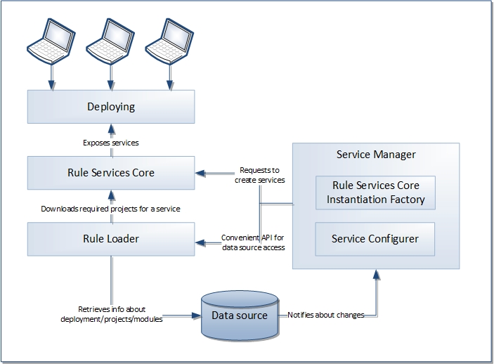
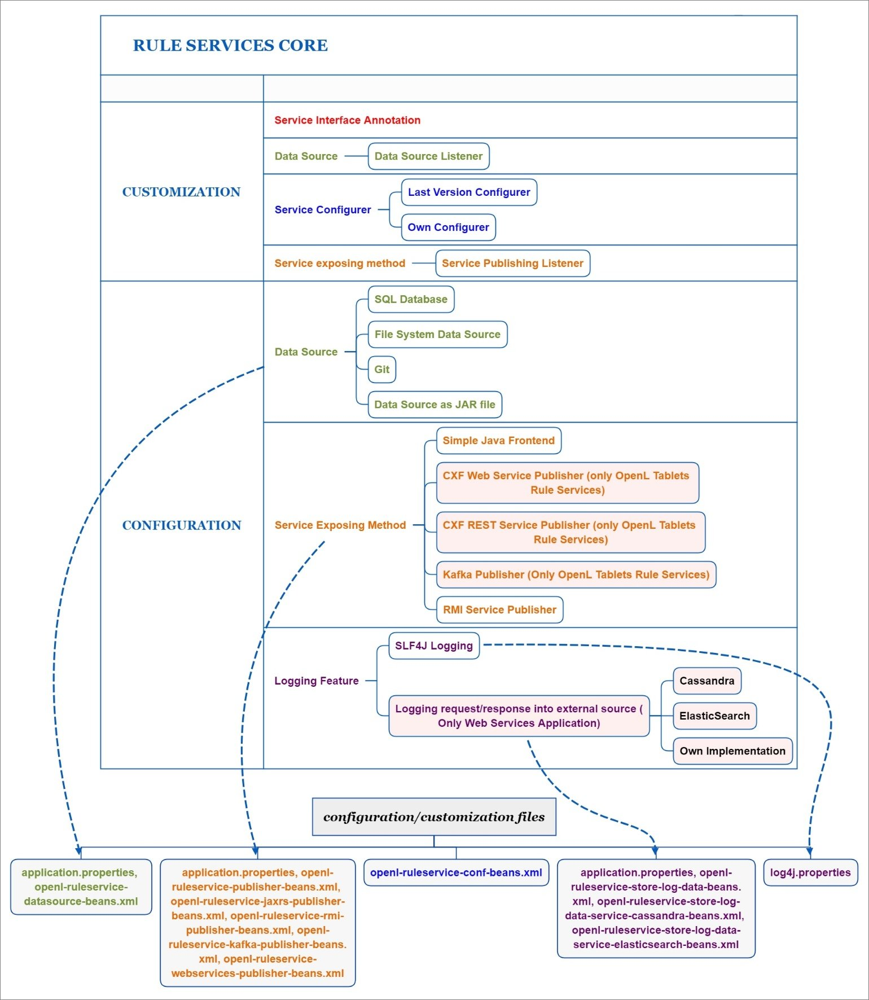
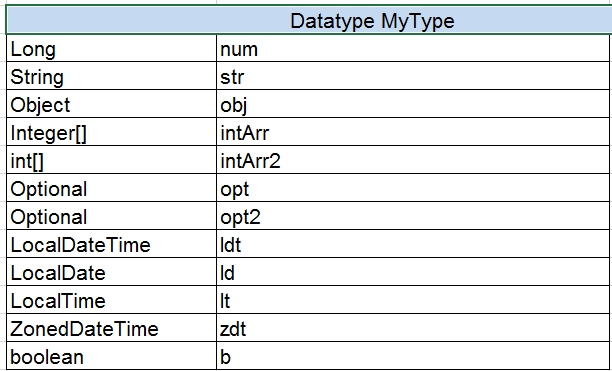
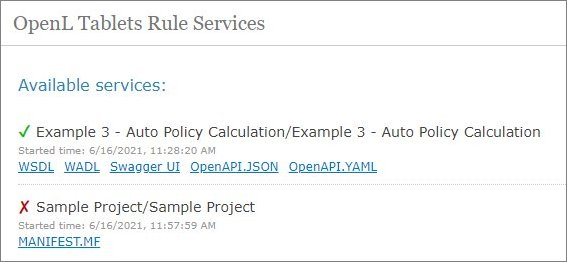
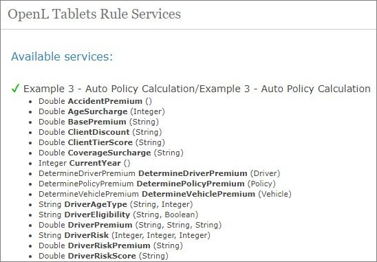
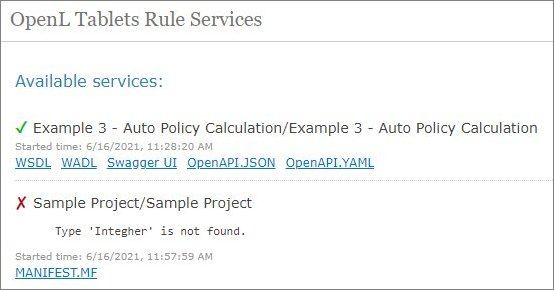
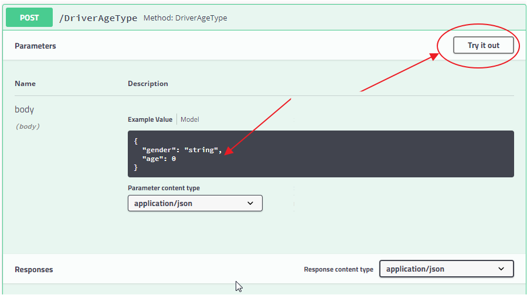
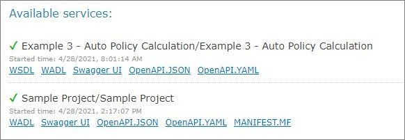

# OpenL Tablets Rule Services Usage and Customization Guide

```
Release 5.26
OpenL Tablets Documentation is licensed under a Creative Commons Attribution 3.0 United States License.
```

## Preface

OpenL Tablets is a Business Rules Management System (BRMS) based on the tables presented in Excel documents. Using unique concepts, OpenL Tablets facilitates treating business documents containing business logic specifications as executable source code.

OpenL Tablets provides a set of tools addressing BRMS related capabilities including *OpenL Tablets Rule Services* *application* designed for integration of business rules into different customers’ applications.

The goal of this document is to explain how to configure Rule Services Core, that is, configure OpenL Tablets Rule Services or integrate the Rule Services Core module into the existing application, for different working environments and how to customize the services to meet particular customer requirements.

The following topics are included in this chapter:

-   [Audience](#audience)
-   [How This Guide Is Organized](#how-this-guide-is-organized)
-   [Related Information](#related-information)
-   [Typographic Conventions](#typographic-conventions)

### Audience

This guide is targeted at rule developers who integrate the Rule Services Core module and set up, configure, and customize OpenL Tablets Rule Services to facilitate the needs of customer rules management applications.

Basic knowledge of Java, Apache Tomcat, Ant, Maven, and Excel is required to use this guide effectively.

### How This Guide Is Organized

| Section                                                                                                                          | Description                                                                                                                             |
|----------------------------------------------------------------------------------------------------------------------------------|-----------------------------------------------------------------------------------------------------------------------------------------|
| [Introduction](#introduction)                                                                                                   | Provides overall information about OpenL Tablets Rule Services.                                                                         |
| [Rule Services Core](#rule-services-core)                                                                                        | Introduces Rule Services Core functionality.                                                                                            |
| [OpenL Tablets Rule Services Configuration](#openl-tablets-rule-services-configuration)                                                               | Describes the default configuration of OpenL Tablets Rule Services, introduces Service <br/>Manager, and explains main configuration points. |
| [OpenL Tablets Rule Services Advanced Configuration and Customization](#openl-tablets-rule-services-advanced-configuration-and-customization)                                    | Describes OpenL Tablets Rule Services advanced services configuration and customization.                                                |
| [Appendix A: Tips and Tricks](#appendix-a-using-openl-tablets-rest-services-from-java-code)                                      | Describes how to use OpenL Tablets Rule Services from Java code.                                                                        |
| [Appendix B: Projects on the OpenL Tablets Rule Services Launch](#appendix-b-projects-on-the-openl-tablets-rule-services-launch)                                         | Explains how projects appear upon OpenL Tablets Rule Services launch.                                                                   |
| [Appendix C: Types of Exceptions in OpenL Tablets Rule Services](#appendix-c-types-of-exceptions-in-openl-tablets-rule-services) | Explains typical exceptions in OpenL Tablets Rule Services.                                                                             |
| [Appendix D: OpenAPI Support](#appendix-d-openapi-support)                                                                             | Explains Swagger support in OpenL Tablets.                                                                                              |
| [Appendix E: Programmatically Deploying Rules to a Repository](#appendix-e-programmatically-deploying-rules-to-a-repository)     | Describes how to locate a project with rules in the database repository <br/>without OpenL Tablets WebStudio deploy functionality.           |
| [Appendix F: Backward Compatibility Settings](#appendix-f-backward-compatibility-settings)                                       | Describes backward compatibility settings.                                                                                              |
| [Appendix G: Deployment Project ZIP Structure](#appendix-g-deployment-project-zip-structure)                                     | Describes ZIP structure for single and multiple project deployment.                                                                     |
| [Appendix H: Manifest File for Deployed Projects](#appendix-h-manifest-file-for-deployed-projects)                               | Introduces manifest files created during project deployment from OpenL Tablets WebStudio <br/>or using the OpenL Tablets Maven plugin.       |

### Related Information

The following table lists sources of information related to contents of this guide:

| Title                                                                                                                                                       | Description                                                                                                   |
|-------------------------------------------------------------------------------------------------------------------------------------------------------------|---------------------------------------------------------------------------------------------------------------|
| [OpenL Tablets WebStudio Guide](https://openldocs.readthedocs.io/en/latest/documentation/guides/webstudio_user_guide) | Describes OpenL Tablets WebStudio, a web application for managing OpenL Tablets projects through web browser. |
| [OpenL Tablets Reference Guide](https://openldocs.readthedocs.io/en/latest/documentation/guides/reference_guide)             | Provides overview of OpenL Tablets technology, as well as its basic concepts and principles.                  |
| [OpenL Tablets Installation Guide](https://openldocs.readthedocs.io/en/latest/documentation/guides/installation_guide)       | Describes how to install and set up OpenL Tablets software.                                                   |
| [https://openl-tablets.org/](http://openl-tablets.org/)                                                                                                   | OpenL Tablets open source project website.                                                                    |

### Typographic Conventions

The following styles and conventions are used in this guide:

| Convention                 | Description                                                                                                                                                                                                                                                                                                                         |
|----------------------------|-------------------------------------------------------------------------------------------------------------------------------------------------------------------------------------------------------------------------------------------------------------------------------------------------------------------------------------|
| **Bold**                   | Represents user interface items such as check boxes, command buttons, dialog boxes, drop-down list values, field names, menu commands, <br/>menus, option buttons, perspectives, tabs, tooltip labels, tree elements, views, and windows. <br/>Represents keys, such as **F9** or **CTRL+A**. <br/>Represents a term the first time it is defined. |
| `Courier`                  | Represents file and directory names, code, system messages, and command-line commands.                                                                                                                                                                                                                                              |
| Select **File \> Save As** | Represents a command to perform, such as opening the **File** menu and selecting **Save As**.                                                                                                                                                                                                                                       |
| *Italic*                   | Represents any information to be entered in a field. Represents documentation titles.                                                                                                                                                                                                                                               |
| \< \>                      | Represents placeholder values to be substituted with user specific values.                                                                                                                                                                                                                                                          |
| Hyperlink                  | Represents a hyperlink. Clicking a hyperlink displays the information topic or external source.                                                                                                                                                                                                                                     |
| **[name of guide]**        | Reference to another guide that contains additional information on a specific feature.                                                                                                                                                                                                                                              |

## Introduction

The majority of OpenL Tablets customers need to expose business rules as REST web services. For this purpose, OpenL Tablets Rule Services is provided. To meet requirements of various customer project implementations, OpenL Tablets Rule Services provides the ability to dynamically create web services for customer rules and offers extensive configuration and customization capabilities.

Overall architecture of OpenL Tablets Rule Services is expandable and customizable. All functionality is divided into pieces; each of them is responsible for a small part of functionality and can be replaced by another implementation if it is required. Usually, default implementation is enough to cover all requirements of most customers.



*Overall OpenL Tablets Rule Services architecture*

OpenL Tablets Rule Services provides the following key features and benefits:

-   easily integrating customer business rules into various applications running on different platforms
-   using different data sources, such as a central OpenL Tablets production repository or file system of a proper structure
-   exposing multiple projects and modules as a single web service according to a project logical structure

The subsequent chapters describe how to set up a data source, Service Configurer, and a service exposing method, and how to integrate OpenL Tablets into the existing application.

OpenL Tablets Rule Services is based on Rule Services Core and supports all features provided by the Rule Services Core module.

The following diagram identifies all components to be configured and customized.



*Configurable and customizable components of Rule Services Core*

## Rule Services Core

This section introduces Rule Services Core functionality and includes the following topics:

-   [Adding Dependencies into the Project](#adding-dependencies-into-the-project)
-   [Configuring Spring Integration for Rule Services Core](#configuring-spring-integration-for-rule-services-core)
-   [Customizing and Configuring Rule Services Core](#customizing-and-configuring-rule-services-core)

### Adding Dependencies into the Project

To use the Rule Services Core within Maven, declare the module dependencies in the project object model (POM) as described in the following example:

```xml
<dependency>
    <groupId>org.openl.rules</groupId>
    <artifactId>org.openl.rules.ruleservice</artifactId>
    <version>${openl.version}</version>
</dependency>
```

If Apache Maven is not used in the project, it is recommended to download all dependencies via Maven and add all downloaded dependencies into the existing project classpath.

### Configuring Spring Integration for Rule Services Core

This section describes how to configure Spring and Rule Services Core integration and includes the following topics:

-   [Adding a Bean Configuration File to the Spring Context Definition](#adding-a-bean-configuration-file-to-the-spring-context-definition)
-   [Simple Java Frontend Implementation](#simple-java-frontend-implementation)

#### Adding a Bean Configuration File to the Spring Context Definition

To support the Rule Services Core features, add the `openl-ruleservice-beans.xml` bean configuration file into the application Spring context definition. An example is as follows:

`<import resource="classpath:openl-ruleservice-beans.xml" />`

After adding the Rule Services Core beans, Spring configuration has a simple Java frontend service as a default publisher for all OpenL Tablets services.

#### Simple Java Frontend Implementation

Spring configuration defined in the `openl-ruleservice-beans.xml` file registers the `frontend` bean with default frontend implementation. This bean implements the `org.openl.rules.ruleservice.simple.RulesFrontend `interface that is designed to interact with deployed OpenL Tablets services.

| Inceptor                                                                                            | Description                                                                                                                                       |
|-----------------------------------------------------------------------------------------------------|---------------------------------------------------------------------------------------------------------------------------------------------------|
| `OpenLService findServiceByName(String serviceName)`                                                | Find registered OpenL Tablets service by name.                                                                                                    |
| `Object execute(String serviceName, String ruleName, Class<?>[] inputParamsTypes, Object[] params)` | Invokes a rule with the defined parameter types and parameter values from the deployed OpenL Tablets service.                                     |
| `Object execute(String serviceName, String ruleName, Object... params)`                             | Invokes a rule with the defined parameter values from the deployed OpenL service. <br/>Parameter types are automatically defined from sent parameters. |
| `Object getValue(String serviceName, String fieldName)`                                             | Returns field value from the defined OpenL Tablets service.                                                                                       |
| `Collection<String> getServiceNames()`                                                              | Returns a list of registered OpenL Tablets services.                                                                                              |
| `void registerService(OpenLService service)`                                                        | Registers the OpenL Tablets service.                                                                                                              |
| `void unregisterService(String serviceName)`                                                        | Unregisters the OpenL Tablets service.                                                                                                            |
| `<T> T buildServiceProxy(String serviceName, Class<T> proxyInterface)`                              | Builds a proxy for the OpenL Tablets service with a defined interface.                                                                            |
| `<T> T buildServiceProxy(String serviceName, Class<T> proxyInterface, ClassLoader classLoader)`      | Builds a proxy for the OpenL Tablets service with a defined interface and defined class loader.                                                   |

The `frontend `bean can be injected to user’s bean to interact with deployed OpenL Tablets services.

`OpenLServiceFactoryBean` is a factory bean implementation used to create a proxy object to interact with OpenL Tablets service. To create a proxy object, define a been factory as described in the following example:

```xml
<bean id="service1" class="org.openl.rules.ruleservice.simple.OpenLServiceFactoryBean">
    <!-- <property name="rulesFrontend" ref="frontend"/> optional. For custom implementation of RulesFrontend  -->
    <property name="serviceName" value="service1"/>
    <property name="proxyInterface" value="com.myproject.Service1"/>
</bean>
```

In this example, `serviceName` is a name of the deployed OpenL Tablets service and `proxyInterface` is an interface for building a proxy object. All invocations of proxy object methods are delegated to the `execute `method of the `frontend `bean. The invoked method name with its parameters is used as input parameters for the `execute `method.

**Note:** Proxy beans and proxy objects created by `frontend` bean are automatically updated if the OpenL Tablets service is redeployed into a data source. Nevertheless, these objects are not working while the project is redeployed. To synchronize this process, use Service Publisher listeners described in further sections.

### Customizing and Configuring Rule Services Core

The Rule Services Core module configuration features resemble configuration features for OpenL Tablets Rule Services. The OpenL Tablets Rule Services customization and configuration information is provided in this document and can be applied to Rule Services Core in the same way. For the list of components supported only by OpenL Tablets Rule Services, see diagrams in [Introduction](#introduction).

## OpenL Tablets Rule Services Configuration

OpenL Tablets Rule Services architecture allows extending mechanisms of services loading and deployment according to the particular project requirements.

This section describes OpenL Tablets Rule Services configuration and includes the following topics:

-   [OpenL Tablets Rule Services Default Configuration](#openl-tablets-rule-services-default-configuration)
-   [OpenL Tablets Rule Services Default Configuration Files](#openl-tablets-rule-services-default-configuration-files)
-   [Service Manager](#service-manager)
-   [Configuration Points](#configuration-points)

### OpenL Tablets Rule Services Default Configuration

All OpenL Tablets Rule Services configuration is specified in Spring configuration files and `application*.*properties` files. The `application.properties` file is located inside the application `.war `file (inside WEB-INF/classes folder), in a user’s directory or in a working directory.

The configuration file located inside the `.war `file contains default settings for all properties. Use it as a reference of possible settings and redefine as required in your configuration file, such as the `application.properties` file located in a user’s home directory.

All settings used in `application.properties` file can be defined as JVM options. In this case, JVM options override settings defined in files.

By default, OpenL Tablets Rule Services is configured as follows:

1.  A data source is configured as `FileSystemDataSource` located in the `"${user.home}/.openl/datasource"` folder.
2.  All services are exposed as REST services using the CXF framework.
3.  `LastVersionProjectsServiceConfigurer` is used as a default service configurer that takes the last version of each deployment and creates the service for each project using all modules contained in the project.

### OpenL Tablets Rule Services Default Configuration Files

If necessary, modify the OpenL Tablets Rule Services configuration by overriding the existing configuration files. All overridden Spring beans must be defined in the `openl-ruleservice-override-beans.xml `file. The following table lists Spring configuration files used in OpenL Tablets Rule Services:

| File                                          | Description                                                                                                                                      |
|-----------------------------------------------|--------------------------------------------------------------------------------------------------------------------------------------------------|
| `openl-ruleservice-beans.xml`                 | Main configuration file that includes all other configuration files. This file is searched by OpenL Tablets Rule Services in the classpath root. |
| `openl-ruleservice-core-beans.xml`            | Configuration for ServiceManager and InstantiationFactory.                                                                                       |
| `openl-ruleservice-datasource-beans.xml`      | Configuration for data sources.                                                                                                                  |
| `openl-ruleservice-loader-beans.xml`          | Configuration for rules loader.                                                                                                                  |
| `openl-ruleservice-publisher-beans.xml`       | Common publisher configurations.                                                                                                                 |
| `openl-ruleservice-jaxrs-publisher-beans.xml` | Configuration for RESTful services publisher.                                                                                                    |
| `openl-ruleservice-rmi-publisher-beans.xml`   | Configuration for RMI services publisher.                                                                                                        |
| `openl-ruleservice-kafka-publisher-beans.xml` | Configuration for Kafka services publisher.                                                                                                      |
| `openl-ruleservice-conf-beans.xml`            | Configuration for Service Configurer.                                                                                                            |
| `openl-ruleservice-store-log-data-beans.xml`  | Configuration for external request and response storages.                                                                                        |
| `application.properties        `                      | Main configuration file containing properties for OpenL Tablets Rule Services configuration.                                                     |

For more information on configuration files, see [Configuration Points](#configuration-points).

### Service Manager

**Service Manager** is the main component of OpenL Tablets Rule Services frontend joining all major parts, such as a loader, rule service publishers, and Service Configurer. For more information on OpenL Tablets Rule Services frontend components, see [OpenL Tablets Developers Guide](https://openldocs.readthedocs.io/en/latest/documentation/guides/developer_guide).

Service Manager manages all currently running services and intelligently controls all operations for deploying, undeploying, and redeploying the services. These operations are only performed in the following cases:

-   initial deployment at application startup
-   processing after data source update

Service Manager always acts as a data source listener as described in further sections of this chapter.

### Configuration Points

Any part of OpenL Tablets Rule Services frontend can be replaced by the user’s own implementation. For more information on the system architecture, see [OpenL Tablets Developers Guide](https://openldocs.readthedocs.io/en/latest/documentation/guides/developer_guide).

If the common approach is used, the following components must be configured:

| Component                   | Description                                                                                     |
|-----------------------------|-------------------------------------------------------------------------------------------------|
| **Data source**             | Informs the OpenL Tablets system where to retrieve user’s rules.                                |
| **Service exposing method** | Defines the way services are exposed, for example, as a web service or a simple Java framework. |

The following sections describe how to configure these components:

-   [Configuring a Data Source](#configuring-a-data-source)
-   [Service Configurer](#service-configurer)
-   [Service Exposing Methods](#service-exposing-methods)
-   [Configuring System Settings](#configuring-system-settings)
-   [CORS Filter Support](#cors-filter-support)
-   [Logging Requests to OpenL Tablets Rule Services and Their Responds in a Storage](#logging-requests-to-openl-tablets-rule-services-and-their-responds-in-a-storage)

    **Note:** There is a specific rule of parsing parameter names in methods. The algorithm checks the case of the second letter in a word and sets the first letter case the same as for the second letter. For example, parameters for `MyMethod (String fParam, String Sparam)` in REST requests are defined as `FParam` and `sparam`.

#### Configuring a Data Source

The system supports the following data source implementations:

-   [File System](#file-system)
-   [Relational Database](#relational-database)
-   [Amazon AWS S3](#amazon-aws-s3)
-   [GIT](#git)
-   [Classpath JAR](#classpath-jar)

##### File System

Using a file system as a data source for projects means that projects are stored in a local folder. By default, the configuration folder represents a single deployment containing all the projects and does not support multiple deployments and project versions. This data source is used by default.

To configure a local file system as a data source, proceed as follows:

1.  In `application.properties`, set `production-repository.factory = repo-file`.
    <br/>By default, the `${user.home}/.openl/openl-ruleservice/datasource` folder is used as a local folder for projects.
2.  To enable versioning support for deployment, set the `ruleservice.datasource.filesystem.supportVersion` setting to `true`.

    **Note:** For proper parsing of Java properties file, the path to the folder must be defined with a slash (‘/’) as the folders delimiter. Back slash “\\” is not allowed.

##### Relational Database

To use a relational database repository as a data source, proceed as follows:

1.  Add the appropriate driver library for a database.
    For example, for MySQL 5.6, it is the `mysql-connector-java-5.1.31.jar`.
2.  In the `application.properties` file, set repository settings as follows:
3.  Set `production-repository.factory = repo-jdbc`.
4.  Set the value for `production-repository.uri` according to the database as follows:

    | Database       | URL value                                                                                   |
    |----------------|---------------------------------------------------------------------------------------------|
    | MySQL, MariaDB | jdbc:mysql://[host][:port]/[schema]                                                         |
    | Oracle         | jdbc:oracle:thin:@//[HOST][:PORT]/SERVICE                                                   |
    | MS SQL         | jdbc:sqlserver://[serverName[\instanceName][:portNumber]][;property=value[;property=value]] |
    | PostrgeSQL     | jdbc:postrgesql://[host][:port]/[schema]                                                    |

    For example, for MySQL:
    ```properties
    production-repository.uri = jdbc:mysql://localhost:3306/deployment-repository
    ```

5.  Set login and password for a connection to the database in production-repository.login and production-repository.password settings.

    **Note:**        The password must be encoded via Base64 encoding schema if the repository.encode.decode.key property is not empty. 
	
    ```properties
    production-repository.factory = repo-jdbc
    production-repository.uri = jdbc:h2:mem:repo;DB_CLOSE_DELAY=-1
    production-repository.login = root
    production-repository.password = admin
    # Secret key for password code/decode
    secret.key=
    #secret.cipher=AES/CBC/PKCS5Padding
    ```

##### Amazon AWS S3

To use an AWS S3 repository as a data source, proceed as follows:

1.  To build a customized version of OpenL Tablets Rule Services with dependencies on `*org.openl.rules.repository.aws`, create a `pom.xml` file with the following content:

    ```xml
    <?xml version="1.0" encoding="UTF-8"?>
    <project xmlns="http://maven.apache.org/POM/4.0.0" xmlns:xsi="http://www.w3.org/2001/XMLSchema-instance" xsi:schemaLocation="http://maven.apache.org/POM/4.0.0 http://maven.apache.org/maven-v4_0_0.xsd">
        <modelVersion>4.0.0</modelVersion>
        <groupId>com.example.openl</groupId>
        <artifactId>webservice-aws</artifactId>
        <packaging>war</packaging>
        <version>1.0-beta</version>

	<properties>
            <project.build.sourceEncoding>UTF-8</project.build.sourceEncoding>
            <org.openl.version>#Define OpenL Tablets version here#</org.openl.version>
        </properties>
        <dependencies>
            <dependency>
                <groupId>org.openl.rules</groupId>
                <artifactId>org.openl.rules.repository.aws</artifactId>
                <version>${org.openl.version}</version>
            </dependency>
            <dependency>
                <groupId>org.openl.rules</groupId>
                <artifactId>org.openl.rules.ruleservice.ws</artifactId>
                <type>war</type>
                <version>${org.openl.version}</version>
            </dependency>
        </dependencies>
        <dependencyManagement>
            <dependencies>
                <dependency>
                    <groupId>com.fasterxml.jackson.core</groupId>
                    <artifactId>jackson-databind</artifactId>
                    <version>2.9.5</version>
                </dependency>
                <dependency>
                    <groupId>com.fasterxml.jackson.core</groupId>
                    <artifactId>jackson-annotations</artifactId>
                    <version>2.9.5</version>
                </dependency>
                <dependency>
                    <groupId>commons-codec</groupId>
                    <artifactId>commons-codec</artifactId>
                    <version>1.11</version>
                </dependency>
            </dependencies>
        </dependencyManagement>
    </project>
    ```
        
1.  Set the following properties in the `application.properties` file:
    
    ```
    properties
    production-repository.factory = repo-aws-s3
    production-repository.bucket-name = yourBucketName
    production-repository.region-name = yourS3Region
    production-repository.access-key = yourAccessKey
    production-repository.secret-key = yourSecretKey
    ```
  
	
##### GIT

To use a Git repository as a data source, proceed as follows:

1.  To build a customized version of OpenL Tablets Rule Services with dependencies on `*org.openl.rules.repository.git`, create a `pom.xml` file with the following content:
	
    ```xml
    <?xml version="1.0" encoding="UTF-8"?>
    <project xmlns="http://maven.apache.org/POM/4.0.0" xmlns:xsi="http://www.w3.org/2001/XMLSchema-instance" xsi:schemaLocation="http://maven.apache.org/POM/4.0.0 http://maven.apache.org/maven-v4_0_0.xsd">
        <modelVersion>4.0.0</modelVersion>
        <groupId>com.example.openl</groupId>
        <artifactId>webservice-git</artifactId>
        <packaging>war</packaging>
        <version>1.0-beta</version>

        <properties>
            <project.build.sourceEncoding>UTF-8</project.build.sourceEncoding>
            <org.openl.version>>#Define OpenL Tablets version here#</org.openl.version>
        </properties>
        <dependencies>
            <dependency>
                <groupId>org.openl.rules</groupId>
                <artifactId>org.openl.rules.repository.git</artifactId>
                <version>${org.openl.version}</version>
            </dependency>
            <dependency>
                <groupId>org.openl.rules</groupId>
                <artifactId>org.openl.rules.ruleservice.ws</artifactId>
                <type>war</type>
                <version>${org.openl.version}</version>
            </dependency>
        </dependencies>
    </project>
    ```
        
1.  Build it with Maven: `mvn clean package`.
2.  Replace `webservice.war` with the war file you built.
3.  Set the following properties to the `application.properties` file (change necessary fields):

    ```properties
    production-repository.factory = repo-git
    production-repository.uri = https://github.com/<your-name>/your-repo.git
    production-repository.login = your-login
    production-repository.password = your-password
    ```

4.  Additionally, to override default values, add these optional properties:
    
    ```xml
    properties
    # Local path for Git repository.
    production-repository.local-repository-path = ${ruleservice.openl.home}/git
    # The branch where deployed projects can be found.
    production-repository.branch = master
    # Committer's display name. If null, username will be “OpenL_Deployer”.
    production-repository.user-display-name =
    # Committer's email. If null, email will be empty.
    production-repository.user-email =
    # Repository connection timeout in seconds. Must be greater than zero.
    production-repository.connection-timeout = 60
    # Repository changes check interval in seconds. Must be greater than 0.
    production-repository.listener-timer-period = 10
    ```

##### Classpath JAR

If rule projects with the `rules.xml` project descriptor are packed into a JAR file and placed in the classpath, these projects are deployed in the configured data source at the application launch.

Proceed as follows:

1.  Put the JAR file with the project to `\<TOMCAT_HOME>\webapps\<rule services file name>\WEB-INF\lib`.
2.  In the `application.properties` file, set up the `ruleservice.datasource.deploy.classpath.jars = true`.

By default, this property is set to `true`.

**Note:** Project deployment is skipped if the data source already contains the project with the same name.

#### Service Configurer

This section introduces Service Configurer and includes the following topics:

-   [Understanding Service Configurer](#understanding-service-configurer)
-   [Deployment Configuration File](#deployment-configuration-file)
-   [Service Description](#service-description)
-   [Configuring the Deployment Filter](#configuring-the-deployment-filter)

##### Understanding Service Configurer

Service Configurer resolves a list of services to be exposed, such as modules contained in each service, service interface, and runtime context provision.

Modules for a service can be retrieved for different projects. Each deployment containing in a data source has a set of properties and can be represented in several versions. Deployment consists of projects that also have properties and contain some modules. There can be only one version of a specific project in the deployment.

Each module for a service can be identified by the deployment name, deployment version, project name inside the deployment, and module name inside the project.

Different module gathering strategies according to their needs can be implemented by extending `org.openl.rules.ruleservice.conf.ServiceConfigurer` interface. Users can choose deployments and projects with concrete values of a specific property, such as service for some LOB property or service containing modules with an expiration date before a specific date, or versions of deployments, or both these approaches.

OpenL Tablets users typically need web services containing several rule projects or modules. In this case, multiple modules can be united in one service using the `org.openl.rules.ruleservice.core.ServiceDescription` service description. Service description contains information about the required service, such as the service name, URL, and service class, and can be expanded to contain new configurations. To instantiate several modules, users can rely on the OpenL Tablets multi-module mechanism that combines a group of modules into a single rules engine instance.

The `org.openl.rules.ruleservice.conf.LastVersionProjectsServiceConfigurer` default implementation of Service Configurer retrieves all deployments from a data source and publishes the latest versions of projects with unique version from the corresponding deployment configuration file `rules-deploy.xml. `In other words, if the `version` tag is not used in service description files for the same project versions, only one latest deployment version is published; otherwise, all deployment versions with unique `version` tag are published.

##### Deployment Configuration File

Default implementation of Service Configurer uses the `rules-deploy.xml` deployment configuration file from the project root folder. This file is created manually or via OpenL Tablets WebStudio. An example of the `rules-deploy.xml` file is as follows:

```xml
<rules-deploy>
    <isProvideRuntimeContext>true</isProvideRuntimeContext>
    <isProvideVariations>false</isProvideVariations>
    <serviceName>myService</serviceName>
    <serviceClass>com.example.MyService </serviceClass>
    <url>com.example.MyService</url>
    <publishers>
        <publisher>RESTFUL</publisher>
    </publishers>
    <configuration>
        <entry>
            <string>someString</string>
            <string>someString</string>
        </entry>
    </configuration>
</rules-deploy>
```

When deploying a project to OpenL Tablets Rule Services, if the rules-deploy.xml file is missing or publishers are not defined, only the RESTful service is deployed according to the following property:

`ruleservice.publishers=RESTFUL`

| Tag                               |  Description                                                                                                                                                                                                                                                                                                                                                                                                                                                                                                                                                                                                                                                                                                                                                                                                                                                                                     | Required            |
|-----------------------------------|--------------------------------------------------------------------------------------------------------------------------------------------------------------------------------------------------------------------------------------------------------------------------------------------------------------------------------------------------------------------------------------------------------------------------------------------------------------------------------------------------------------------------------------------------------------------------------------------------------------------------------------------------------------------------------------------------------------------------------------------------------------------------------------------------------------------------------------------------------------------------------------------------|---------------------|
| isProvideRuntimeContext           | Identifies, if set to `true`, that a project provides a runtime context.  <br/>The default value is defined in the `application.properties` file.                                                                                                                                                                                                                                                                                                                                                                                                                                                                                                                                                                                                                                                                                                                                                     | No                  |
| isProvideVariations               | Identifies, if set to `true`, that a project provides variations.  <br/>The default value is defined in the `application.properties` file.                                                                                                                                                                                                                                                                                                                                                                                                                                                                                                                                                                                                                                                                                                                                                            | No                  |
| serviceName                       | Defines a service name. <br/>The service name defined in the file is displayed for a deployed project in the embedded mode only. <br/>Otherwise, the service name is derived from its path. <br/>A default pattern is "{deployment_configuration_name}/{project_name}".                                                                                                                                                                                                                                                                                                                                                                                                                                                                                                                                                                                                                                         | No                  |
| serviceClass                      | Defines a service class. If it is not defined, a generated class is used.                                                                                                                                                                                                                                                                                                                                                                                                                                                                                                                                                                                                                                                                                                                                                                                                                        | No                  |
| rmiServiceClass                   | Define a service class to be used by RMI publisher.                                                                                                                                                                                                                                                                                                                                                                                                                                                                                                                                                                                                                                                                                                                                                                                                                                              | Yes <br/>if RMI is used |
| version                           | Defines a service version.                                                                                                                                                                                                                                                                                                                                                                                                                                                                                                                                                                                                                                                                                                                                                                                                                                                                       | No                  |
| url                               | Defines URL for a service.                                                                                                                                                                                                                                                                                                                                                                                                                                                                                                                                                                                                                                                                                                                                                                                                                                                                       | No                  |
| annotationTemplateClassName       | Defines an interface being used as a template to annotate dynamic generated interface class.                                                                                                                                                                                                                                                                                                                                                                                                                                                                                                                                                                                                                                                                                                                                                                                                     | No                  |
| groups                            | Defines a list of comma-separated groups used for this project.                                                                                                                                                                                                                                                                                                                                                                                                                                                                                                                                                                                                                                                                                                                                                                                                                                  | No                  |
| publishers                        | Defines a list of publishers for a project. <br/>Available values are as follows: <br/>- [RESTFUL](#_CXF_REST_Publisher) <br/>- [RMI](#rmi-publisher) <br/>- [KAFKA](#kafka-publisher) <br/>If the publisher list is empty, the service is deployed as a Java object without network API defined. <br/>This can be useful if deploying multiple projects in one deployment <br/>where some of these projects must not define the network API.                                                                                                                                                                                                                                                                                                                                                                                                                                                                                             | No                  |
| configuration                     | Is used as extension point for custom service configuration.                                                                                                                                                                                                                                                                                                                                                                                                                                                                                                                                                                                                                                                                                                                                                                                                                                     | No                  |
| lazy-modules-for-compilation      | Defines a list of modules to be loaded in case lazy loading mechanism is used. <br/>Module names can contain Ant path expressions.                                                                                                                                                                                                                                                                                                                                                                                                                                                                                                                                                                                                                                                                                                                                                                    | No                  |
| jackson.serializationInclusion    | Serialization option for JSON based services.                                                                                                                                                                                                                                                                                                                                                                                                                                                                                                                                                                                                                                                                                                                                                                                                                                                    | No                  |
| jackson.defaultDateFormat         | Used to define date format is used in JSON.                                                                                                                                                                                                                                                                                                                                                                                                                                                                                                                                                                                                                                                                                                                                                                                                                                                      | No                  |
| jackson.caseInsensitiveProperties | Deserialization option for JSON based services.                                                                                                                                                                                                                                                                                                                                                                                                                                                                                                                                                                                                                                                                                                                                                                                                                                                  | No                  |
| jackson.failOnUnknownProperties   | Deserialization option for JSON based services. <br/>For more information on this property, see [Configuring JSON Payload Serialization and Deserialization](#configuring-json-payload-serialization-and-deserialization).                                                                                                                                                                                                                                                                                                                                                                                                                                                                                                                                                                                                                                                                            | No                  |
| jackson.propertyNamingStrategy    | Used to configure names of output spreadsheet attributes. <br/>Supported attribute name strategies are as follows: <br/><br/>**org.openl.rules.serialization.spr.LowerCamelCaseStrategy** <br/>All name elements, excluding the first one, start with a capitalized letter, followed by lowercase ones. <br/>The first letter is lowercased, and there are no separators.  <br/>**Example:** columnName. <br/><br/>**org.openl.rules.serialization.spr.SnakeCaseStrategy** <br/>All letters are lowercase with underscores used as separators between name elements. <br/>**Example:** columnname_rowname. <br/><br/>**org.openl.rules.serialization.spr.LowerCaseStrategy** <br/>All letters are lowercase with no separators. <br/>**Example:** columnname. <br/><br/>**org.openl.rules.serialization.spr.UpperCamelCaseStrategy** <br/>All name elements start with a capitalized letter, followed by lowercase ones, and there are no separators. <br/>**Example:** ColumnNameRowName. |                     |
| rootClassNamesBinding             | Defines a list of classes for automatically define inheritance between defined classes and properly registering them.                                                                                                                                                                                                                                                                                                                                                                                                                                                                                                                                                                                                                                                                                                                                                                            | No                  |

##### Service Description

Commonly each service is represented by rules and service interface and consists of the following elements:

| Service                                | Description                                                                                                                                                                                                                                                    |
|----------------------------------------|----------------------------------------------------------------------------------------------------------------------------------------------------------------------------------------------------------------------------------------------------------------|
| Service name                           | Unique service identifier. <br/>If a service name is defined in the `rules-deploy.xml `file, it is displayed for the service in the embedded mode only. <br/>Otherwise, the service name is generated from the path as "{deployment_configuration_name}/{project_name}". |
| Service URL                            | URL path for the service. It is absolute for the console start and relative to the context root for the `ws.war` case.                                                                                                                                         |
| Service class                          | Interface of the service to be used at the server and the client side.                                                                                                                                                                                         |
| Version                                | Number of the service version.                                                                                                                                                                                                                                 |
| Rules                                  | Module or a set of modules to be combined as a single rules module.                                                                                                                                                                                            |
| **Provide runtime context** flag       | Identifier of whether the runtime context must be added to all rule methods. <br/>If it is set to `true`, the `IRulesRuntimeContext` argument must be added to each method in the service class.                                                                  |
| **Support variations** flag (optional) | Identifier of whether the current service supports variations. <br/>For more information on variations, see [Variations](#_Variations).                                                                                                                             |

##### Configuring the Deployment Filter

The system provides the ability to set up the Deployment Filter to filter deployments from configured data source when several applications use the same data source. Filtering selects deployments by name.

The property `ruleservice.datasource.deployments` is defined in the `application.properties` file and it is disabled by default.

To enable the Deployment Filter, set the exact deployment names using a comma separator, or use the wildcard character to enable the filter to match patterns in the deployment name:

`ruleservice.datasource.deployments = foo-deployment, bar-*`

The wildcard character “\*” matches any characters in the deployment name as follows:

-   If a single asterisk is used, any of the `foo-*`, `*deployment.single` wildcard character patterns detect `foo-deployment`.
-   If multiple asterisks are used, any of the `*deploy*, *deployment*` single wildcard character patterns detect `foo-deployment`.

#### Service Exposing Methods

Common flow of service exposing is as follows:

1.  Retrieve service descriptions from a data source.
2.  Undeploy the currently running services that are not in services defined by Service Configurer.

Some services can become unnecessary in the new version of the product.

1.  Redeploy currently running services that are still in services defined by Service Configurer, such as service update.
2.  Deploy new services not represented earlier.

To set the method of exposing services, configure a Spring bean with the `ruleServiceManager` name in `openl-ruleservice-publisher-beans.xml`.

This bean supports mapping a concrete publisher for a service configuration or uses a default publisher if the publisher is not defined in the `rules-deploy.xml `deployment configuration file.

To add a publisher, use any framework by implementations of `org.openl.rules.ruleservice.publish.RuleServicePublisher `interface and register it in the `ruleServicePublisher` bean.

OpenL Tablets Rule Services supports following publisher implementations out of the box:

-   [CXF REST Publisher](#cxf-rest-publisher)
-   [RMI Publisher](#rmi-publisher)
-   [Kafka Publisher](#kafka-publisher)

##### CXF REST Publisher

CXF REST Service Publisher implementation class is org.openl.rules.ruleservice.publish.JAXRSRuleServicePublisher. The Spring configuration for this publisher is located in the `openl-ruleservice-jaxrs-publisher-beans.xml `file.

The following URL can be used to retrieve a list of methods for a service:

`webserver_context_path/ws_app_war_name/admin/services/{serviceName}/methods/`

###### Configuring HTTP Status for Responses

The system can be configured to use the HTTP 200 status for all RESTful services requests even if service execution fails. To enable this feature, set `ruleservice.jaxrs.responseStatusAlwaysOK = true `in the `application.properties` file.

###### Defining a Date Format for JSON Serialization and Deserialization

REST services support the ISO-8601 standard for date type representation and accept the `yyyy-MM-dd'T'HH:mm:ss.SSS` format. Time and time zones are optional in requests. Time zones in ISO-8601 are represented as local time, with the location unspecified, as UTC, or as an offset from UTC. For more information on the ISO-8601 standard, see <https://en.wikipedia.org/wiki/ISO_8601>.

Date format can be defined in the `ruleservice.jackson.defaultDateFormat `property, in the `application.properties` file. The default date format value is as follows:

`ruleservice.jackson.defaultDateFormat=yyyy-MM-dd'T'HH:mm:ss.SSS`

This value is used by the system for all published projects that do not have the date format defined in the deployment configuration `rules-deploy.xml` file.

The `jackson.defaultDateFormat` value must be in the same syntax of the date time pattern as `SimpleDateFormat` described in <https://docs.oracle.com/en/java/javase/11/docs/api/java.base/java/text/SimpleDateFormat.html>.

Note that changing this setting affects all projects in the system. To change the date format for a particular project, modify the date format in the `rules-deploy.xml` deployment configuration file as follows:

```xml
<rules-deploy>
   ….
    <configuration>
        <entry>
            <string>jackson.defaultDateFormat</string>
            <string>yyyyMMddHHmmss</string>
        </entry>
    </configuration>
</rules-deploy>
```

###### Configuring JSON Payload Serialization and Deserialization

Default JSON properties serialization and deserialization behavior can be changed via `ruleservice.jackson.serializationInclusion`, `ruleservice.jackson.caseInsensitiveProperties`, and `ruleservice.jackson.failOnUnknownProperties` in the `application.properties` file. The default value for this property is set as follows:

```properties
ruleservice.jackson.serializationInclusion = USE_DEFAULTS
ruleservice.jackson.caseInsensitiveProperties = false
ruleservice.jackson.failOnUnknownProperties = false
```

These values are used by the system for all published projects that do not have these properties defined in the `rules-deploy.xml` file.

`ruleservice.jackson.serializationInclusion` is used for JSON serialization. Supported values are as follows:

| Value        | Description                                                                                                                                                                                                              |
|--------------|--------------------------------------------------------------------------------------------------------------------------------------------------------------------------------------------------------------------------|
| ALWAYS       | A property is always included, regardless of the property value.                                                                                                                                                         |
| NON_ABSENT   | Properties with no null values including no content null values are used.                                                                                                                                                |
| NON_DEFAULT  | All values except for the following are included: <br/>values considered empty <br/>primitive or wrapper default values <br/>date and time values that have a timestamp of \`0L\`, that is, \`long\` value of milliseconds since epoch  |
| NON_EMPTY    | Properties with empty values are excluded.                                                                                                                                                                               |
| NON_NULL     | Properties with non-null values are included.                                                                                                                                                                            |
| USE_DEFAULTS | Defaults settings or annotations either from the class level or ObjectMapper level are used.                                                                                                                             |

For more information on serialization values, see <https://fasterxml.github.io/jackson-annotations/javadoc/2.6/com/fasterxml/jackson/annotation/JsonInclude.Include.html>.

JSON payload of the same datatype with different `serializationInclusion` property values are as follows:



*JSON payload of the same datatype with different* `serializationInclusion` *values*

`ruleservice.jackson.caseInsensitiveProperties `is a JSON deserialization. The system matches JSON property names to a Java class ignoring case sensitivity if this property is enabled.

`ruleservice.jackson.failOnUnknownProperties `is a JSON deserialization. The system fails if a missing field in a datatype is present in the JSON request. By default, the system ignores JSON properties in a request that cannot be matched to existing Java classes.

`ruleservice.jackson.failOnEmptyBeans` is used in JSON serialization. The system fails when a fieldless datatype is present in the response. If this property is enabled, which is a default value, an exception is thrown to indicate non-serializable datatypes. If the property is disabled, non-serializable objects are serialized as empty objects, that is, without any properties.

**Note:** Changing these settings affects all projects in the system. To modify `serializationInclusion` for a particular project, modify the `rules-deploy.xml` deployment configuration file as follows:

```xml
<rules-deploy>
    …
    <configuration>
        <entry>
            <string>jackson.serializationInclusion</string>
            <string>NON_ABSENT</string>
        </entry>
        <entry>
            <string>jackson.failOnUnknownProperties</string>
            <string>true</string>
        </entry>
        <entry>
            <string>jackson.caseInsensitiveProperties </string>
            <string>NON_ABSENT</string>
        </entry>
        <entry>
            <string>jackson.failOnEmptyBeans</string>
            <string>false</string>
        </entry>
    </configuration>
</rules-deploy>
```

OpenL Tablets Rule Services uses a Jackson library to serialize an object to JSON and deserialize JSON to an object. This library supports configuration via MixIn annotation. For more information on MixIn annotations, see Jackson documentation <https://github.com/FasterXML/jackson-docs/wiki/JacksonMixInAnnotations>.

To register MixIn classes for a project, annotate the MixIn class with the org.openl.rules.ruleservice.databinding.annotation.MixInClassFor or org.openl.rules.ruleservice.databinding.annotation.MixInClassFor annotation and add this class to the rules-deploy.xml deployment configuration file as described further in this section. These annotations expect the class name that is used for registering MixIn class in the object mapper.

JAXB annotations is supported in the MixIn classes out of the box because the system is configured to use com.fasterxml.jackson.module.jaxb.JaxbAnnotationIntrospector as a secondary annotation interceptor in the object mapper for the deployed service.

Example of the Jackson MixIn class implementation is as follows:

```groovy
@MixInClass(“org.openl.generated.beans.Customer”)
public abstract class CustomerMixIn {

    @JsonProperty(required = true)
    protected Integer customerID;

    @JsonIgnore
    protected Integer privateField;

    @JsonFormat(pattern = “yyyy-MM-dd”)
    protected Date dob;

    @JsonProperty(“genderCd”)
    @ApiModelProperty(example = “male”)
    protected String gender;
}
```

Example of the deployment configuration file is as follows:

```xml
<rules-deploy>
    …
    <configuration>
        <entry>
            <string>rootClassNamesBinding</string>
            <string>org.example.custom.mixin.CustomerMixIn</string>
        </entry>
    </configuration>
</rules-deploy>
```

##### RMI Publisher

RMI Service Publisher implementation class is `org.openl.rules.ruleservice.publish.RmiRuleServicePublisher`. The Spring configuration for this publisher is located in the `openl-ruleservice-rmi-publisher-beans.xml `file.

**Note:** The full RMI service address is `rmi://hostname:port/rmi name specified by you in rules.xml file`.

The appropriate port and host name for RMI can be defined in the `application.properties` file.

By default, these properties are defined as follows:

```properties
ruleservice.rmiPort = 1099 // Port for RMI
ruleservice.rmiHost = 127.0.0.1 // Used as host for RMI
```

##### Kafka Publisher

The system handles messages from the Kafka input topic and publishes rules calculation results to an output topic or dead letter topic if any error occurs during message processing.

Only Kafka brokers 0.11.0 and later are supported.

The following topics are included in this section:

-   [Modes for Exposing Services](#modes-for-exposing-services)
-   [Supported Message Headers](#supported-message-headers)
-   [Custom Message Serialization](#custom-message-serialization)
-   [Date Format Definition and JSON Serialization and Deserialization Configuration](#date-format-definition-and-json-serialization-and-deserialization-configuration)
-   [Spring Kafka Integration Support](#spring-kafka-integration-support)

###### Modes for Exposing Services

Kafka Publisher allows exposing the services in the following modes:

| Mode                                                                             | Description                                                                                                                                                                                                                                                                                                                                                                                                                                                                                          |
|----------------------------------------------------------------------------------|------------------------------------------------------------------------------------------------------------------------------------------------------------------------------------------------------------------------------------------------------------------------------------------------------------------------------------------------------------------------------------------------------------------------------------------------------------------------------------------------------|
| A user configures Kafka settings <br/>for each rules method to expose <br/>as a service. | - All messages in all input topics belong to one rule method and have the same format. <br/>- One Kafka Consumer and two Kafka producers, that is, output topic and dead letter topic, are created for each exposed method. <br/>- Input topic, output topic, and DLT must be created for each method.                                                                                                                                                                                                               |
| A user configures Kafka settings <br/>for a service.                                | - All methods from this service are exposed as services. <br/>- Messages in the input topic belong to different rule methods and are of different format, depending on the method input parameters. <br/>- The method name is set via Kafka Headers. <br/>- One Kafka consumer and two producers, that is, output topic and dead letter topic, are created for a service. <br/>- One input topic, one output topic, and one DLT is enough for the OpenL Tablets service. <br/>- A service can be exposed in both modes at the same time.  |

The following topics are included in this section:

-   [Enabling Kafka Publisher for a Service](#enabling-kafka-publisher-for-a-service)
-   [Configuring Application Level Kafka Settings](#configuring-application-level-kafka-settings)
-   [Configuring Service Level Kafka Settings](#configuring-service-level-kafka-settings)

####### Enabling Kafka Publisher for a Service

By default, Kafka Publisher is not used for deployed projects. To enable it, add the Kafka Publisher type to `rules-deploy.xml` as follows:

```xml
<rules-deploy>
    …
    <publishers>
        <publisher>KAFKA</publisher>
    </publishers>
    …
</rules-deploy>
```

####### Configuring Application Level Kafka Settings

OpenL Tablets Rule Services can be configured via the `application.properties` file or environment variables. Kafka-related settings are as follows:

| Property name                       | Default value    | Description                                                    |
|-------------------------------------|------------------|----------------------------------------------------------------|
| ruleservice.kafka.bootstrap.servers | localhost:9092   | Comma separated Kafka broker hosts.                            |
| `ruleservice.kafka.group.id`        | openl-webservice | Group name for all Kafka consumers created by the application. |

####### Configuring Service Level Kafka Settings

If an OpenL Tablets service is configured to use Kafka Publisher, the OpenL Tablets service must contain the `kafka-deploy.yaml` file in the same place where rules-deploy.xml deployment configuration is located.
Kafka settings for a service:

```
service:
    in.topic.name: in-topic-for-service
    out.topic.name: out-topic-for-service
    dlt.topic.name: dlt-topic-for-service
    consumer.configs:
        auto.offset.reset: earliest
```

Kafka setting for each rules method that want to expose as a service:

```
method.configs:
  - method.name: method1
    in.topic.name: in-topic-for-method1
    out.topic.name: out-topic-for-method1
    dlt.topic.name: dlt-topic-for-method1
  - method.name: method2
    in.topic.name: in-topic-for-method2
    out.topic.name: out-topic-for-method2
    dlt.topic.name: dlt-topic-for-method2
    consumer.configs:
        auto.offset.reset: earliest
```

Configuring Kafka consumers or Kafka producer is supported via `producer.configs`, `consumer.configs`, and `dlt.producer.configs`. These settings can be used for a service or each method.

The default configuration for all methods or service is supported if `producer.configs`, `consumer.configs` and `dlt.producer.configs` are defined at the top level of `kafka-deploy.yaml`.

An example of `consumer.configs` is as follows:

```yaml
auto.offset.reset: earliest
```

An example of the `method.configs` is as follows:

```yaml
  - method.name: method1
    in.topic.name: in-topic-for-method1
    out.topic.name: out-topic-for-method1
    dlt.topic.name: dlt-topic-for-method1
  - method.name: method2
    in.topic.name: in-topic-for-method2
    out.topic.name: out-topic-for-method2
    dlt.topic.name: dlt-topic-for-method2
```

Kafka consumers for all methods are configured to use `auto.offset.reset = earliest` as described in the previous example.

For a complete list of configuration properties, see [https://kafka.apache.org/documentation/\#consumerconfigs](https://kafka.apache.org/documentation/#consumerconfigs) and [https://kafka.apache.org/documentation/\#producerconfigs](https://kafka.apache.org/documentation/#producerconfigs).

###### Supported Message Headers

Configurations `out.topic.name` and `dlt.topic.name` are optional, and the system can handle an output topic name and DLT topic name from record headers. A list of supported headers is as follows:

| Header name                      | Description                                                                                                                                                                                                                                                                                             |
|----------------------------------|---------------------------------------------------------------------------------------------------------------------------------------------------------------------------------------------------------------------------------------------------------------------------------------------------------|
| `methodName`                     | Method name. <br/>If an OpenL Tablets service is configured to use one input topic for all rule methods, this header defines a rule method name to invoke. <br/>If a rule method name is not unique in rules, for example, when overloading is used for a method, <br/>`methodParameters` header must be used as well. |
| `methodParameters`               | Comma separated list of rule method types. Wildcards are supported.                                                                                                                                                                                                                                     |
| `kafka_correlationId`            | Information to correlate requests and replies.                                                                                                                                                                                                                                                          |
| `kafka_replyPartition`           | Partition number on which to send the reply.                                                                                                                                                                                                                                                            |
| `kafka_replyTopic`               | Default reply topic. If this header is defined, the output topic from a header is used by Kafka Publisher for this message.                                                                                                                                                                             |
| `kafka_replyDltPartition`        | Partition number on which to send the reply DLT topic.                                                                                                                                                                                                                                                  |
| `kafka_replyDltTopic`            | Default reply DLT topic. If this header is defined, the DLT topic from a header is used by Kafka Publisher for this message.                                                                                                                                                                            |
| `kafka_dlt-exception-fqcn`       | Exception class name for a record published sent to a dead-letter topic.                                                                                                                                                                                                                                |
| `kafka_dlt-exception_message`    | Exception message for a record published to a dead-letter topic.                                                                                                                                                                                                                                        |
| `kafka_dlt-original-offset`      | Original offset for a record published to a dead-letter topic.                                                                                                                                                                                                                                          |
| `kafka_dlt-original-topic`       | Original topic for a record published to a dead-letter topic.                                                                                                                                                                                                                                           |
| `kafka_dlt-original-partition`   | Original partition for a record published to a dead-letter topic.                                                                                                                                                                                                                                       |
| `kafka_dlt-original-message-key` | Original message key for a record published to a dead-letter topic.                                                                                                                                                                                                                                     |

###### Custom Message Serialization

By default, Kafka Publisher uses the JSON format.

To use custom serializers and deserializers, do the following:

-   Implement custom deserializer for input parameters via the implementation `org.openl.rules.ruleservice.kafka.ser.MessageDeserializer` class.
-   Register a custom implemented deserializer in the `value.serializer` Kafka configuration property for particular consumers.

###### Date Format Definition and JSON Serialization and Deserialization Configuration

JSON configuration is the same as described for the REST services:

-   [Defining a Date Format for JSON Serialization and Deserialization](#defining-a-date-format-for-json-serialization-and-deserialization)
-   [Configuring JSON Payload Serialization and Deserialization](#configuring-json-payload-serialization-and-deserialization)

    **Note:** The same JSON serialization and deserialization configuration is used for REST publisher and Kafka publisher.

###### Spring Kafka Integration Support

Kafka Publisher supports Spring Kafka headers to work with Spring Kafka Request Reply design pattern implementation out of the box.

#### Configuring System Settings

Rules behavior in OpenL Tablets can be extended using one of the following options:

-   [Dispatching Table Properties](#dispatching-table-properties)
-   [Table Dispatching Validation Mode](#table-dispatching-validation-mode)
-   [Configuring a Number of Threads to Rules Compilation](#configuring-a-number-of-threads-to-rules-compilation)
-   [Enabling Logging to Console](#enabling-logging-to-console)
-   [Configuring the Instantiation Strategy](#configuring-the-instantiation-strategy)

These settings are defined in the `application.properties` configuration file.

##### Dispatching Table Properties

Previously selecting tables that correspond to the current runtime context was processed by Java code. Now rules dispatching is the responsibility of the generated Dispatcher decision table. Such table is generated for each group of methods overloaded by dimension properties. The Dispatcher table works like all decision tables, so the first rule matched by properties is executed even if there are several tables matched by properties. Previously, in Java code dispatching, AmbiguousMethodException would be thrown in such case.

To support both functionalities, the dispatching.mode system property is introduced. It has the following possible values:

| **Value** | **Description**                                                                                                                                                               |
|-----------|-------------------------------------------------------------------------------------------------------------------------------------------------------------------------------|
| **java**  | Dispatching is processed by Java code. <br/>The benefit of such approach is stricter dispatching: if several tables are matched by properties, AmbiguousMethodException is thrown. |
| **dt**    | Deprecated. Dispatching is processed by the Dispatcher decision table.                                                                                                        |

If the system property is not specified or if the dispatching.mode property has an incorrect value, the Java approach is used by default.

##### Table Dispatching Validation Mode

An explanation of table dispatching validation is as follows.

Consider a rule table for which some business dimension properties are set up. There is only one version of this rule table. The following table describes options of versioning functionality behavior for this case depending on the dispatching.validation property value located in webstudio\\WEB-INF\\conf:

| **Value** | **Versioning behavior description**                                                                                                                                                                                                                                                              |
|-----------|--------------------------------------------------------------------------------------------------------------------------------------------------------------------------------------------------------------------------------------------------------------------------------------------------|
| True      | Versioning functionality works as for a rule that has only one version. <br/>OpenL Tablets reviews properties values of this rule table and executes the rule if the specified properties values match runtime context. <br/>Otherwise, the **No matching methods for context** error message is returned. |
| False     | OpenL Tablets ignores properties of this rule table, and this rule is always executed and returns the result value despite of runtime context.                                                                                                                                                   |

For table testing, dispatching validation is enabled by setting the dispatching.validation property value to true. The property is located in the application.properties file. In this case, versioning functionality works as for a rule that has only one version, and OpenL Tablets reviews properties values of this rule table and executes the rule if the specified properties values match runtime context. In production, this property value must be set to false.

By default, the dispatching.validation value is set to false in OpenL Tablets Rule Services and to true in OpenL Tablets WebStudio.

##### Configuring a Number of Threads to Rules Compilation

The system supports parallel rules compilation. Rules compilation consumes a large amount of memory. If the system tries to compile too many rules at once, it fails with an out of memory exception.

Use the `ruleservice.instantiation.strategy.maxthreadsforcompile `property in the `application.properties` file to limit the number of threads to compile rules.

By default, only three threads are used to compile rules in parallel:

```properties
ruleservice.instantiation.strategy.maxthreadsforcompile = 3
```

For example, to permit only one thread to compile rules, set value to one as follows:

```properties
ruleservice.instantiation.strategy.maxthreadsforcompile = 1
```

##### Enabling Logging to Console

To enable logging all requests to OpenL Tablets Rule Services and their responds to standard output, set the `ruleservice.logging.enabled `property in the `application.properties` file to `true`. This feature is very valuable in development. By default, it is disabled.

##### Configuring the Instantiation Strategy

The system provides an ability to change an instantiation strategy. The property `ruleservice.instantiation.strategy.lazy` is defined in the `application.properties` file.

By default, the lazy initialization strategy is enabled:

```properties
ruleservice.instantiation.strategy.lazy = true
```

Modules are compiled upon the first request and can be unloaded in future for memory save.

To disable the lazy initialization strategy, set `ruleservice.instantiation.strategy.lazy = false`. All modules are compiled on the application launch.

#### CORS Filter Support

**Cross-Origin Resource Sharing (CORS)** is a specification which is a standard mechanism that enables cross-origin requests. The specification defines a set of Access-Control-\* headers that allow the browser and server to communicate about which requests are allowed. The filter also protects against HTTP response splitting. If request is invalid or is not permitted, the request is rejected with HTTP status code 403 (Forbidden). For more information on CORS, see <https://fetch.spec.whatwg.org/>.

The CORS filter supports the following initialization parameters:

| Attribute               | Description                                                                                                                                                                                                                                                                                                                                                                    |
|-------------------------|--------------------------------------------------------------------------------------------------------------------------------------------------------------------------------------------------------------------------------------------------------------------------------------------------------------------------------------------------------------------------------|
| cors.allowed.origins  | A list of [origins](https://tools.ietf.org/html/rfc6454) that are allowed to access the resource. <br/>A \* can be specified to enable access to resource from any origin. <br/>Otherwise, an allowed list of comma-separated origins can be provided.  <br/>**Examples:** https://www.w3.org, https://www.example.com.  <br/>The empty string means that no origin is allowed to access the resource. |
| cors.allowed.methods  | A comma separated list of HTTP methods that can be used to access the resource using cross-origin requests. <br/>These methods are also included as a part of the `Access-Control-Allow-Methods` header in pre-flight response.  <br/>**Example:** GET,POST.                                                                                                                                 |
| cors.allowed.headers  | A comma separated list of request headers for making an actual request. <br/>These headers are also returned as a part of the `Access-Control-Allow-Headers` header in pre-flight response.  <br/>**Example:** Origin,Accept.                                                                                                                                                                |
| cors.preflight.maxage | The number of seconds a browser is allowed to cache the result of the pre-flight request. <br/>This attribute is included as a part of the `Access-Control-Max-Age` header in the pre-flight response. <br/>A negative value prevents a CORS filter from adding this response header to the pre-flight response.                                                                         |

The default CORS configuration is as follows:

```properties
cors.allowed.origins =
cors.allowed.methods = GET,OPTIONS,HEAD,PUT,POST
cors.allowed.headers = Content-Type,Accept,api_key,Authorization
cors.preflight.maxage = 7200
```

#### Logging Requests to OpenL Tablets Rule Services and Their Responds in a Storage

The system provides an ability to store all requests to OpenL Tablets Rule Services and their responds in a storage. The setting is defined in the `application.properties` file. The following topics describe logging setup:

-   [Understanding Logging to an External Storage](#understanding-logging-to-an-external-storage)
-   [Enabling Logging to an External Storage](#enabling-logging-to-an-external-storage)
-   [Storing Log Records in Apache Cassandra](#storing-log-records-in-apache-cassandra)
-   [Storing Log Records in the Relational Database](#storing-log-records-in-the-relational-database)
-   [Storing Log Records in Hive](#storing-log-records-in-hive)

##### Understanding Logging to an External Storage

OpenL Tablets Rule Services supports storing requests and responses for the REST and Kafka publishers in the external storage. This feature is designed to support any external storage and use the Apache Casandra out of the box.

For each request to OpenL Tablets Rule Services, the system creates an object of the `org.openl.rules.ruleservice.storelogdata.StoreLogData` class, which is populated with data during request processing and then can be stored in the configured storage. It contains the following data:

| Field name           | Description                                                                                                                |
|----------------------|----------------------------------------------------------------------------------------------------------------------------|
| requestMessage       | Request data for logging, such as request body, URL, request header, and request content type.                             |
| responseMessage      | Response data for logging, such as response body, response status, and response header.                                    |
| incomingMessageTime  | Time when request is received by the server.                                                                               |
| outcomingMessageTime | Time when response message preparation is completed and the message is ready to be sent to the client.                     |
| service              | OpenL Tablets service used for the call. Data includes service name, compiled OpenL Tablets rules, and other information.  |
| inputName            | Method used for the call.                                                                                                  |
| parameters           | Parameters of the call, which is an array of objects after binding request message to models.                              |

When the logging data is collected, the system invokes the storing service responsible for saving logging data. The storing service must implement the `org.openl.rules.ruleservice.storelogdata.StoreLogDataService` interface.

##### Enabling Logging to an External Storage

By default, logging requests to OpenL Tablets Rule Services and their responds is disabled:

```properties
ruleservice.store.logs.enabled = false
```

To enable logging, set `ruleservice.store.logs.enabled = true`.

##### Storing Log Records in Apache Cassandra

Apache Cassandra is a free and open-source, distributed, wide column storage database that can be used as external storage. To start using Apache Cassandra, proceed as follows:

1.  Download the OpenL Tablets Rule Services full web application at <https://openl-tablets.org/downloads> or use the following Maven command:

    ```sh
    mvn dependency:copy -Dartifact=org.openl.rules:org.openl.rules.ruleservice.ws.full:<openl version here>:war -DoutputDirectory=./
    ```

1.  Enable the Cassandra Storing Log feature using the `ruleservice.store.logs.cassandra.enabled=true` setting in the `application.properties` file.
2.  Set up Cassandra connection settings defined in the `application.properties` file as described in the following lines:
        
    ```properties
    datastax-java-driver.basic.load-balancing-policy.local-datacenter = datacenter1
    datastax-java-driver.basic.contact-points.0 = 127.0.0.1:9042
    datastax-java-driver.basic.session-keyspace = openl_ws_logging
    datastax-java-driver.advanced.protocol.version = V4
    datastax-java-driver.advanced.auth-provider.username =
    datastax-java-driver.advanced.auth-provider.password =
    ```
        
    For more information on Cassandra, see <https://docs.datastax.com/en/developer/java-driver/4.5/manual/core/configuration/>. For more information on connection configuration options, see <https://docs.datastax.com/en/developer/java-driver/4.5/manual/core/configuration/reference/>.
        
3.  Before running the application, create a keyspace in Cassandra as described in <https://docs.datastax.com/en/cql/3.1/cql/cql_reference/create_keyspace_r.html>.
4.  To create a schema in the Cassandra database, start OpenL Tablets Rule Services for the first time with the `ruleservice.store.logs.cassandra.schema.create = true` property.
        
    By default, this option is enabled. When the schema is created, set this property to the `false` value.

As a result, the following table with the `openl_log_data` name is created in the Cassandra database:

| Column name    | Type      | Description                                                    |
|----------------|-----------|----------------------------------------------------------------|
| ID             | TEXT      | Unique ID for the request. It is a primary key for the record. |
| INCOMINGTIME   | TIMESTAMP | Incoming request time.                                         |
| METHOD_NAME    | TEXT      | Method of a service that was called.                           |
| OUTCOMINGTIME  | TIMESTAMP | Outgoing response time.                                        |
| PUBLISHER_TYPE | TEXT      | Request source, such as web service or REST service.           |
| REQUEST        | TEXT      | Request body.                                                  |
| RESPONSE       | TEXT      | Response body.                                                 |
| SERVICE_NAME   | TEXT      | Deployment service that was called.                            |
| URL            | TEXT      | URL of the request.                                            |

**Note:** Only methods annotated with `org.openl.rules.ruleservice.storelogdata.cassandra.annotation.StoreLogDataToCassandra `are used for storing their requests and responses in Apache Cassandra. The system supports customization to use different tables for each OpenL Tablets project, use product specific table names, and configure a set of columns of tables. For more information on customization using annotations, see [Service Customization through Annotations](#service-customization-through-annotations).

##### Storing Log Records in the Relational Database

To start using a relational database, proceed as follows:

1.  Download the OpenL Tablets Rule Services full web application at <https://openl-tablets.org/downloads> or use the following Maven command:
        
    ```sh
    mvn dependency:copy -Dartifact=org.openl.rules:org.openl.rules.ruleservice.ws.full:<openl version here>:war -DoutputDirectory=./
    ```
        
1.  Enable the relational database Storing Log feature using the `ruleservice.store.logs.db.enabled=true` setting` `in the `application.properties` file.
2.  Set up the Hibernate connection settings defined in the `application.properties` file as described in the following lines:
                
    ```properties
    hibernate.connection.driver_class=oracle.jdbc.driver.OracleDriver
    hibernate.connection.url=
    hibernate.connection.username=
    hibernate.connection.password=
    hibernate.show_sql=false
    hibernate.hbm2ddl.auto=update
    hibernate.connection.provider_class=org.hibernate.hikaricp.internal.HikariCPConnectionProvider
    hibernate.hikari.connectionTimeout=20000
    hibernate.hikari.minimumIdle=10
    hibernate.hikari.maximumPoolSize=20
    hibernate.hikari.idleTimeout=300000
    ```

Relational database is supported via the Hibernate framework. Hibernate connection properties, such as `hibernate.connection.driver_class` and `hibernate.connection.url`, must be used to configure a connection to a relational database. For a full list of properties, see Hibernate documentation at [https://docs.jboss.org/hibernate/orm/5.6/userguide/html_single/Hibernate_User_Guide.html\#database](https://docs.jboss.org/hibernate/orm/5.6/userguide/html_single/Hibernate_User_Guide.html#database).

If table creating is enabled in Hibernate, the system creates the following table with the `openl_log_data` name:

| Column name    | Type      | Description                                                    |
|----------------|-----------|----------------------------------------------------------------|
| ID             | TEXT      | Unique ID for the request. It is a primary key for the record. |
| INCOMINGTIME   | TIMESTAMP | Incoming request time.                                         |
| METHOD_NAME    | TEXT      | Method of a service that was called.                           |
| OUTCOMINGTIME  | TIMESTAMP | Outgoing response time.                                        |
| PUBLISHER_TYPE | TEXT      | Request source, such as web service or REST service.           |
| REQUEST        | TEXT      | Request body.                                                  |
| RESPONSE       | TEXT      | Response body.                                                 |
| SERVICE_NAME   | TEXT      | Deployment service that was called.                            |
| URL            | TEXT      | URL of the request.                                            |

**Note:** Only methods annotated with `org.openl.rules.ruleservice.storelogdata.db.annotation.StoreLogDataToDB `are used for storing their requests and responses in a relational database. The system supports customization to use different tables for each OpenL Tablets project, use product specific table names, and configure a set of columns for tables. For more information on customization using annotations, see [Service Customization through Annotations](#service-customization-through-annotations).

##### Storing Log Records in Hive

Apache Hive is supported as external storage out of the box. The Hive data warehouse software facilitates reading, writing, and managing large datasets residing in distributed storage using SQL. Structure can be projected onto data already in storage. A command line tool and JDBC driver are provided to connect users to Hive.

The system uses the JDBC driver to communicate with the Hive server that process application requests.

To start using Hive, proceed as follows:

1.  Download the OpenL Tablets Rule Services full web application at <https://openl-tablets.org/downloads> or use the following Maven command:
        
    ```sh
    mvn dependency:copy -Dartifact=org.openl.rules:org.openl.rules.ruleservice.ws.all:<openl version here>:war -DoutputDirectory=./
    ```
        
1.  Set up Hive connection settings defined in the `application.properties` file as follows:
        
    ```properties
    ruleservice.store.logs.hive.enabled = true
    hive.connection.url = jdbc:hive2://localhost:10000/default
    hive.connection.username =
    hive.connection.password =
    hive.connection.pool.maxSize = 10
    ```

The following properties can be modified to configure Hive:

| Property                                 | Description                                                                                                                                                                                             |
|------------------------------------------|---------------------------------------------------------------------------------------------------------------------------------------------------------------------------------------------------------|
| ruleservice.store.logs.hive.enabled      | Property to enable storing Hive logs.                                                                                                                                                                   |
| hive.connection.url                      | URL for connecting to the Hive server. <br/>**Example:** `hive.connection.url = jdbc:hive2://localhost:10000/default`                                                                         |
| hive.connection.username                 | Username for connecting to the Hive server.                                                                                                                                                           |
| hive.connection.password                 | Password for connecting to the Hive server.                                                                                                                                                           |
| hive.connection.pool.maxSize             | OpenL Tablets uses HikariCP JDBC connection pool for managing Hive connections. The default pool size is 10. <br/>For more information on HikariCP, see <https://github.com/brettwooldridge/HikariCP>. |
| ruleservice.store.logs.hive.table.create | If set to true, property that enables the SQL script to create a table before making a record in it.                                                                                                  |

As a result, the following table with the default openl_log_data name is created in Hive:

| **Column name** | **Type**  | **Description**                                                |
|-----------------|-----------|----------------------------------------------------------------|
| ID              | STRING    | Unique ID for the request. It is a primary key for the record. |
| INCOMINGTIME    | TIMESTAMP | Incoming request time.                                         |
| METHODNAME      | STRING    | Method of a service that was called.                           |
| OUTCOMINGTIME   | TIMESTAMP | Outgoing response time.                                        |
| PUBLISHERTYPE   | STRING    | Request source, such as web service or REST service.           |
| REQUEST         | STRING    | Request body stored as JSON.                                   |
| RESPONSE        | STRING    | Response body stored as JSON.                                  |
| SERVICENAME     | STRING    | Deployment service that was called.                            |
| URL             | STRING    | URL of the request.                                            |

**Note:** Only methods annotated with org.openl.rules.ruleservice.storelogdata.hive.annotation.StoreLogDataToHive are used for storing their requests and responses to Hive. The system supports customization to use different tables for each OpenL Tablets project, use product specific table names, and configure a set of columns of the tables. For more information on customization using annotations, see [Service Customization through Annotations](#service-customization-through-annotations).

## OpenL Tablets Rule Services Advanced Configuration and Customization

This section describes OpenL Tablets Rule Services advanced services configuration and customization and explains the following:

-   [OpenL Tablets Rule Services Customization Algorithm](#openl-tablets-rule-services-customization-algorithm)
-   [Data Source Listeners](#data-source-listeners)
-   [Service Publishing Listeners](#service-publishing-listeners)
-   [Dynamic Interface Support](#dynamic-interface-support)
-   [Service Customization through Annotations](#service-customization-through-annotations)
-   [Variations](#variations)
-   [Customization of Log Requests to OpenL Tablets Rule Services and Their Responds in a Storage](#customization-of-log-requests-to-openl-tablets-rule-services-and-their-responds-in-a-storage)

### OpenL Tablets Rule Services Customization Algorithm

If a project has specific requirements, OpenL Tablets Rule Services customization algorithm is as follows:

1.  Create a Maven project that extends OpenL Tablets Rule Services.
2.  Add or change the required points of configuration.
3.  Add the following dependency to the `pom.xml` file with the version used in the project specified:
        
    ```xml
    <dependency>
        <groupId>org.openl.rules</groupId>
        <artifactId>org.openl.rules.ruleservice.ws</artifactId>
        <version>5.X.X</version>
        <type>war</type>
        <scope>runtime</scope>
    </dependency>
    ```
        
1.  Use the following Maven plugin to control the OpenL Tablets Rule Services building with user’s custom configurations and classes:
        
    ```xml
    <plugin>
        <groupId>org.apache.maven.plugins</groupId>
        <artifactId>maven-war-plugin</artifactId>
        <configuration>
            <warSourceDirectory>webapps/ws</warSourceDirectory>
            <!—Define war name here-->
            <warName>${war.name}-${project.version}</warName>
            <packaging Excludes>
                <!—Exclude unnecessary libraries from parent project here-->
                WEB-INF/lib/org.openl.rules.ruleservice.ws.lib-*.jar
            </packaging Excludes>
            <!—Define paths for resources. Developer has to create a file with the same name to overload existing file in the parent project-->
            <web Resources>
                <resource>
                    <directory>src/main/resources</directory>
                </resource>
                <resource>
                    <directory>war-specific-conf</directory>
                </resource>
            </web Resources>
        </configuration>
    </plugin>
    ```
        
1.  If necessary, add customized spring beans into openl-ruleservice-override-beans.xml in src/main/resources.

### Data Source Listeners

A data source registers data source listeners and notifies some components of OpenL Tablets Rule Services about modifications. The only available event type on the production repository modification is about newly added deployment.

A service manager is always a data source listener because it must handle all modifications in the data source.

Users can add their own listener implementing `org.openl.rules.ruleservice.loader.DataSourceListener` for additional control of data source modifications with the required behavior and register it in data source via Spring configuration.

### Service Publishing Listeners

Service publishing listeners notify about the deployed or undeployed OpenL Tablets projects. Users can add their own listeners implementing `org.openl.rules.ruleservice.publisher.RuleServicePublisherListener` for additional control of deploying and undeploying projects with the required behavior and add them to the Spring configuration. The system automatically finds and registers all Spring beans implemented `RuleServicePublisherListener` interface as a publishing listener.

The `org.openl.rules.ruleservice.publisher.RuleServicePublisherListener` interface has the following methods:

| Inceptor                         | Description                                                                                               |
|----------------------------------|-----------------------------------------------------------------------------------------------------------|
| onDeploy(OpenLService)         | Invoked each time when the OpenL Tablets service is deployed with the publisher that fires this listener. |
| onUndeploy(String serviceName) | Invoked each time when the service with the defined name is undeployed.                                   |

### Dynamic Interface Support

OpenL Tablets Rule Services supports interface generation for services at runtime. This feature is called **Dynamic Interface Support.** If a static interface is not defined for a service, the system automatically generates an interface at runtime with all methods defined in the module or, in case of a multimodule, in the list of modules.

This feature is enabled by default. To use a dynamic interface, do not define a static interface for a service in `rules-deploy.xml `service description file.

It is not a good practice to use all methods from a module in a generated interface because of the following limitations:

-   All return types and method arguments in all methods must be transferrable through network.
-   An interface for web services must not contain the method designed for internal usage.

The system provides a mechanism for filtering methods in modules by including or excluding them from the dynamic interface.

This configuration can be applied to projects using the `rules.xml` file. An example is as follows:

```xml
<project>
    <name>project-name</name>
    <modules>
        <module>
            <name>module-name</name>
            <rules-root path="rules/Calculation.xlsx"/>
            <method-filter>
                <includes>
                    <value>.*determinePolicyPremium.*</value>
                    <value>.*vehiclePremiumCalculation.*</value>
                </includes>
           </method-filter>
       </module>
    </modules>
    <classpath>
        <entry path="lib/*"/>
    </classpath>        
</project>
```

For filtering methods, define the `method`-filter tag in the `rules.xml` file. This tag contains the `includes` and `excludes` tags. The algorithm is as follows:

-   If the `method`-filter tag is not defined in the `rules.xml`, the system generates a dynamic interface with all methods provided in the module or modules for multimodule.
-   If the `includes` tag is defined for method filtering, the system uses the methods which names match a regular expression of defined patterns.
-   If the `includes` tag is not defined, the system includes all methods.
-   If the `excludes` tag is defined for method filtering, the system uses methods which method names do not match a regular expression for defined patterns.
-   If the excludes tag is not defined, the system does not exclude the methods.

If OpenL Tablets Dynamic Interface feature is used, a client interface can also be generated dynamically at runtime. Apache CXF supports the dynamic client feature. For more information on dynamic interface support by Apache CXF, see <http://cxf.apache.org/docs/dynamic-clients.html>.

Note: If a project is empty and does not contain any method, it is unavailable as a service.

### Service Customization through Annotations

This section describes interface customization using annotations. The following topics are included:

-   [Interceptors for Methods](#interceptors-for-methods)
-   [Method Return Type Customization through Annotations](#method-return-type-customization-through-annotations)
-   [REST Endpoint Customization through Annotations](#rest-endpoint-customization-through-annotations)
-   [Customization through Annotations for Dynamic Generated Interfaces](#customization-through-annotations-for-dynamic-generated-interfaces)

#### Interceptors for Methods

Required Maven dependency for OpenL Tablets Rule Services annotations is org.openl.rules:org.openl.rules.ruleservice.annotation. Use the provided scope for dependency because this dependency already exists in OpenL Tablets Rule Services and it must not be included in the deployment distributive to avoid class duplication in the Java ClassLoader.

Interceptors for service methods can be specified using the following annotations:

-   `@org.openl.rules.ruleservice.core.interceptors.annotations.ServiceCallBeforeInterceptor`

This annotation is used to define “before” interceptors for the annotated method. The goal of these interceptors is to add extra logic before service method invocation, such as validation for service method arguments, or to change values in input arguments. A class of the “before” interceptor must implement the `org.openl.rules.ruleservice.core.interceptors.ServiceMethodBeforeAdvice` interface.

An example is as follows:

```java
public class RequestModelValidator implements ServiceMethodBeforeAdvice {
    public void before(Method interfaceMethod, Object proxy, 
                       Object... args) throws Throwable {
        if (args == null || args.length == 0) {
            throw new IllegalArgumentException("Service method should have at least one argument");
        }
        //other validation logic
    }
}
```

To use the “before” interceptor, proceed as follows:

```java
@ServiceMethodBeforeAdvice({ RequestModelValidator.class })
Result doSomething(RequestModel requestModel);
```

-   `@org.openl.rules.ruleservice.core.interceptors.annotations.ServiceCallAroundInterceptor`

This annotation is used to define “around” interceptors. A class for the “around” interceptor must implement the `org.openl.rules.ruleservice.core.interceptors.ServiceMethodAroundAdvice` interface. “Around” interceptors are used to add around logic for service method invocation. An example is when arguments of the case service method must be converted to another type before using them in service rules, and the results also require additional processing before return.

An example is as follows:

```java
public class MyMethodAroundInterceptor implements ServiceMethodAroundAdvice<Response> {
    @Override
    public Response around(Method interfaceMethod, Method proxyMethod, Object proxy, Object... args) throws Throwable {
        Result res = (Result) proxyMethod.invoke(proxy, args);
        return new Response("SUCCESS", res);
    }
}
```

To use the “around” interceptor, proceed as follows:

```java
@ServiceCallAroundInterceptor({ MyMethodAroundInterceptor.class })
Response doSomething(RequestModel requestModel);
```

-   `@org.openl.rules.ruleservice.core.interceptors.annotations.ServiceCallAfterInterceptor`

This annotation is used to defined “after” interceptors. This type of interceptions is used for result processing or error handling before return by the service method.

The following table describes “after” interceptor types:

| Inceptor          | Description                                                                                                                                                                                                                                                                                                                                                                                                          |
|-------------------|----------------------------------------------------------------------------------------------------------------------------------------------------------------------------------------------------------------------------------------------------------------------------------------------------------------------------------------------------------------------------------------------------------------------|
| `AfterReturning` | Intercepts the result of a successfully calculated method, with a possibility of post processing of the return result, including result conversion to another type. <br/>In this case, the type must be specified as the return type for the method in the service class. <Br/>`AfterReturning` interceptors must be a subclass of `org.openl.rules.ruleservice.core.interceptors.AbstractServiceMethodAfterReturningAdvice.` |
| `AfterThrowing`  | Intercepts a method that has an exception thrown, with a possibility of post processing of an error and throwing another type of exception. <br/>`AfterThrowing` interceptors must be a subclass of `org.openl.rules.ruleservice.core.interceptors.AbstractServiceMethodAfterThrowingAdvice.`                                                                                                                           |

Example of the “after” interceptor implementation with after returning logic is as follows:

```java
public class SpreadsheetResultConverter extends
                               AbstractServiceMethodAfterReturningAdvice<ResponseDTO> {

    @Override
    public ResponseDTO afterReturning(Method interfaceMethod,
                                      Object result, Object... args) {
        SpreadsheetResult = (SpreadsheetResult) result;
        return mapSpreadsheetResultToResponseDTO(spreadsheetResult);
    }

    private ResponseDTO mapSpreadsheetResultToResponseDTO(SpreadsheetResult result) {
        ResponseDTO response = new ResponseDTO();
        response.setPremium((Double) result.getFieldValue("$Value$PremiumStep"));
        // Do some other mapping logic...
        return response;
    }
}
```

Example of the “after” interceptor implementation with after throwing logic is as follows:

```java
public class ExceptionHandlingAdvice extends AbstractServiceMethodAfterThrowingAdvice <ResponseDTO> {
    private static final Logger LOG = LoggerFactory.getLogger(ExceptionHandlingAdvice.class);
    @Override
    public ResponseDTO afterThrowing(Method iMethod, Exception t, Object... args) {
        LOG.error(t.getMessage(), t);
        return new ResponseDTO("INTERNAL_ERROR", t.getMessage());
    }
}
```

To use the “after” interceptor, proceed as follows:

```java
@ServiceCallAfterInterceptor({ SpreadsheetResultConverter.class, ExceptionHandlingAdvice.class })
ResponseDTO doSometing(Request request);
```

Use `@org.openl.rules.ruleservice.core.interceptors.annotations.NotConvertor` or `@org.openl.rules.ruleservice.core.interceptors.annotations.UseOpenMethodReturnType` on an interceptor implementation class when an interceptor must return a type of the generated class that is not available at compilation time to use as a generic parameter of the interceptor class. The `NotConvertor` annotation instructs the system that the interceptor does not change the return type of the method even if `Object` or any other class is used as a generic parameter of the class. The `UseOpenMethodReturnType` annotation instructs the system that the interceptor returns the original type of the rules method even if any other type is used as a generic parameter of the interceptor class.

-   `@org.openl.rules.ruleservice.core.annotations.ServiceExtraMethod`

This annotation is used to define the extra method absent in OpenL rules. Additional method implementation must implement `org.openl.rules.ruleservice.core.annotations.ServiceExtraMethodHandler` interface, and it exposes methods that differ in signature with the rules or do not exist in the Excel sheet.

For example, an Excel file contains the `String hello(String)` method and this method must be exposed as `String hello(Integer)`.

The advice class uses the same class loader that is used to compile the OpenL Tablets project. It means that a user can access all datatype classes generated by the system for a particular project. An additional method can be used when additional mapping between the OpenL Tablets model and external model is required, for example:

```java
    public static class LoadClassExtraMethod implements ServiceExtraMethodHandler<Object> {
        @Override
        public Object invoke(Method interfaceMethod, Object serviceBean, Object... args) throws Exception {
            // MyBean is Datatype defined in OpenL
            Class<?> myBeanClass = Thread.currentThread().getContextClassLoader()
                        .loadClass("org.openl.generated.beans.MyBean");
            Object myBean = myBeanClass.newInstance();
            // … Do some mapping below and then return result
            return myBean;
        }
    }
```

**Note:** Java byte code does not have argument names in interfaces, so they are named as 'arg0', 'arg1', and so on. To request more meaningful names for parameters, use the @ org.openl.rules.ruleservice.core.annotations.Name annotation together with @ServiceExtraMethod.

Use the org.openl.rules.ruleservice.core.interceptors.IOpenMemberAware and org.openl.rules.ruleservice.core.interceptors.IOpenClassAware interfaces if a reference to the compiled IOpenClass or IOpenMember object is required in an interceptor implementation class.

#### Method Return Type Customization through Annotations

By default, OpenL Tablets applies the org.openl.rules.ruleservice.core.interceptors.converters.SPRToPlainConverterAdvice interceptor to all spreadsheet table methods that return SpreadsheetResult and org.openl.rules.ruleservice.core.interceptors.converters.VariationResultSPRToPlainConverterAdvice interceptor to all variations methods that correspond to spreadsheet table methods that return SpreadsheetResult. These annotations transform the spreadsheet table result to the generated Java bean and return it instead of SpreadsheetResult.

**Note:**  If any interceptor is used on the method, the SPRToPlainConverterAdvice or VariationResultSPRToPlainConverterAdvice interceptors must be added manually to keep default behavior**.**

To change default behavior, define `@org.openl.rules.ruleservice.core.interceptors.annotations.ServiceCallAfterInterceptor `with an empty value on the method to return SpreadsheetResult.

#### REST Endpoint Customization through Annotations

By default, URLs and HTTP method type for methods are determined automatically by the system. The path for the methods equals the corresponding service method name, and HTTP method type depends on used arguments: if the service method has at least one argument, a HTTP method type is set to POST, otherwise, to GET.

The following JAX-RS annotations can be used to override the default behavior of service method publishing:

| Annotation | Import details             |
|------------|----------------------------|
| `@POST`    | `import javax.ws.rs.POST;` |
| `@GET`     | `import javax.ws.rs.GET;`  |
| `@Path`    | `import javax.ws.rs.Path;` |

-   `@POST` annotation overrides a default method type.

Service methods annotated `@POST` accepts only POST requests. Usage example is as follows:

```java
@POST
MyResponse someMethod();
```

-   `@GET` annotation overrides a default method type.

Service method annotated `@GET` accepts only GET requests. Usage example is as follows:

```java
@GET
MyResponse someMethod(MyType myType);
```

-   `@Path` annotation overrides a default URL method path.

Usage example is as follows:

```java
@Path(“/customPrefix/someMethod”)
MyResponse someMethod(MyType myType);
```

Required Maven dependency is as follows:

```xml
<dependency>
    <groupId>jakarta.ws.rs</groupId>
    <artifactId>jakarta.ws.rs-api</artifactId>
    <version>2.1.5</version>
    <scope>provided</scope>
</dependency>
```

**Note:** It is not necessary to declare pairs of `@POST` + `@Path` or `@GET` + `@Path` because OpenL Tablets provides the capability to define a single annotation and generate the other one automatically.

All other JAX-RS annotations, such as `@PUT`, `@DELETE`, `@QueryParam`, and `@PathParam,` are also supported by OpenL Tablets. For more information on JAX-RS annotation, see <https://docs.oracle.com/javaee/7/api/javax/ws/rs/package-summary.html>.

#### Customization through Annotations for Dynamic Generated Interfaces

Annotation customization can be used for dynamically generated interfaces. This feature is only supported for projects that contain the `rules-deploy.xml `deployment configuration file. To enable customization through annotation, proceed as follows:

1.  Add the `annotationTemplateClassName` tag to the `rules-deploy.xml` file*.*
        
    An example is as follows:
        
    ```xml
    <rules-deploy>
        <isProvideRuntimeContext>true</isProvideRuntimeContext>
        <isProvideVariations>false</isProvideVariations>
        <serviceName>dynamic-interface-test3</serviceName>
        <annotationTemplateClassName>org.openl.ruleservice.dynamicinterface.test.MyTemplateClass</annotationTemplateClassName>
        <url></url>
    </rules-deploy> 
    ```
        
1.  Define a template interface with the annotated methods with the same signature as in a generated dynamic interface.

This approach supports replacing argument types in the method signature with types assignable from generated types in the generated interface.

**Example:** SubType is a subclass of class MyType. Consider the following methods are generated in the generated interface:

```java
void someMethod(IRulesRuntimeContext context, MyType myType);
void someMethod(IRulesRuntimeContext context, SubType otherType);
```

Add an annotation to the first method using the same method signature in the template interface as follows:

```java
@ServiceCallAfterInterceptor(value = { MyAfterAdvice.class })
void someMethod(IRulesRuntimeContext context, MyType myType);
```

If the `MyType` class is also generated at runtime, use a super type of the `MyType` class. An example is as follows:

```java
@ServiceCallAfterInterceptor(value = { MyAfterAdvice.class })
void someMethod(IRulesRuntimeContext context, @RulesType("MyType") Object myType);
```

This example uses the `@org.openl.rules.ruleservice.core.interceptors.RulesType` annotation. If this annotation is missed, this template method is applied to both methods because `Object` is assignable from both types `MyType `and `SubType`.

The `@RulesType` annotation value accepts the following:

-   canonical class name
-   datatype name
-   custom SpreadsheetResult name

Use this annotation if more details are required to define a template method.

**Note:** A user can also use class level annotations for a dynamically generated class. It can be useful for JAX-WS or JAX-RS interface customization.

### Variations

In highly loaded applications, performance of execution is a crucial point in development. There are many approaches to speed up the application. One of them is to calculate rules with variations.

A **variation** stands for additional calculation of the same rule with a slight modification in its arguments. Variations are very useful when a rule must be calculated several times with similar arguments. The idea of this approach is to once calculate rules for particular arguments and then recalculate only the rules or steps that depend on the modified, by variation, fields in those arguments.

The following topics are included:

-   [Variations Algorithm](#variations-algorithm)
-   [Predefined Variations](#predefined-variations)
-   [Variations Factory](#variations-factory)
-   [Enabling Variations Support](#enabling-variations-support)

#### Variations Algorithm

A rule that can be calculated with variations must have the following methods in a service class:

-   original method with a corresponding rule signature
-   method with injected variations

The method enhanced with variations has a signature similar to the original method. Add the argument of the `org.openl.rules.variation.VariationsPack` type as the last argument. The return type must be generic `org.openl.rules.variation.VariationsResult<T>`, where `T` is the return type of the original method.   
The` VariationsPack` class contains all required variations to be calculated. The` VariationsResult<T> `class contains results of the original calculation, without any modifications of arguments, and all calculated variations that can be retrieved by variation ID. There can be errors during calculation of a specific variation. The following methods are used to get result of a particular variation:

| Method                                            | Description                                                |
|---------------------------------------------------|------------------------------------------------------------|
| `getResultForVariation(String variationID)`       | Returns the result of a successfully calculated variation. |
| `getFailureErrorForVariation(String variationID)` | Returns the corresponding error message.                   |

**Note:** When using a user’s own service class instead of the one generated by default, the original method must be defined for each method with variations.

**Note:** The result of the original calculation can be retrieved in the same manner as for all variations, by using the special `Original calculation `ID in code as `org.openl.rules.project.instantiation.variation.NoVariation.ORIGINAL_CALCULATION`.

#### Predefined Variations

A variation typically has a unique ID and is responsible for modifying arguments and restoring original values. The ID is a `String` value used to retrieve the result of the calculation with this variation.

By default, the variation’s abstract class `org.openl.rules.project.instantiation.variation.Variation` has two methods, `applyModification` and `revertModifications`. The first method modifies arguments; the second rolls back the changes. For this purpose, a special instance of Stack is passed to both these methods: in the `applyModification` method, the previous values must be stored; in `revertModifications,` the previous values can be retrieved from the Stack and saved into arguments.

The following table describes predefined variation types in the `org.openl.rules.variation `package:

| Variation type                 | Description                                                                                                                                                                                                                                                                                                                                                                                                                                                                                                               |
|--------------------------------|---------------------------------------------------------------------------------------------------------------------------------------------------------------------------------------------------------------------------------------------------------------------------------------------------------------------------------------------------------------------------------------------------------------------------------------------------------------------------------------------------------------------------|
| `NoVariation`                  | Empty variation without any modifications. <br/>It is used for the original calculation and has a predefined `Original calculation` ID.                                                                                                                                                                                                                                                                                                                                                                                        |
| `ArgumentReplacementVariation` | Variation that replaces an entire argument. <br/>It was introduced because `JXPathVariation` cannot replace a value of a root object, or argument. <br/>The argument index, value to be set instead of the argument, and ID are required to construct this variation.                                                                                                                                                                                                                                                               |
| `JXPathVariation`              | Variation that modifies an object field or replaces an element in the array defined by the special path. <br/>JXPath is used to analyze paths and set values to corresponding fields, therefore use JXPath-consistent path expressions. <br/>The following data is required for this variation: <br/>- index of the argument to be modified <br/>- path to the field that must be modified in the JXPath notation <br/>- value to be set instead of the original field value <br/>- ID <br/>For more information on JXPath, see <http://commons.apache.org/jxpath/>. |
| `ComplexVariation`             | Variation that combines multiple variations as a single variation. <Br/>It is applicable when different fields or arguments must be modified.                                                                                                                                                                                                                                                                                                                                                                                  |
| `DeepCloningVariation`         | Variation used to avoid reverting changes of a specific variation that will be delegated to `DeepCloningVariation`. <br/>This variation clones user’s arguments and thus allows avoiding any problems caused by changes in arguments.  <br/>This variation is not recommended because of performance drawbacks: <br/>the argument cloning takes time so the variations usage can be useless.                                                                                                                                             |

If predefined implementations do not satisfy user needs, implement user’s own type of variation that inherits the `org.openl.rules..variation.Variation` class. <br/>Custom implementations can be faster than the predefined variations in case they use direct access to fields instead of a reflection as in `JXPathVariation`.

#### Variations Factory

The` org.openl.rules.project.VariationsFactory` class is a utility class for simple creation of predefined variations. It uses the following arguments:

| Argument         | Description                                                                                           |
|------------------|-------------------------------------------------------------------------------------------------------|
| `variationId`    | Unique ID for a variation.                                                                            |
| `argumentIndex`  | 0-based index of an argument to be modified.                                                          |
| `path`           | Path to the field to be modified, or just a dot `.` to modify the root object, that is, the argument. |
| `valueToSet`     | Value to be set by path.                                                                              |
| `cloneArguments` | Identifier of whether cloning must be used.                                                           |

Usually `VariationsFactory` creates the `JXPathVariation` variation which covers most cases of variations usage. When a dot `.` is specified as a path, `ArgumentReplacementVariation` is constructed. The `cloneArguments` option says to `VariaitonsFactory` to wrap created variation by `DeepCloninigVariation`.

An alternative way is to use a special `VariationDescription` bean that contains all fields described previously in this section. It is useful to transmit a variation in OpenL Tablets Rule Services and define variations in rules.

#### Enabling Variations Support

Default value for all deployed services is defined in the `ruleservice.isSupportVariations` property in` application.properties`. By default, it is disabled. A variation can be enabled and disabled on the project level using the `rules-deploy.xml` deployment configuration file. An example is as follows:

```xml
<rules-deploy>
    …
    <isProvideVariations>false</isProvideVariations>
    …
</rules-deploy> 
```

### Customization of Log Requests to OpenL Tablets Rule Services and Their Responds in a Storage

This section describes advanced customization for logging requests to OpenL Tablets Rule Services and their responds in a storage if different parts of the input and output data must be stored separately. It also describes how to customize a structure of tables and indexes in a storage.

The following topics are included:

-   [Storage Service for Log Requests and Their Responds](#storage-service-for-log-requests-and-their-responds)
-   [Customization for Apache Cassandra](#customization-for-apache-cassandra)
-   [Customization for the Relational Database](#customization-for-the-relational-database)
-   [Customization for Hive](#customization-for-hive)

#### Storage Service for Log Requests and Their Responds

This section describes storage service used for log requests and responds and includes the following topics:

-   [Log Request and Response Storage Service Overview](#log-request-and-response-storage-service-overview)
-   [Collecting Data from Requests and Their Responds and Populating Custom Values](#collecting-data-from-requests-and-their-responds-and-populating-custom-values)
-   [Log Requests and Their Responds Customization Using Annotations](#log-requests-and-their-responds-customization-using-annotations)

##### Log Request and Response Storage Service Overview

OpenL Tablets Rule Services supports Apache Cassandra and relational database storages to log request and their responds out of the box. This part of the system is designed customizable and extendable via the org.openl.rules.ruleservice.storelogdata.StoreLogDataService interface to support the third-party storages.

The StoreLogDataService interface has the following methods:

| Method                               | Description                                            |
|--------------------------------------|--------------------------------------------------------|
| boolean isEnabled()                  | Identifies whether the log storing service is enabled. |
| void save(StoreLogData storeLogData) | Saves storeLogData data to a storage.                  |

The implementation class of this interface must be registered in the application Spring context. The system discovers all implementation of the interface automatically and uses all found services at the same time.

`org.openl.rules.ruleservice.storelogdata.StoreLogData` is a class that contains all available data from the request and respond. This class has the `getCustomValues()` method that returns a map for interested values that can be stored separately from request payload.

Custom implementation of the StoreLogDataService interface supports all features described in this document.

Annotation on the called method `@org.openl.rules.ruleservice.storelogdata.annotation.SkipFaultStoreLogData` instructs the system to skip storing fault requests and their responds in a storage.

##### Collecting Data from Requests and Their Responds and Populating Custom Values

Populating custom values in the StoreLogData object and collecting data for service methods is defined using the @org.openl.rules.ruleservice.storelogdata.annotation.PrepareStoreLogData annotation.

| Attribute                 | Description                                                                                                                                                                                                                                                                                                                                   |
|---------------------------|-----------------------------------------------------------------------------------------------------------------------------------------------------------------------------------------------------------------------------------------------------------------------------------------------------------------------------------------------|
| value                   | Mandatory reference to the StoreLogDataAdvice interface implementation. <br/>The implementation class defines which data is collected.                                                                                                                                                                                                             |
| bindToServiceMethodAdvice | Optional reference to an implementation of the ServiceMethodAdvice interface. <br/>It defines that the implementation of the theStoreLogDataAdvice interface must be invoked <br/>before or after the corresponding ServiceMethodAdvice implementation. <br/>It is used when required data for collecting is not more available after result transformation. |
| before                  | Optional attribute specifying the order of the called data collecting advice. <br/>If the bindToServiceMethodAdvice attribute is present, before determines the advice execution relative to the defined interceptor, <br/>otherwise relative to the base method. <br/>The default value is false, that is, execution happens after method or interceptor.   |

Implement a single method in the StoreLogDataAdvice interface for collecting data to be used along with the `@Value` annotation in entities or directly from StoreLogData.getCustomValues().

Using more than one @PrepareStoreLogData to logically decouple the code of collecting a data is allowed for the same method.

All these annotations can be used on fields or on getter or setter methods in entity classes.

The org.openl.rules.ruleservice.storelogdata.advice.StoreLogDataAdvice interface has only one method to implement. An example is as follows:

```java
public class CollectDataStoreLogDataAdvice implements StoreLogDataAdvice {
   @Override
   public void prepare(Map<String, Object> values, Object[] args, Object result, Exception ex) {
       values.put(“state", ((CalculationResult)result).getState());
   }
}
```

To programmatically control whether a call to the service must be stored or skipped, use the org.openl.rules.ruleservice.storelogdata.StoreLogDataHolder.get().ignore() line of code in implementation of StoreLogDataAdvice.

If compound object serialization to string is required in StoreLogDataAdvice, use the org.openl.rules.ruleservice.storelogdata.advice.ObjectSerializerAware interface. It injects the org.openl.rules.ruleservice.storelogdata.ObjectSerializer instance automatically via the void setObjectSerializer(ObjectSerializer objectSerializer) method. ObjectSerializer provides functionality to serialize an object to a string with the same mechanism used in the invoked publisher. For example, it produces a JSON string for REST or Kafka services.

##### Log Requests and Their Responds Customization Using Annotations

OpenL Tablets Rule Services has annotations for mapping requests and their responds data to entity classes. The org.openl.rules: org.openl.rules.ruleservice.ws.storelogdata Maven dependency is required for the log requests and their respond annotations. Use the provided scope for dependency as it already exists in OpenL Tablets Rule Services and it must not be included in the deployment distributive to avoid class duplication in ClassLoader.

The org.openl.rules.ruleservice.storelogdata.StoreLogDataMapper class maps OpenL Tablets annotations to the entity class.

The following annotations located in the org.openl.rules.ruleservice.storelogdata.annotation package are supported:

| **Annotation**       | **Field Type**  | **Description**                                                                                                                                                    |
|----------------------|-----------------|--------------------------------------------------------------------------------------------------------------------------------------------------------------------|
| `IncomingTime`       | `ZonedDateTime` | Incoming request time.                                                                                                                                             |
| `OutcomingTime`      | `ZonedDateTime` | Outgoing response time.                                                                                                                                            |
| `MethodName`         | `String`        | Method of a service that is called.                                                                                                                                |
| `ServiceName`        | `String`        | Deployment service name that is called.                                                                                                                            |
| `Publisher`          | `String`        | Request source, such as web service or REST service or Kafka.                                                                                                      |
| `Request`            | `String`        | Request body, such as JSON for the REST service, and message body for Kafka.                                                                                       |
| `Response`           | `String`        | Response body, such as JSON for REST service, and message body for Kafka.                                                                                          |
| `Url`                | `String`        | URL of the request if available.                                                                                                                                   |
| `Value`              | `Object`        | Value from the map that is returned by StoreLogData .getCustomValues()                                                                                             |
| `KafkaMessageHeader` | `byte[]`        | Kafka message header data. The value attribute with a defined header name is required. <br/>The type attribute is used to define a producer or consumer message to use. |

All annotations described in this section have an optional converter attribute for converting a collected type into the required field type. Use implementation of the org.openl.rules.ruleservice.storelogdata.Converter interface for the convertor attribute. A usage example of this interface is as follows:

```java
public final class ZonedDataTimeToDateConvertor implements Converter<ZonedDateTime, Date> {
    @Override
    public Date apply(ZonedDateTime value) {
        return value != null ? Date.from(value.toInstant()) : null;
    }
}
```

#### Customization for Apache Cassandra

This section describes customization for Apache Cassandra and automatically creating a table schema for entity classes. The following topics are described:

-   [Log Requests and Responds Customization for Apache Cassandra](#log-requests-and-responds-customization-for-apache-cassandra)
-   [Automatically Creating a Cassandra Table Schema Creation for Entity Classes](#automatically-creating-a-cassandra-table-schema-for-entity-classes)

##### Log Requests and Responds Customization for Apache Cassandra

Service storing log requests and their responds for Apache Cassandra requires a Cassandra driver version 4.x. The Cassandra driver uses a new mapping model between object in the code and a table in a database. For more information on mapping, see <https://docs.datastax.com/en/developer/java-driver/4.3/manual/mapper/>. The nutshell working with this model assumes that there are three objects: Entity, Dao, and Mapper interface.

For a method, to enable logging requests and their responds to Apache Cassandra, annotate calling method with the `@org.openl.rules.ruleservice.storelogdata.cassandra.annotation.StoreLogDataToCassandra` annotation. The annotation has an optional attribute that obtains entity classes. If `@StoreLogDataToCassandra` is used with an empty value, the default table described in [Storing Log Records in Apache Cassandra](#storing-log-records-in-apache-cassandra) is used. If more than one entity class is used in the value attribute for the `@StoreLogDataToCassandra` annotation, the system splits data and stores it in multiple Cassandra tables.

An entity is a simple data container that represents a row in the product table. For more information on entities, see <https://docs.datastax.com/en/developer/java-driver/4.3/manual/mapper/entities/>.

Cassandra entity example is as follows:

```java
@Entity
@EntitySupport(PersonOperations.class)
@CqlName("person")
public class Person {
   @PartitionKey()
   @Value("id")
   private String id;
   @PartitionKey(1)
   @Value(value = "birthday")
   private ZonedDateTime birthday;
   @Request
   private String request;
   @Response
   private String response;        
…
}
```

A **data access object** (DAO) defines a set of query methods to insert entities into a storage. For more information on DAO, see <https://docs.datastax.com/en/developer/java-driver/4.3/manual/mapper/daos/>.

DAO interface example to insert a Person entity is as follows:

```java
@Dao
public interface PersonDao {
   @Insert
   CompletionStage<Void> insert(Person entity);
}
```

Mapper interface is a top-level entry point for mapper features used to obtain DAO instances. For more information on Mapper interface, see <https://docs.datastax.com/en/developer/java-driver/4.3/manual/mapper/mapper/>.

Mapper example that obtains PersonDao is as follows:

```java
@Mapper
public interface PersonMapper {
   @DaoFactory
   PersonDao getDao();
}
```

Generate an implementation for these interfaces to use it at runtime. To generate the code annotation processor, add it to the Maven build script. For more information on how to configure the annotation processor, see <https://docs.datastax.com/en/developer/java-driver/4.3/manual/mapper/config/>.

An example of using Maven plugin to generate implementations is as follows:

```xml
<plugin>
    <artifactId>maven-compiler-plugin</artifactId>
    <configuration>
        <annotationProcessorPaths>
            <path>
                <groupId>com.datastax.oss</groupId>
                <artifactId>java-driver-mapper-processor</artifactId>
                <version>${cassandra.driver.version}</version>
            </path>
        </annotationProcessorPaths>
    </configuration>
</plugin>      
```

The @org.openl.rules.ruleservice.storelogdata.cassandra.annotation.EntitySupport annotation is used to define a class that instantiates a mapper instance with generated mapper builder and implements insert operation. This annotation must be used on the entity class as follows:

```java
@Entity
@EntitySupport(PersonOperations.class)
@CqlName("person")
public class Person {
  …
}
public class PersonOperations implements EntityOperations<PersonDao, Person> {
   @Override
   public PersonDao buildDao(CqlSession cqlSession) throws DaoCreationException {
       PersonMapper entityMapper = new PersonMapperBuilder(cqlSession).build();
       return entityMapper.getDao();
   }
   @Override
   public CompletionStage<Void> insert(PersonDao, Person person) {
       return personDao.insert(person);
   }
}
```

##### Automatically Creating a Cassandra Table Schema for Entity Classes

The system uses the ClassLoader CQL scripts that are located in the same package and have the same names as entity classes and the `.cql` file extension to create Cassandra schema tables automatically on application launch.

Cassandra identifiers, such as keyspace, table, and column names, are case-insensitive by default. There are several naming strategies to map names and fields. By default , it is [`SNAKE_CASE_INSENSITIVE`](https://docs.datastax.com/en/drivers/java/4.3/com/datastax/oss/driver/api/mapper/entity/naming/NamingConvention.html#SNAKE_CASE_INSENSITIVE) that divides the Java name into words, splits on upper-case characters, lower-cases everything concatenates the words with underscore separators, and makes the result a case-insensitive CQL name. For example, Product =\> product, productId =\> product_id.

The default strategy can be modified. For more information on naming strategies, see [https://docs.datastax.com/en/developer/java-driver/4.3/manual/mapper/entities/\#naming-strategy](https://docs.datastax.com/en/developer/java-driver/4.3/manual/mapper/entities/#naming-strategy).

An example is as follows:

```sql
CREATE TABLE IF NOT EXISTS person(
  id text,
  birthday timestamp,
  request text,
  response text,
  …
}
```

#### Customization for the Relational Database

OpenL Tablets Rule Services uses Hibernate implementation to store requests and their responds in the relational database.

To enable logging requests and their responses to the relational database, mark the method with the org.openl.rules.ruleservice.storelogdata.db.annotation.StoreLogDataToDB annotation. It resembles @StoreLogDataToCassandra described in [Log Requests and Responds Customization for Apache Cassandra](#log-requests-and-responds-customization-for-apache-cassandra), and it has entity classes as optional attributes.

If entity classes are not defined in @StoreLogDataToDB, all records are stored in `openl_log_data`.

A custom relational database entity example is as follows:

```java
@Entity(name = "person")
public class Person {
    
    @Id
    @GeneratedValue(strategy = GenerationType.SEQUENCE, generator = "person_generator")
    @SequenceGenerator(name = "person_generator", sequenceName = "openl_log_data_generator", allocationSize = 50)
    private Long id;
    
    @IncomingTime
    private Date incomingTime;

    @OutcomingTime(converter = ZonedDataTimeToDateConvertor.class)
    private ZonedDateTime outcomingTime;

    @Request
    private String requestBody;

    @Response
    private String responseBody;

}
```

#### Customization for Hive

OpenL Tablets Rule Services stores its requests and responds in Hive.

To enable logging requests and their responses to Hive, mark the method with the `org.openl.rules.ruleservice.storelogdata.hive.annotation.StoreLogDataToHive` annotation. It resembles `@StoreLogDataToCassandra` described in [Log Requests and Responds Customization for Apache Cassandra](#log-requests-and-responds-customization-for-apache-cassandra), and it has entity classes as optional attributes.

If entity classes are not defined in `@StoreLogDataToHive`, all records are stored in the table described in [Storing Log Records in Hive](#storing-log-records-in-hive).

If only one entity class is defined, for example, `@StoreLogDataToHive(CustomHiveEntity.class)`, the system uses a table defined in the custom entity.

If multiple entity classes are defined, for example, `@StoreLogDataToHive(HiveEntity1.class, HiveEntity2.class, ..., HiveEntityN.class)`, the system splits data into multiple Hive tables.

Custom Hive entity example is as follows:

```java
@Entity("person_data")
public class Person {
    
    @Value(converter = RandomUUID.class)
    private String id;

    @IncomingTime
    private ZonedDateTime incomingTime;

    @OutcomingTime
    private ZonedDateTime  outcomingTime;

    @Request
    private String request;

    @Response
    private String response;

    @ServiceName
    private String serviceName;

    @MethodName
    private String methodName;

    @Publisher
    private String publisherType;

    @Url
    private String url;
}
```

Entity annotation identifies a domain object to be persisted in Hive.

The system uses the ClassLoader SQL scripts which are located in the same package and have the same names as entity classes and the .sql file extension to create Hive table automatically on application launch. For more information on how to enable this feature, see [Storing Log Records in Hive](#storing-log-records-in-hive).

## Appendix A: Using OpenL Tablets REST Services from Java Code

This section describes how to write a client code that invokes OpenL Tablets REST services projects. Another way can be used to invoke services, but it is recommended to use Apache CXF framework to prevent additional effort for data binding.

The following example illustrates client code generation for the JSON content type:

```java
JacksonObjectMapperFactoryBean = new JacksonObjectMapperFactoryBean();
jacksonObjectMapperFactoryBean.setEnableDefaultTyping(true);
Set<String> overrideTypes = new HashSet<String>();
overrideTypes.add(SomeClass.class.getName());
        
jacksonObjectMapperFactoryBean.setOverrideTypes(overrideTypes);
ObjectMapper mapper = jacksonObjectMapperFactoryBean.createJacksonDatabinding();
        
final JacksonJsonProvider jsonProvider = new JacksonJsonProvider();

WebClient webClient = WebClient.create(#REST service url#,
            new ArrayList<Object>() {
                private static final long serialVersionUID = 5636807402394548461L;
                {
                    add(jsonProvider);
                }
            });
        
webClient.type(MediaType.APPLICATION_JSON);
        
Response response = webClient.get();
```

**Note**: If you use POST request for more than one argument, create a DTO that contains field with method argument names and send this DTO object via `webClient.post()` method.

## Appendix B: Projects on the OpenL Tablets Rule Services Launch

When OpenL Tablets Rule Services is launched using the `openl:port/webservice` link, the system displays a list of deployed projects.



*List of projects displayed upon OpenL Tablets Rule Services launch*

The successfully deployed projects appear with the green check mark that can be clicked to expand the list of available methods for the project.



*Expanding project methods*

Projects deployed with errors are marked with the red cross mark that is clickable and displays the error message.



*Viewing error message for a project*

## Appendix C: Types of Exceptions in OpenL Tablets Rule Services

The following table describes exception types in OpenL Tablets Rule Services:
<br/>**Cause:** error("Some message") in rules
<br/>**Status code:** 400
<br/>**REST:** 
<br/>{
<br/>  message : "Some message",
<br/>  type : "USER_ERROR"
<br/>}
<br/>
<br/>**Cause**: Runtime execution error in OpenL rules, such as NPE, CCE, and DivByZero.
<br/>**Status code:** 500
<br/>**REST:**
<br/>{
<br/>  message : "Cannot convert '1ab2' to Double",
<br/>  type : "RULES_RUNTIME"
<br/>}
<br/>
<br/>**Cause**: Compilation and parsing errors.
<br/>**Status code:** 500
<br/>**REST:**
<br/>{
<br/>  message : "Missed condition column in Rules table",
<br/>  type : "COMPILATION"
<br/>}
<br/>
<br/>**Cause**: Other exception outside the OpenL engine, such as NPE, CCE, and AccessException.
<br/>**Status code:** 500
<br/>**REST:**
<br/>{
<br/>  message : "Cannot be null",
<br/>  type : "SYSTEM"
<br/>}
<br/>
<br/>**Cause**: Validation errors in input parameters, such as a value outside of a valid domain or wrong value in the context.
<br/>**Status code:** 500
<br/>**REST:**
<br/>{ 
<br/>  message : "'Mister' is outside of valid domain ['Male', 'Female']", 
<br/>  type : "RULES_RUNTIME" 
<br/>}

## Appendix D: OpenAPI Support

**Swagger** is an open-source software framework backed by a large ecosystem of tools that helps developers design, build, document, and consume RESTful web services. While most users identify Swagger by the Swagger UI tool, the Swagger toolset includes support for automated documentation, code generation, and test-case generation. For more information on Swagger, see <https://swagger.io/docs/>.

In OpenL, Swagger v3 (OpenAPI) is used. It allows directly accessing project methods, data types, and methods, and enables simple, convenient, and quick running or testing of rules deployed as services.

To use Swagger, in OpenL Tablets Rule Services, click the Swagger (UI) link, select the required rule, click **Try it out,** enter input parameters, and click **Execute.**



*Using Swagger UI*

## Appendix E: Programmatically Deploying Rules to a Repository

If a user does not use OpenL Tablets WebStudio deploy functionality to locate a project with rules in the database repository, use the deploy(File zipFile, String config) method of the org.openl.rules.workspace.deploy.ProductionRepositoryDeployer class in the WEB-`INF\lib\org.openl.rules.workspace-5.X.X.jar library`.

The first method parameter zipFile contains the path to the project zip file, and the config parameter sets the location of the deployer.properties file, containing the same properties as described in [Configuring a Data Source](#configuring-a-data-source).

## Appendix F: Backward Compatibility Settings

This appendix describes backward compatibility settings and includes the following topics:

-   [Version in Deployment Name](#version-in-deployment-name)
-   [Custom Spreadsheet Type](#custom-spreadsheet-type)

### Version in Deployment Name

If the Deployment repository is created in an OpenL Tablets version older than 5.20, the **Version in deployment name** option must be enabled for backward compatibility.

The 5.20 version of the OpenL Tablets Deployment repository contains only actual deployments which are exposed as services. Each new deployment updates the current deployment, while older versions are hidden in history and cannot be loaded into the RuleService directly. Different API versions of services are located in different deployments. They are distinguished by a suffix generated in OpenL Tablets WebStudio according to the API version in `rules-deploy.xml`. As a result, services are exposed more quickly. However, if a user created a repository in the OpenL Tablets version older than 5.20 and migrated to a newer OpenL Tablets Rule Services, enable the **Version in deployment name** option to expose services correctly.

In this case, add the following property to the `application.properties` file:

```properties
version-in-deployment-name = true
```

If you create a new repository, omit this property or set it to false.

### Custom Spreadsheet Type

In OpenL Tablets, **custom spreadsheet type** is used by default. To enable support of the previously created rules based on other types, in the `application.properties` configuration file, set this property to `false`.

## Appendix G: Deployment Project ZIP Structure

Deployment projects described in this section can be built via **OpenL Maven Plugin** or archived manually. The following topics are included:

-   [Single Project Deployment Structure](#single-project-deployment-structure)
-   [Multiple Projects Deployment Structure](#multiple-projects-deployment-structure)

### Single Project Deployment Structure

Deployable single project must be archived into ZIP file and have the following structure:

```
deployment.zip:
    rules.xml                    OpenL Tablets project descriptor
    rules-deploy.xml             OpenL Tablets project deployment configuration
    *.xlsx                       Excel files with rules
```

OpenL Tablets project descriptor and project deployment configuration are optional and can be skipped in deployment archive.

### Multiple Projects Deployment Structure

Deployable multiple projects must be archived into ZIP file and have the following structure:

```
deployment.zip:
        deployment.yaml                        OpenL Tablets deployment descriptor
        project-1                                OpenL Tablets project folder #1
                rules.xml
                rules-deploy.xml
                *.xlsx
        project-2                                OpenL Tablets project folder #2
rules.xml
                rules-deploy.xml
                *.xlsx
        project-*                                OpenL Tablets project folder #N
rules.xml
                rules-deploy.xml
                *.xlsx
```

This type of deployment is useful when several projects have mutual dependencies and must be deployed as single deployment.

OpenL Tablets deployment descriptor is a marker which tells OpenL Tablets Engine that this type of deployment may contain several OpenL Tablets projects. This file is mandatory and may optionally contain the name property to customize deployment name:

```yaml
name: openl-multiple-project-deployment
```

## Appendix H: Manifest File for Deployed Projects

When a user deploys the OpenL Tablets project from OpenL Tablets WebStudio or using the OpenL Tablets Maven plugin, the MANIFEST.MF file is generated. This file contains information about deployment author, deployment time, project version, and OpenL Tablets version used for deployment.

If OpenL Tablets Maven plugin is used for deployment, the manifest file contains the following information:

| Attribute              | Description                                                                    |
|------------------------|--------------------------------------------------------------------------------|
| Build-Date             | Current zone datetime in the ISO8601 format.                                   |
| Built-By               | Name of the user currently logged in.                                          |
| Created-By             | OpenL Maven Plugin \<OpenL version\>                                           |
| Implementation-Title   | Deployment project name. Default format is project.groupId:project.artifactId. |
| Implementation-Version | Project version from the Maven pom.xml file.                                   |
| Implementation-Vendor  | Deployment project vendor. By default, it is project organization.             |

If the project is deployed in OpenL Tablets WebStudio, the manifest file contains the following information:

| Attribute            | Description                                                   |
|----------------------|---------------------------------------------------------------|
| Build-Date           | Current zone datetime.                                        |
| Build-Number         | Git revision ID or database revision value.                   |
| Built-By             | Name of the user currently logged in OpenL Tablets WebStudio. |
| Implementation-Title | Deployment project name.                                      |
| Branch-Name          | Git branch if the project is connected to Git.                |
| Created-By           | OpenL Tablets WebStudio version.                              |

The manifest file is available in OpenL Tablets Rule Services, on the main page, for each deployed service.



*Manifest file available for the deployed project*

If the project was deployed in a different way and it does not contain the manifest file, no link to it appears after the project name.

An example of the file contents is as follows:

```json
{
  "entries": {},
  "mainAttributes": {
    "Manifest-Version": "1.0",
    "Build-Date": "2022-05-26T00:47:06.894013+02:00",
    "Built-By": "openl",
    "Implementation-Title": "Sample Project",
    "Implementation-Version": "1.0-SNAPSHOT",
    "Created-By": "OpenL WebStudio v5.26.0",
    "Build-Branch": "master",
    "Build-Number": "0123abcd968574142536fedc01cc",
  }
}
```
