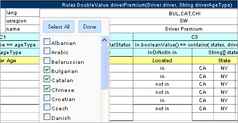

# OpenL Tablets BRMS WebStudio User Guide

```
Release 5.26
OpenL Tablets Documentation is licensed under a Creative Commons Attribution 3.0 United States License. 
```

## Preface

```
This preface is an introduction to the OpenL Tablets WebStudio User Guide. The following topics are included in this preface:
```

-   [Audience](#audience)
-   [Related Information](#_Related_Information)
-   [Typographic Conventions](#typographic-conventions)

### Audience

This guide is intended for the following users:

| User type      | Purpose                                                                     | Required knowledge                                 |
|----------------|-----------------------------------------------------------------------------|----------------------------------------------------|
| Business users | View and modify company business rules stored in tables.                    | Knowledge of decision tables is required.          |
| Developers     | Manage technical details of rule tables. Organize and deploy rule projects. | Knowledge of OpenL Tablets technology is required. |

### Related Information

OpenL Tablets WebStudio is a tool of the OpenL Tablets product. For information on OpenL Tablets Rules, see [OpenL Tablets Reference Guide](https://openldocs.readthedocs.io/en/latest/documentation/guides/reference_guide/).

### Typographic Conventions

The following styles and conventions are used in this guide:

| Convention                 | Description                                                                                                                                                                                                                                                                                                                         |
|----------------------------|-------------------------------------------------------------------------------------------------------------------------------------------------------------------------------------------------------------------------------------------------------------------------------------------------------------------------------------|
| **Bold**                   | Represents user interface items such as check boxes, command buttons, dialog boxes, drop-down list values, field names, menu commands, <br/>menus, option buttons, perspectives, tabs, tooltip labels, tree elements, views, and windows. <br/>Represents keys, such as **F9** or **CTRL+A**. <br/>Represents a term the first time it is defined. |
| `Courier`                  | Represents file and directory names, code, system messages, and command-line commands.                                                                                                                                                                                                                                              |
| Select **File \> Save As** | Represents a command to perform, such as opening the **File** menu and selecting **Save As**.                                                                                                                                                                                                                                       |
| *Italic*                   | Represents any information to be entered in a field. Represents documentation titles.                                                                                                                                                                                                                                               |
| \< \>                      | Represents placeholder values to be substituted with user specific values.                                                                                                                                                                                                                                                          |
| Hyperlink                  | Represents a hyperlink. Clicking a hyperlink displays the information topic or external source.                                                                                                                                                                                                                                     |
| **[name of guide]**        | Reference to another guide that contains additional information on a specific feature.                                                                                                                                                                                                                                              |

## Introducing OpenL Tablets WebStudio

This chapter introduces main OpenL Tablets WebStudio concepts. The following topics are included in this chapter:

-   [What Is OpenL Tablets WebStudio?](#what-is-openl-tablets-webstudio)
-   [Working with Projects in OpenL Tablets WebStudio](#working-with-projects-in-openl-tablets-webstudio)
-   [OpenL Tablets WebStudio Components](#openl-tablets-webstudio-components)
-   [Security Overview](#security-overview)

### What Is OpenL Tablets WebStudio?

**OpenL Tablets WebStudio** is a web application employed by business users and developers to view, edit, and manage business rules and rule projects created using OpenL Tablets technology. For more information on OpenL Tablets, see [OpenL Tablets Reference Guide](https://openldocs.readthedocs.io/en/latest/documentation/guides/reference_guide/).

By using OpenL Tablets WebStudio, users can modify rules directly in a web browser without installing additional tools. OpenL Tablets WebStudio provides an advanced functionality for creating and modifying rules, viewing errors, and executing tests.

### Working with Projects in OpenL Tablets WebStudio

OpenL Tablets WebStudio is intended for a multi-user environment. It provides a centralized storage of rule projects called **Design repository**. Design repository is stored on the OpenL Tablets WebStudio server and can be accessed by any user. However, users cannot modify projects directly in Design repository. Instead, to make modifications to a project, users must execute the following procedure:

| Step | Action            | Description                                                                                                                                                                                                                                                                                                                                                                                                                                                                                                                 |
|------|-------------------|-----------------------------------------------------------------------------------------------------------------------------------------------------------------------------------------------------------------------------------------------------------------------------------------------------------------------------------------------------------------------------------------------------------------------------------------------------------------------------------------------------------------------------|
| 1    | Open a project.   | When a project is opened, its status is set to **No Changes**, and a copy of it is created in the user’s workspace, a specific location on the OpenL Tablets WebStudio server. Work copies of projects made editable by a particular user are stored there. Users can only access their personal workspaces.                                                                                                                                                                                                                |
| 2    | Modify a project. | After any modification of a project, its status is set to **In Editing**. A project in the **In Editing** status is locked in Design repository to avoid loss of information. Other users cannot edit it until the project is saved. Other users can only open the project in read-only mode, with the **No Changes** status. Modifications to a project in the **In** **Editing** status are performed on the working copy stored in the user's workspace. Modifications do not become immediately visible to other users. |
| 3    | Save a project.   | Saving a project copies the modified copy of the project from the user's workspace to Design repository. A new revision of the project is created in Design repository. A project can be restored to any of its previous revisions. In this case, its status is set to **Viewing Revision.** From this moment, changes are visible to other users and the project is available for editing.                                                                                                                                 |

Closing a project deletes it from the user's workspace without saving changes and does not affect the revision in Design repository. Closed projects can be browsed in repository editor but are not available in Rules Editor.

The following diagram illustrates general rules project lifecycle. This is a simplified schema of rules development workflow where activities as opening, opening for editing, closing, deleting, and erasing the current project or deploying configuration are omitted.


*Rules project development workflow*

Development of rules starts with creating a new project that will contain the rules. If the project already exists, it must be opened for editing. Then rules are created or updated and properly tested. After rules are completed and all tests are passed, a user saves the project. At this point, the updated revision of the project is saved to Design repository and applied changes of the project become available for viewing and editing by other users. If no more changes to the project are planned in the nearest future, a user can close the project.

Saved project revision is used to create deploy configuration. Several projects can be included in the same deploy configuration. Deploy configurations are used to deploy updates to the production environment.

If the project is not required any more, it can be deleted.

### OpenL Tablets WebStudio Components

OpenL Tablets WebStudio consists of the following main components:

| Component                        | Description                                                                                                                                                                                                                                                                                                                                                                                                                                                                                                                                                                                                                                                                                                                                                                                                                                      |
|----------------------------------|--------------------------------------------------------------------------------------------------------------------------------------------------------------------------------------------------------------------------------------------------------------------------------------------------------------------------------------------------------------------------------------------------------------------------------------------------------------------------------------------------------------------------------------------------------------------------------------------------------------------------------------------------------------------------------------------------------------------------------------------------------------------------------------------------------------------------------------------------|
| Rules Editor                     | Graphic user interface running in a web browser allowing users to browse rule modules, modify table data, and run tests. Rule project configurations are browsed and updated there as well. Rules Editor is the default user interface displayed when a user opens OpenL Tablets WebStudio. Rules Editor does not display all rule module files but provides a logical view of rules stored in a module. This view is convenient for users who modify business rules. Rules Editor displays only modules available in projects stored in the user's workspace. To retrieve a project to the user's workspace, open the project as described in [Working with Projects in OpenL Tablets WebStudio](#working-with-projects-in-openl-tablets-webstudio). For more information on using Rules Editor, see [Using Rules Editor](#using-rules-editor). |
| Repository editor                | Graphic user interface running in a web browser allowing users to browse and manage projects in Design repository. Unlike Rules Editor, repository editor displays physical contents of rule projects. Users can easily switch between Rules Editor and repository editor in user interface. Repository editor provides the following main functions: uploading projects from the file system to Design repository editing, saving, opening, and closing projects modifying project structure and properties managing project revisions copying and deleting projects in Design repository managing and tracing deploy configurations For more information on using repository editor, see [Using Repository Editor](#using-repository-editor).                                                                                                  |
| Design repository                | Centralized storage of rule projects accessible by all OpenL Tablets WebStudio users. Projects uploaded to Design repository are visible to other users. Design repository creates a separate project revision each time a project is saved. Any project revision can be opened.                                                                                                                                                                                                                                                                                                                                                                                                                                                                                                                                                                 |
| Deploy configurations repository | Centralized storage of final rule projects to be delivered to the production environment where solution applications use them. Projects can be deployed to deployment repository from Design repository using deploy configurations. **Deploy configuration** is a specific OpenL Tablets WebStudio project type. It identifies rule projects and project revisions to be deployed to deployment repository. Deploy configurations are saved and versioned so that developers can identify which specific rule project revisions are deployed.                                                                                                                                                                                                                                                                                                   |
| Deployment repositories          | Production storages of deployed rule projects where solution applications use them.                                                                                                                                                                                                                                                                                                                                                                                                                                                                                                                                                                                                                                                                                                                                                              |
| User workspace                   | Project storage on the server containing projects edited by users. Each user has a personal workspace unavailable to other users.                                                                                                                                                                                                                                                                                                                                                                                                                                                                                                                                                                                                                                                                                                                |

### Security Overview

OpenL Tablets WebStudio supports the following user modes:

| Mode             | Description                                                                                                                                                                                                                                                                                                                                                                                                                                                                                                                                                                                                                                                                                                                                                                         |
|------------------|-------------------------------------------------------------------------------------------------------------------------------------------------------------------------------------------------------------------------------------------------------------------------------------------------------------------------------------------------------------------------------------------------------------------------------------------------------------------------------------------------------------------------------------------------------------------------------------------------------------------------------------------------------------------------------------------------------------------------------------------------------------------------------------|
| Demo mode        | This is a multi user mode with the list of users predefined in the database. All changes in the database will be lost after the application restart. The User’s projects will be located in the `user-workspace\<user name>` folder.                                                                                                                                                                                                                                                                                                                                                                                                                                                                                                                                                |
| Single user mode | In this mode, only one user who is currently logged in on the computer can work in OpenL Tablets WebStudio. This mode is selected when OpenL Tablets WebStudio is installed on the local machine. All user projects are located in the root of the `user-workspace` directory. Single user mode is set by default and does not require additional settings, including logon to the system. Moreover, the system works faster in this mode but neither user management nor access control is provided.                                                                                                                                                                                                                                                                               |
| Multi user mode  | This mode enables multiple users to work in OpenL Tablets WebStudio and supports a security mechanism restricting access to certain product functions based on user access rights. Each OpenL Tablets WebStudio user is identified by a unique name. When a user opens OpenL Tablets WebStudio in a web browser, he or she must log into the system. Users can have varied levels of access in OpenL Tablets WebStudio. For example, system administrators usually have full access to all OpenL Tablets WebStudio functions, whereas other users may only have access rights to view or modify business rules. WebStudio is used to authenticate and manage user credentials/permissions. In this mode, user’s projects are located in the `user-workspace\<user name>` directory. |
| Active Directory | In this mode, multiple users can run OpenL Tablets WebStudio using their unique user names. The User’s projects will be located in the `user-workspace\<user name>` directory. Active Directory will be used to authenticate and manage user credentials. A place where user permissions will be managed can be WebStudio or Active Directory.                                                                                                                                                                                                                                                                                                                                                                                                                                      |
| SSO: CAS         | In this mode, multiple users can run OpenL Tablets WebStudio using their unique user names. The User’s projects will be located in the `user-workspace\<user name>` directory. CAS (Central Authentication Service) server will be used to authenticate and manage user credentials. A place where user permissions will be managed can be WebStudio or SSO Identity provider.                                                                                                                                                                                                                                                                                                                                                                                                      |
| SSO: SAML        | In this mode, multiple users can run OpenL Tablets WebStudio using their unique user names. The User’s projects will be located in the `user-workspace\<user name>` directory. SAML (Security Assertion Markup Language) supporting Identity Provider server will be used to authenticate and manage user credentials. A place where user permissions will be managed can be OpenL Tablets WebStudio or SSO Identity provider.                                                                                                                                                                                                                                                                                                                                                      |
| SSO:OAuth2       | Multiple users can run OpenL Tablets WebStudio using their unique user names. User projects will be located in the `user-workspace\<user name>` directory. OAuth2 (Open Authorization) supporting the identity provider server is used to authenticate and manage user credentials.                                                                                                                                                                                                                                                                                                                                                                                                                                                                                                 |

## Getting Started

This chapter explains logging into OpenL Tablets WebStudio and briefly introduces the user interface. The following topics are included in this chapter:

-   [Signing In to OpenL Tablets WebStudio](#signing-in-to-openl-tablets-webstudio)
-   [Modifying User Profile](#modifying-user-profile)
-   [Displaying the OpenL Tablets WebStudio Help](#displaying-the-openl-tablets-webstudio-help)
-   [Signing Out of OpenL Tablets WebStudio](#signing-out-of-openl-tablets-webstudio)
-   [Introducing Rules Editor](#introducing-rules-editor)
-   [Introducing Repository Editor](#introducing-repository-editor)

### Signing In to OpenL Tablets WebStudio

To sign in to OpenL Tablets WebStudio, proceed as follows:

1.  In the web browser address bar, enter the OpenL Tablets WebStudio URL provided by the system administrator.

The OpenL Tablets WebStudio URL has the following pattern:

`http://<server>:<port>/webstudio`

In the single user mode, users are automatically signed in using the DEFAULT account. In the multi-user mode, the following form appears.


*Login window*

1.  Enter the user name and password provided by the system administrator and click **Sign in**.

For more information on OpenL Tablets WebStudio UI, see [Introducing Rules Editor](#introducing-rules-editor) and [Introducing Repository Editor](#introducing-repository-editor). For more information on the single and multi-user modes, see [Security Overview](#security-overview).

### Modifying User Profile

OpenL Tablets WebStudio provides a drop-down dialog located in the top-right corner of the application, under the user name, for updating user profile information, changing the password, and editing user settings. All data is stored in the user profile and includes **User details** and **User settings** sections.


*Opening the user profile window*

This section describes how to modify user profile information and includes the following topics:

-   [Modifying User Details](#modifying-user-details)
-   [Synchronizing with a Third Party Service](#synchronizing-with-a-third-party-service)
-   [Modifying User Settings](#modifying-user-settings)

#### Modifying User Details

To manage user details, proceed as follows:

1.  In OpenL Tablets WebStudio, in the top-right corner of the window, click an arrow icon next to the username.
2.  In the actions list, click **User Details**.


*Viewing user details*

1.  To update user’s first or last name, display name, or email, modify values as required.

If user data is retrieved from a third party system, such as Active Directory, these fields cannot be edited.

1.  To update the password, in the **Change Password** section, enter the current and new password values.
2.  Click **Save.**

#### Synchronizing with a Third Party Service

When users are managed by a third party service, such as Active Directory, it is necessary to regularly check that the data in the OpenL Tablets WebStudio user storage is synchronized with the data defined in the third party service. Data is compared periodically or on specific events and if necessary, must be synchronized.

The following user information requires synchronization:

-   first name
-   last name
-   display name
-   email address

The following general guidelines apply:

-   If the field value is synchronized with the third party service, the field becomes locked from editing.
-   If the field is added locally and not synchronized, the field value remains available for editing.

The following synchronization rules apply:

-   If the third party email address, first name, or last name value is empty or unavailable, the current email address, first name, or last name is not emptied.
-   If the third party email address, first name, last name, or display name is not empty, the current values for local user email address, first name, last name, or display name is changed to the value received from the third party.
-   If the display name value is empty or unavailable, the local display name is not modified.

An exception is the situation when the first or last name was changed.

-   If the display name was set to “first name + space + last name”, it is updated to the new “first name + space + last name”.
-   If the display name was set to the “last name + space + first name”, it is updated to the new “last name + space + first name”.
-   If the display name is set to **Other** and its value in OpenL Tablets WebStudio is not empty, and in the third party service, it is empty, upon synchronization, the display name set locally is not changed.
-   If the display name value is empty in OpenL Tablets WebStudio and the third party service, but the first name and last name values are not empty, the display name is set to “first name + space + last name”, regardless of the pattern specified upon local user creation.

If this user was not created as a local user previously but instead, created upon the external user logon, the display name value stays empty.

#### Modifying User Settings

To manage user settings, proceed as follows:

1.  In OpenL Tablets WebStudio, in the top-right corner of the window, click an arrow icon next to the username.
2.  In the actions list, click **User settings**.


*Viewing user settings*

1.  In the **Table Settings** section, identify whether table header and MS Excel formulas must be displayed.
2.  In the **Testing settings**, select values for displaying rule test results.

By default, all test results are displayed with five test tables, or unit tests, and compound result is not displayed. For more information on testing settings, see [Running Unit Tests](#running-unit-tests).

1.  In the **Trace Settings,** specify whether numbers must be displayed without formatting.

### Displaying the OpenL Tablets WebStudio Help

To display the OpenL Tablets WebStudio help topics, in OpenL Tablets WebStudio, in the top-right corner of the window, click an arrow icon next to the username and select **Help**.

### Signing Out of OpenL Tablets WebStudio

To sign out of OpenL Tablets WebStudio, proceed as follows:

1.  In OpenL Tablets WebStudio, in the top-right corner of the window, click an arrow icon next to the username.
2.  In the actions list, click **Sign out**.

### Introducing Rules Editor

This section briefly introduces Rules Editor and includes the following topics:

-   [Rules Editor Overview](#rules-editor-overview)
-   [View Modes](#view-modes)

For more information on tasks that can be performed in Rules Editor, see [Using Rules Editor](#using-rules-editor).

#### Rules Editor Overview

**Rules Editor** enables users to browse rule modules and modify table data. A default editor is displayed when a user opens a table in a module.


*OpenL Tablets WebStudio Rules Editor*

Rules Editor displays one module at a time. To switch between modules, select a module in the **Projects** tree or use breadcrumb navigation for quick switching between projects or modules of the current project.


*Rules Editor breadcrumb navigation*

One rule project can contain several modules.

The following table describes Rules Editor organization:

| Pane                     | Description                                                                                                                                        |
|--------------------------|----------------------------------------------------------------------------------------------------------------------------------------------------|
| `Left pane`              | Displays the module tree providing a list of elements in the currently displayed rule module.                                                      |
| Middle pane              | Displays contents of the table selected in the left pane and provides controls for modifying table data, running tests, and checking test results. |
| Right pane               | Displays properties of the currently displayed table.                                                                                              |
| Upper part of the window | Contains toolbars with controls as described further in this section.                                                                              |

The following table describes the Rules Editor toolbar controls:

| Control                                                                                                                           | Description                                                                                                                                                                                                                                                                                                            |
|-----------------------------------------------------------------------------------------------------------------------------------|------------------------------------------------------------------------------------------------------------------------------------------------------------------------------------------------------------------------------------------------------------------------------------------------------------------------|
|                                                                   | The following table describes the available options: - Revisions: displays project revisions. - Local Changes: opens a page for reverting module changes. - Table Dependencies: opens a graph displaying dependencies among tables of the module. - Compare Excel files: initiates a dialog for comparing Excel files. |
|                                                                   | Runs a simple search. For more information on performing searches, see [Performing a Search](#performing-a-search).                                                                                                                                                                                                    |
|                                                                   | Refreshes OpenL Tablets WebStudio with the latest changes in Excel files.                                                                                                                                                                                                                                              |
|                                                                   | Initiates the table creation wizard.                                                                                                                                                                                                                                                                                   |
|                                                                   | Displays recently viewed tables instead of the module tree.                                                                                                                                                                                                                                                            |
|                                                                   | Returns to the module tree view.                                                                                                                                                                                                                                                                                       |
|                                                                   | Hides comment tables and dispatcher tables generated automatically when a rule table is overloaded by business dimension property.                                                                                                                                                                                     |
|                                                                   | Deploys the project. For more information on project deployment, see [Deploying Projects](#deploying-projects).                                                                                                                                                                                                        |
|                                                                   | Synchronizes and merges the updates made in the specified branches.                                                                                                                                                                                                                                                    |
|                                                                   | Copies the project. For more information on project copying, see [Copying a Project](#copying-a-project).                                                                                                                                                                                                              |
|                                                                   | Saves the changes and sets the project status to **No Changes**.                                                                                                                                                                                                                                                       |
|   | Updates the current module or project with uploaded file or zip file. Exports the current version of the module or project.                                                                                                                                                                                            |
|                                                                   | Switches user interface to repository editor. For more information on repository editor, see [Introducing Repository Editor](#introducing-repository-editor).                                                                                                                                                          |
|                                                                   | Switches user interface to Rules Editor. For more information on Rules Editor, see [Using Rules Editor](#using-rules-editor).                                                                                                                                                                                          |
|                                                                   | Switches user interface to the **Administration** mode. For more information on administrative functions, see [Using Administration Tools](#using-administration-tools).                                                                                                                                               |

#### View Modes

OpenL Tablets WebStudio provides different modes for displaying rule elements. In this guide, modes are contingently divided into a **simple view** and **extended view**.

When a table is opened in a simple view, OpenL Tablets WebStudio hides various technical table details, such as table header and MS Excel formulas. An example of a table opened in a simple view is as follows.


*A rule table in a simple view*

In the extended view, all table structure is displayed. An example of a table opened in an extended view is as follows.


*A rule table in an extended view*

To switch between views, use the **Show Header** and **Show Formula** options in **User settings**.

Rule tables can be organized, or sorted, and displayed in the module tree in different way depending on the selected value.


*Modes for sorting tables in the module tree*

By default, tables are sorted by type.

| Mode                     | Description                                                                                                                                                                                                                                                                                                                                                                                                             |
|--------------------------|-------------------------------------------------------------------------------------------------------------------------------------------------------------------------------------------------------------------------------------------------------------------------------------------------------------------------------------------------------------------------------------------------------------------------|
| **By Category**          | The tree structure is rather logical than physical. Rule tables are organized into categories based on the **Category** table property or, if the property is not defined, based on the Excel table sheet names. This view is **simple.** An example of a module tree sorted by the category parameter is as follows:  *Module tree sorted by category* |
| **By Category Detailed** | The **By Category Detailed** view displays modules sorted by the first value of the **Category** property. In the following example, the same module tree is sorted by **Category Detailed** and, for example, **Test \> Auto** category is displayed in the **Test** node and **Auto** sub-node:  *Module tree sorted by Category Detailed*            |
| **By Category Inversed** | The following example provides the module tree sorted by **Category Inversed** where the modules are sorted by the second value of the **Category** property:  *Module tree sorted by Category Inversed*                                                                                                                                                |

**Note:** If the scope in a **Properties** table is defined as **Module**, in the **By Category** view, this table is displayed in the **Module Properties** sub-node as in the last example. If the scope is defined as **Category**, the table is displayed in the Category **Properties** sub-node.

The two following modes display a project in a way convenient to experienced users, with module tree elements organized by physical structure rather than logically, in an **extended** view.

| Mode        | Description                                                                                                                                                                            |
|-------------|----------------------------------------------------------------------------------------------------------------------------------------------------------------------------------------|
| **By Type** | An example of a module tree displayed in extended view and sorted by type is as follows:  *Module tree sorted by type* |
| **By File** | The following module tree is sorted by file and by spreadsheets within the file:  *Module tree sorted by file*         |

### Introducing Repository Editor

**Repository editor** provides controls for browsing and managing Design repository. A user can switch to repository editor by clicking the **Repository** control. Repository editor resembles the following:


*OpenL Tablets WebStudio repository editor*

The following table describes repository editor organization:

| Pane        | Description                                                                                                                                                                                                                                                                                                                                                                                                                                                                                                                                      |
|-------------|--------------------------------------------------------------------------------------------------------------------------------------------------------------------------------------------------------------------------------------------------------------------------------------------------------------------------------------------------------------------------------------------------------------------------------------------------------------------------------------------------------------------------------------------------|
| `Left pane` | Contains a tree of projects stored in Design repository and user's workspace. Unlike Rules Editor, repository editor displays physical project contents in terms of files and folders.                                                                                                                                                                                                                                                                                                                                                           |
| Middle pane | Displays content for the element selected in the tree. For each project, the following actions are available: copying a project  archiving a project  closing a project  opening a project  deploying a project  |

A user can switch to Rules Editor by clicking the **Rules Editor** control.

For more information on tasks that can be performed in repository editor, see [Using Repository Editor](#using-repository-editor).

## Using Rules Editor

This chapter describes basic tasks that can be performed in Rules Editor. For more information on Rules Editor, see [Introducing Rules Editor](#_Introducing_Rules_Editor).

The following topics are included in this chapter:

-   [Filtering Projects](#filtering-projects)
-   [Viewing a Project](#viewing-a-project)
-   [Viewing a Module](#viewing-a-module)
-   [Managing Projects and Modules](#managing-projects-and-modules)
-   [Defining Project Dependencies](#defining-project-dependencies)
-   [Viewing Tables](#viewing-tables)
-   [Modifying Tables](#modifying-tables)
-   [Referring to Tables](#referring-to-tables)
-   [Managing Range Data Types](#managing-range-data-types)
-   [Creating Tables by Copying](#creating-tables-by-copying)
-   [Performing a Search](#performing-a-search)
-   [Creating Tables](#creating-tables)
-   [Comparing Excel Files](#comparing-excel-files)
-   [Viewing and Editing Project-Related OpenAPI Details](#viewing-and-editing-project-related-openapi-details)
-   [Reconciling an OpenAPI Project](#reconciling-an-openapi-project)

### Filtering Projects

To limit a list of projects displayed in the **Projects** list, start typing a project name in the field located above the list of projects.


*Filtering projects by Name*

To get a full list of projects, delete filter text value in the field.

### Viewing a Project

Rules Editor allows a user to work with one project at a time. To select a project, in the **Projects** tree, select the blue hyperlink of the required project name. The project page with general information about the project and configuration details appears in the middle pane of the editor.


*A project page in Rules Editor*

If a particular project is not available, it must be opened as described in [Opening a Project](#_Opening_a_Project_1).

### Viewing a Module

Rules Editor allows a user to work with one module at a time. To select a module, in the **Projects** tree, select the black hyperlink of the module name. The following module information is displayed:

-   tree in the left pane displaying module tables
-   general module information displayed in the middle pane, including project and module names, associated Excel file, number of tables, and module dependencies

If a particular module is not available, the project in which it is defined must be opened as described in [Opening a Project](#opening-a-project).

By default, a project is opened in the multi-module mode. This is a common production mode. In the multi-module mode, all modules of the current project with all their dependencies are displayed, that is, modules of projects defined as the project dependencies.

For more information on project and module dependencies, see the *Project and Module dependencies* section in [OpenL Tablets Reference Guide](https://openldocs.readthedocs.io/en/latest/documentation/guides/reference_guide/).

The first opened module page is displayed right after the module is loaded, while loading of the whole project continues in the background. The loading progress bar is displayed in the **Problems** section. Errors and warnings are displayed dynamically while more modules are compiled.


*Loading progress bar*

If a module is modified during loading, this module is re-compiled and project loading continues. When the loading is complete, the progress bar is displayed for ten more seconds and then disappears.

The loading progress bar is not displayed for newly opened projects if a project has only one module or multiple small modules which loading takes less than one second. The loading progress bar is also not displayed if the project is already opened and fully compiled and the following actions happen:

-   A page is refreshed using the browser refresh button.
-   A user leaves the project by switching to the main Editor or Repository page and then returns to the project without opening other projects in the meantime.
-   A user switches between modules of the same project.

If a user clicks the refresh button in OpenL Tablets WebStudio, loading restarts and progress bar appears again. While loading in process, the **Run, Trace, Test,** and **Benchmark** actions work only for currently opened module. That is why the **Within Current Module Only** check box is selected and cannot be edited in the menu of these actions while loading is in progress.

When loading is completed, the **Within Current Module Only** check box is cleared and becomes editable.

### Managing Projects and Modules

This section explains the following tasks that can be performed on projects in Rules Editor:

-   [Editing and Saving a Project](#editing-and-saving-a-project)
-   [Saving a Project for Backward Compatibility](#saving-a-project-for-backward-compatibility)
-   [Updating and Exporting a Project](#updating-and-exporting-a-project)
-   [Copying a Project](#copying-a-project)
-   [Exporting, Updating, and Editing a Module](#exporting-updating-and-editing-a-module)
-   [Comparing and Reverting Module Changes] (#comparing-and-reverting-module-changes)
-   [Copying a Module](#copying-a-module)

#### Editing and Saving a Project

A project can be opened for editing and saved directly in Rules Editor.

1.  To save the edited project, click **Save** .

    **Note:** If a project is in the **Local** status, this option is not available in Rules Editor.

2.  To modify the project in the **Project** page, modify the values as described in the following table:

| Project details                                                                                                                               | Available actions                                                                                                                                                                                                                                                                                                                                                                                                                                                                                                                                                                                                                                                                                                                                        |
|-----------------------------------------------------------------------------------------------------------------------------------------------|----------------------------------------------------------------------------------------------------------------------------------------------------------------------------------------------------------------------------------------------------------------------------------------------------------------------------------------------------------------------------------------------------------------------------------------------------------------------------------------------------------------------------------------------------------------------------------------------------------------------------------------------------------------------------------------------------------------------------------------------------------|
| General project information and configuration, such as OpenL version compatibility, description, project name, and custom file name processor | Put the mouse cursor over the project name and click **Edit**  . For more information on OpenL version compatibility, see [Saving a Project for Backward Compatibility](#saving-a-project-for-backward-compatibility). Project name can be edited only for projects in a non-flat Git repository. The project name will be changed in OpenL Tablets WebStudio only, while the folder name remains unchanged. For more information on properties pattern for the file name, see the **Properties Defined in the File Name** section of [OpenL Tablets Reference Guide](https://openldocs.readthedocs.io/en/latest/documentation/guides/reference_guide/). |
| Project sources                                                                                                                               | Put the mouse cursor over the **Sources** label and click **Manage Sources**  .                                                                                                                                                                                                                                                                                                                                                                                                                                                                                                                                                                                                          |
| Modules configuration                                                                                                                         | Put the mouse cursor over the **Modules** label or a particular module name and click **Add Module**  or **Edit Module**  or **Remove Module** .                                                                                                                                                                                                                                                                                                                                                                                                         |
| Project dependencies                                                                                                                          | Manage dependencies as described in [Defining Project Dependencies](#defining-project-dependencies).                                                                                                                                                                                                                                                                                                                                                                                                                                                                                                                                                                                                                                                     |

All changes are saved in the project `rules.xml` file. For more information on this XML file, see the [OpenL Tablets Developers Guide](https://openldocs.readthedocs.io/en/latest/documentation/guides/developer_guide).

#### Saving a Project for Backward Compatibility

For backward compatibility, a project can be saved in earlier OpenL versions, for example, 5.11.0 or 5.12.0.

It is important that the structure of `rules.xml` and `rules-deploy.xml` is changed after saving a project in a previous OpenL version, and may result, for example, in disappeared UI fragments.


*Selecting an OpenL Tablets version for creating a backward compatible project version*

#### Updating and Exporting a Project

To update or export a project, proceed as follows:

1.  To update a project directly in Rules Editor, in the top line menu, click **Update** and make the necessary changes.

The **Update** button is available for projects in the **In Editing** status.

1.  To export the project to the user’s local machine, for a project, in the top line menu, click **Export** and select a project revision.

The default project version for export is the one that a user has currently open in Rules Editor. If it contains unsaved changes, it is marked as **In Editing,** otherwise, it is called **Viewing.**

Exported project is downloaded as a `.zip` archive.


*Importing and updating the project from a .zip file*

#### Copying a Project

To create a copy of a project, proceed as follows:

1.  In the top line menu, click **Copy**.
2.  In the window that appears, enter the new project name.
3.  Modify **Comment** if needed.
4.  When you need to copy a project with revisions, select the **Copy old revisions** check box and provide the desired number of revisions in the **Revisions to copy** field.
5.  Click **Copy.**

The new project appears in the project list.


*Copying a project*

#### Exporting, Updating, and Editing a Module

A user can export, update, or edit a module directly in Rules Editor. Proceed as follows:

1.  To upload a changed module file, for a module, in the top line menu, click **Upload**.
2.  To export the module to the user’s local machine, for a module, in the top line menu, click **Export** and select a module revision.

The default module version for export is the one that a user has currently open in Rules Editor. If it contains unsaved changes, it is marked as **In Editing,** otherwise, it is called **Viewing**.

1.  To modify module configuration, such as module name, path, and included or excluded methods, in the **Module** page place the mouse cursor over the module name and click **Edit** .


*Initiating module editing*


*Editing module information*

1.  To save the changes, click **Save** .

#### Comparing and Reverting Module Changes

OpenL Tablets WebStudio allows comparing module versions and rolling back module changes against the specific date.

To compare module versions, proceed as follows:

1.  In the **Projects** tree, select the module.
2.  In the top line menu, select **More** **\>** **Local** **Changes**.

The **Local** **Changes** page appears displaying all module versions, with the latest versions on the top.


*Displaying the Changes window*

When a project is modified, upon clicking the **Save** icon , a temporary version of the module is created, and it appears in the list of local changes. When project update is complete, clicking **Save** removes all temporary versions from Local Changes, and a new version is added to the list of revisions.


*Clicking Save to complete project update and save changes as a revision version*

1.  To compare the changes, select check boxes for two required versions and click **Compare**.


*Comparing module versions*

The system displays the module in a separate browser window where changed tables are marked as displayed in the following example.


*Tables with changes*

1.  To view the changes, click the required table.

The result of the comparison is displayed in the bottom of the window.


*The result of the module version comparison*

1.  To revert module changes, for the required module version, click the **Restore** link and confirm the changes.

When **Restore** is clicked, the corresponding changes are restored but this action is not added to the history as a change.

#### Copying a Module

OpenL Tablets WebStudio allows creating a copy of the existing module, in Editor, in either **Project** page, or in the **Module** page. The following topics are included in this section:

-   [Copying a Simple Module](#copying-a-simple-module)
-   [Copying a Module Defined Using the File Path Pattern](#copying-a-module-defined-using-the-file-path-pattern)

##### Copying a Simple Module

To create a copy of a module, proceed as follows:

1.  Do one of the following:
-   To create a copy of a module using the **Project** page, in the project tree, select a project which module must be copied, in the modules list, put the mouse cursor over the selected module name, and click **Copy Module** .
-   To create a copy of a module using the **Module** page, in the project tree, select a module to be copied, put the mouse cursor over the module name, and click **Copy Module** .
1.  In the window that appears, enter the new module name.

When the new module name is entered, the **Copy** button becomes enabled.

1.  Optionally, edit the **New File Name** field value.

The file name can differ from the module name.

1.  Optionally, to copy the module to the specific folder, in the **New File Name** field, enter the file name and its location.

The original path cannot be modified other than by entering the specific path in the **New File Name** field. For example, if the original module is located in `folder1`, the new module will be copied to `folder1`. `Folder1` cannot be changed, but a user can define a new file name, such as `folder2/Bank Rating ver2.xlsx,` and then the new module will be created in `folder1/folder2/Bank Rating ver2.xlsx`.

1.  Click **Copy**.

A new simple module is displayed in the modules list.


*Creating a copy of a module*

##### Copying a Module Defined Using the File Path Pattern

If the module is defined using **File Path Pattern**, to copy such module, proceed as follows:

1.  Do one of the following:
-   To create a copy of a module using the **Project** page, put the mouse cursor over multiple modules, click **Copy Module** , in the window that appears, click **Select module,** and in the **File Path** drop-down list, select the name of the module to copy.
-   To create a copy of a module using the **Module** page, in the project tree, select a module to copy, put the mouse cursor over the module name, and click **Copy Module** .
1.  Click **Select module** and in the **File Path** drop-down list, select the name of the module to copy.
2.  Enter the new module name.
3.  Click **Copy**.

The new module is displayed in the modules list.


*Copying a module with the defined file path and properties patterns*

If the new module name does not match the properties pattern for the file name, no business dimension properties will be applied to the rules inside the module.

### Defining Project Dependencies

A project dependency can be defined when a particular rule project, or **root project**, depends on contents of another project, or **dependency project**. Project dependencies are checked when projects are deployed to the deployment repository. OpenL Tablets WebStudio displays warning messages when a user deploys projects with conflicting dependencies.

To define a dependency on another project, proceed as follows:

1.  In Rules Editor, in the project tree, select a project name.
2.  If the project is not editable, make it editable as described in [Editing and Saving a Project](#editing-and-saving-a-project).
3.  Put the mouse cursor over the **Dependencies** label and click **Manage Dependencies**  .
4.  In the window that appears, update information as required and click **Save**.


*Managing project dependencies*

If the **All Modules** option is selected in the multi-module mode, tables of all modules of the dependency project are accessible from any module of the root project.

If the **All Modules** option is cleared or the single module mode is selected, the root project module has access to the particular module of the dependency project only if an appropriate dependency is added in the **Environment** table of the root module.

**Note:** Module names of the root and dependency projects must be unique.

**Note:** Dependency projects must be available in Rules Editor to make dependency work.

For more information on project and module dependencies, see the **Project and Module dependencies** section in [OpenL Tablets Reference Guide](https://openldocs.readthedocs.io/en/latest/documentation/guides/reference_guide/).

### Viewing Tables

OpenL Tablets module tables are listed in the module tree. Table types are represented by different icons in Rules Editor. The following table describes table type icons:

| Icon                                                             | Table type                                                                           |
|------------------------------------------------------------------|--------------------------------------------------------------------------------------|
|  | Decision table.                                                                      |
|  | Decision table with unit tests.                                                      |
|  | Column match table.                                                                  |
|  | Column match table with unit tests.                                                  |
|  | Tbasic table.                                                                        |
|  | Tbasic table with unit tests.                                                        |
|  | Data table.                                                                          |
|  | Datatype table.                                                                      |
|  | Method table.                                                                        |
|  | Unit test table.                                                                     |
|  | Run method table.                                                                    |
|  | Environment table.                                                                   |
|  | Property table.                                                                      |
|  | Table not corresponding to any preceding types. Such tables are considered comments. |
|  | Spreadsheet table, Constants table.                                                  |

For more information on table types, see [OpenL Tablets Reference Guide](https://openldocs.readthedocs.io/en/latest/documentation/guides/reference_guide/). If a table contains an error, a small red cross is displayed in the corner of the icon.

To view contents of a particular table, in the module tree, select the table. The table is displayed in the middle pane. If the project is not in the **In Editing** status, the table can be viewed but cannot be modified.

### Modifying Tables

OpenL Tablets WebStudio provides embedded tools for modifying table data directly in a web browser. To modify a table, proceed as follows:

1.  In the module tree, select the required table.

The selected table is displayed in the middle pane in read mode.


*Table opened in OpenL Tablets WebStudio*

1.  To switch between simple and extended view, in **User settings**, select or clear the **Show Header** and **Show Formula** options as required.
2.  To switch the table to the edit mode, perform one of the following steps:
-   Above the table, click **Edit**.
-   Right-click anywhere in the table and click **Edit**.
-   Double click the cell to edit.

Alternatively, the file can be edited in Excel. In the local mode, the rule file is opened in Excel, and changes become available in OpenL Tablets WebStudio upon Excel file saving. In the remote mode or if a demo-policy file exists, clicking the **Open** button initiates file download. After editing the file locally, it can be uploaded back to the project in Rules Editor as described in [Exporting, Updating, and Editing a Module](#exporting-updating-and-editing-a-module) or via the repository.

The following table is switched to the edit mode:


*Table in the edit mode*

The edit mode provides the following functional buttons:

| Button                                                           | Description                                             |
|------------------------------------------------------------------|---------------------------------------------------------|
|  | Saves changes in table.                                 |
|  | Reverses last changes.                                  |
|  | Reapplies reversed changes.                             |
|  | Inserts a row.                                          |
|  | Deletes a row.                                          |
|  | Inserts a column.                                       |
|  | Deletes a column.                                       |
|  | Aligns text in currently selected cell with left edge.  |
|  | Centers text in currently selected cell.                |
|  | Aligns text in currently selected cell with right edge. |
|  | Make the text font **bold**.                            |
|  | Applies *italics* to the cell text.                     |
|  | Underlines the cell text.                               |
|  | Sets the fill color.                                    |
|  | Sets the font color.                                    |
|  | Decreases indent.                                       |
|  | Increases indent.                                       |

1.  To modify a cell value, double click it or press **Enter** while the cell is selected.
2.  To enter a formula in the cell, double click it, perform a right click, and select **Formula Editor.**

Now a user can enter formulas in the selected cell.

1.  To save changes, click **Save** .

If a table contains an error, the appropriate message is displayed.


*Example of an error in a table*

The arrow under the message allows viewing all stack trace for this error.


*Error stack trace example*

### Referring to Tables

OpenL Tablets WebStudio supports references from one table to another table. A referred table can be located in the same module where the first table resides, or in the different module of the same project.

Links to the following tables are allowed:

-   data table
-   datatype table
-   rule table types

Links to the rule tables are underlined and marked blue. When a mouse cursor is put over the link, a tooltip with method name and input parameters with types is displayed.


*A tooltip for the linked method to a decision table*

Links to the data and datatype tables are underlined with a dotted line and has an appropriate tooltip with description.


*Links to the datatype tables from the decision and datatype table*

All fields of the datatype tables are also linked and contain tooltips.


*A link to the field of the Corporate datatype table*

### Managing Range Data Types

OpenL Tablets WebStudio provides a special tool, **Range Editor**, for adding and editing range data types, such as IntRange and DoubleRange, in rule tables and test tables.

This section briefly introduces Range Editor and provides examples of its functionality.

The main Range Editor goal is to move to a single range format in OpenL rules, namely, the ‘..’ format. For more information on ranges on OpenL Tablets, see the **Range types in OpenL** section in [OpenL Tablets Reference Guide](https://openldocs.readthedocs.io/en/latest/documentation/guides/reference_guide/).

Consider the following principles while working with Range Editor:

-   The default range format is set to ‘..’ in OpenL Tablets WebStudio.
-   When a new range is created, the ‘..’ format is used.
-   When a range format other than ‘..’ is edited, if only range values are edited, the format remains the same.

If any editor control is used, for example, a check box or the **Done** button, the range format is set to ‘..’.

The following example displays the decision table with data represented as a range:


*Decision table with a range data type*

In this table, the **Hour** column contains hours with the IntRange Data type. All range sells are filled except for the last one. This example is used further in this section to demonstrate how Range Editor works.

The following controls are available in Range Editor:

-   **From** — indicates the left border of the range
-   **To** — indicates the right border of the range
-   **Include** — indicates whether the border is included in the range
-   **‘\>’** — indicates values greater than the specified border
-   **‘\<’** — indicates values smaller than the specified border
-   **‘=’** — indicates a constant
-   **‘-’** — indicates a range

To create a range, proceed as follows:

1.  Double click the cell to be edited.

For example, edit the cell containing 18-21. The table is extended by the pop-up window with a set of controls for editing the range.


*Creating a range in Range Editor*

1.  In the **From** field, enter the left border of the range, which is 22 for the example described in this section.
2.  In the **To** field, enter the right border of the range.

In this example, the **To** value must be 24, but an erroneous value 23 is entered for further editing of this border.

1.  Clear the **Include** check box.
2.  Click **Done** to complete.

The last cell in the **Hour** column is filled as follows:


*New range created in Range Editor*

1.  To modify the range in Range Editor, double click the cell with the [22-23) range.

The table resembles the following:


*Editing a range in Range Editor*

1.  Select the **To** field, set the right border to 24, and select **Include**.
2.  Click **Done** to save the work.

The range resembles the following:


*The range edited in Range Editor*

A range can also be modified using ‘\>’, ‘\<’ and ‘=’ controls as described in the beginning of this section.

### Creating Tables by Copying

A table can be created based on another table using one of the following methods:

-   [Copying the Existing Table](#copying-the-existing-table)
-   [Creating a New Version of the Table](#creating-a-new-version-of-the-table)
-   [Creating a Table as a New Business Dimension Version](#creating-a-table-as-a-new-business-dimension-version)

#### Copying the Existing Table

To create a table as a copy of the existing table, proceed as follows:

1.  In the module list, select a table to copy.
2.  Click the **Copy Table** icon .

The system displays the **Copy Table** form with **New Table** selected by default.


*Copying the existing table*

1.  If necessary, modify the **Name** field value.
2.  To change the workbook and worksheet where the copy must be saved, click the link in the **Save To** area and in the corresponding drop-down list, select the required module and category.
3.  To save the copied table in a new category, use the **New** option.
4.  Click **Copy** to save your changes.

The table appears in the module list.

#### Creating a New Version of the Table

To create a new version of the existing table, proceed as described in [Using Table Versioning](#using-table-versioning). In that case, dimensional properties of a new version are exactly the same as for the original one. OpenL Tablets allows creating an overloaded table from an existing one.

#### Creating a Table as a New Business Dimension Version

To create a table as a new business dimension version, proceed as follows:

1.  In the module list, select a table and click the **Copy Table** icon.
2.  In the **Copy as** list, select **New Business Dimension Version**.
3.  Specify business dimension properties as required.
4.  If necessary, modify the workbook and worksheet values in the **Save as** area.
5.  Click **Copy** to save the table.

### Performing a Search

OpenL Tablets WebStudio provides search functionality to look through all module tables data for a particular project. The following topics describe search modes in OpenL Tablets WebStudio:

-   [Performing a Simple Search](#performing-a-simple-search)
-   [Performing an Advanced Search](#performing-an-advanced-search)

#### Performing a Simple Search

In the **simple search** mode, the system looks for a particular word or phrase in all tables within the given module.

To perform a simple search, in the **Search** field, enter a word or phrase and press **Enter**.


*Starting a simple search*

OpenL Tablets WebStudio displays all tables containing the entered text. Above each table, there is the **Open Table in Excel** link redirecting to the Excel file containing the entered text. The **Edit Table** link opens the table in Rules Editor in the editing mode.


*Search results*

To search for any cell contents, right click the cell and in the context menu, select **Search**. The table is opened in the read mode.

#### Performing an Advanced Search

Advanced search allows specifying criteria to narrow the search through tables. To limit the search, specify the table type, text from the table header, and table properties as described further in this section.

1.  To launch an advanced search, click the arrow to the right of the search window.


*Initiating the advanced search*

1.  In the **Search** field on the top, select whether search must be performed within the current module, or within the project, or within the current project and its dependent projects.


*Specifying search area*

1.  In the filter form, click the **Table Types** field and select the required table type or select **Select All** to search in all table types.
2.  In the **Header contains** field, enter the word or phrase to search for.
3.  Expand the **Table Properties** list, select the required table property, and then click the **Add** button on the right.

The text field for entering the property name appears.

1.  Enter the property name.
2.  In the similar way, add as many table properties as required.
3.  To remove a property, click the cross icon to the right of the property.


*A filled form for advanced search*

1.  Click **Search** to run the search.

As a result, the system displays the tables matching the search criteria along with links to the relevant Excel files and the **Edit Table** links leading to the table editing page.


*Advanced search result*

### Creating Tables

OpenL Tablets WebStudio allows creating tables of the following types:

-   datatype table
-   vocabulary table
-   data table
-   test table
-   properties table
-   simple rules table

Tables are created via the wizard initiated by clicking the **Create Table** button . The wizard creates a table for the current module. The table is available for all included modules and modules linked by dependencies. For more information on dependencies, see the **Project and Module dependencies** section in [OpenL Tablets Reference Guide](https://openldocs.readthedocs.io/en/latest/documentation/guides/reference_guide/).

The following topics are included in this section:

-   [Creating a Datatype Table](#creating-a-datatype-table)
-   [Creating a Data Table](#creating-a-data-table)
-   [Creating a Test Table and Defining the ID Column for Test Cases](#creating-a-test-table-and-defining-the-id-column-for-test-cases)
-   [Creating a Simple Rules Table](#creating-a-simple-rules-table)

#### Creating a Datatype Table

To create a datatype table, proceed as follows:

1.  In OpenL Tablets WebStudio, click **Create Table**.
2.  In the list of table types, select **Datatype Table** and click **Next**.


*Creating a datatype table*

1.  Enter the data type name and if necessary, select the existing data type as a parent.

If a parent data type value is specified, the newly created data type will have access to all fields defined in the parent data type as described in the **Inheritance in Data types** section in [OpenL Tablets Reference Guide](https://openldocs.readthedocs.io/en/latest/documentation/guides/reference_guide/).

This option is unavailable if no custom data types are created in the module.


*Specifying the data type name and parent type*

1.  To define data type fields, click **Add parameter**, specify values as required, and then click **Next**.


*Defining data type fields*

1.  To indicate the new datatype table location, in the **Select destination** window, select an existing sheet, or in the **New** field, enter the new sheet name.

The **Module** value cannot be changed. All created tables go to the current module.


*Specifying table location*

1.  Click **Save** to complete table creation.

The datatype table is created and becomes available in OpenL Tablets WebStudio.

#### Creating a Data Table

Creating a data table resembles creating a datatype table described in [Creating a Datatype Table](#creating-a-datatype-table). Proceed as follows:

1.  In OpenL Tablets WebStudio, click **Create Table**.
2.  Select the **Data Table** item and click **Next**.


*Initiating data table creation*

1.  Select the table type, enter the table name, and click **Next**.


*Defining table type and name*

1.  Define the table columns configuration.

For the **Loss1** type selected in the previous window, column configuration resembles the following:


*Defining column configuration*

1.  To indicate new data table location, in the **Select destination** window, select an existing sheet, or in the **New** field, enter the new sheet name.

The **Module** value cannot be changed. All created tables go to the current module.


*Specifying table location*

1.  Click **Save** to complete table creation.

The new data table is created and can be modified as needed.

OpenL Tablets supports array value definition in data tables as described in the **Defining Array Values in Test and Data Tables** section in [OpenL Tablets Reference Guide](https://openldocs.readthedocs.io/en/latest/documentation/guides/reference_guide/).

#### Creating a Test Table and Defining the ID Column for Test Cases

This section describes how to create a test table and define the ID column for test cases and includes the following topics:

-   [Creating a Test Table](#creating-a-test-table)
-   [Defining the ID Column for Test Cases](#defining-the-id-column-for-test-cases)

##### Creating a Test Table

To create a test table, proceed as follows:

1.  In OpenL Tablets WebStudio, click **Create Table**.
2.  Select **Test Table** and click **Next**.


*Creating a test table*

1.  In the **Select table** window, select the rule table and click **Next**.


*Selecting a rule table to create a test table for*

**Note:** If there is no rule table available in this module, a test table cannot be created, and an error message is displayed.

1.  In the **Input name** window, if necessary, modify the generated test table name and click **Next**.


*Reviewing the test table name*

1.  To define the test table location, in the **Select destination** window, select an existing sheet, or in the **New** field, enter the new sheet name.

The **Module** value cannot be changed. All created tables go to the current module.


*Specifying table location*

1.  To complete table creation, click **Save**.

The test table is created and becomes available in OpenL Tablets WebStudio.

OpenL Tablets supports array value definition in test tables as described in the **Defining Array Values in Test and Data Tables** section in [OpenL Tablets Reference Guide](https://openldocs.readthedocs.io/en/latest/documentation/guides/reference_guide/).

##### Defining the ID Column for Test Cases

The ID column is not mandatory in a test table. A user can define the ID column and set the appropriate unique value for each test case.


*A test table with the ID column defined*

If the ID column is not defined for the test table, default numeric values are displayed beside each test case.

When running a test table, to run the test cases, expand the additional settings for the **Run** button and select the required cases.


*Running the specified test cases*

To use ranges of IDs for executing the required cases, enable the **Use the Range** setting and in the **Range of IDs** field, specify the ID values separated by dash or comma.


*Specifying test cases ID range*

#### Creating a Simple Rules Table

This section describes how to create a new simple rules table in OpenL Tablets WebStudio.

1.  In OpenL Tablets WebStudio, click **Create Table**.
2.  Select **Simple Rules Table** and click **Next**.


*Initiating table creation*

1.  Enter table name and select the required data type to return.
2.  Click **Add Input Parameters** and specify values as required.


*Specifying table parameters*

1.  When finished, click **Next**.

In the **Construct a table** window that appears, a blank simple rules table with the header constructed based on the previously entered values appears.


*Adding data to a table*

Now the table can be filled with data.


*Selecting an action from the context menu*

1.  Right click any cell and select one of the following actions:

| Action                                                   | Description                                                                                                                                                                                                                  |
|----------------------------------------------------------|------------------------------------------------------------------------------------------------------------------------------------------------------------------------------------------------------------------------------|
| **Add Property**                                         | Appears after selecting a property in the drop-down list and indicating its value.                                                                                                                                           |
| **Add Rule**                                             | Allows entering data. An example is as follows:  *Entering table data* This action can be repeated as many times as required.                                |
| **Insert Condition Before** / **Insert Condition After** | Adds a condition column to the specified position. An example of the added **DriverOccupation** condition column is as follows:  *Adding a condition column* |
| **Delete Condition** / **Delete Rule**                   | Removes a condition or rule.                                                                                                                                                                                                 |

1.  When finished, click **Next**.
2.  To indicate new table location, in the **Select destination** window, select an existing sheet, or in the **New** field, enter the new sheet name.

The **Module** value cannot be changed. All created tables go to the current module.

1.  Click **Save** to save the changes.

The new simple rules table is created and appears in the project.

### Comparing Excel Files

OpenL Tablets WebStudio supports comparing contents of Excel files displaying tables and Excel elements that are modified. To compare two Excel files, proceed as follows:

1.  In OpenL Tablets WebStudio Rules Editor, in the top line menu, select **More \> Compare Excel Files.**


*Initiating Excel comparison functionality*

1.  In the window that appears, click **Add** and select two Excel files to compare.
2.  Click **Upload** and wait until file status is changed to **Done.**


*Excel files ready for comparison*

1.  To display tables and other Excel file elements that differ in the selected Excel files, click **Compare.**

The list of tables and Excel elements is displayed, grouped by Excel sheets. Clicking on the table or element in the list displays the changes in the section below.


*Excel file comparison results*

Elements and tables that changed the location or contents are marked with the asterisk icon . Added elements are marked with the plus sign icon . Removed elements or tables are marked with the deletion icon .

1.  To view or hide equal rows in the table, select or clear the **Show equal rows** check box.
2.  To display all equal tables and Excel file elements in the selected Excel files, select **Show equal elements** check box and click **Compare.**

All elements that are equal in the selected Excel files are displayed, grouped by Excel sheets. Elements that are relocated, added, or removed are marked with an appropriate icon.

If contents of two Excel files with different names is completely identical, the **File elements are identical** message is displayed.

### Viewing and Editing Project-Related OpenAPI Details

When a project is generated from the imported OpenAPI file, it becomes available in Rules Editor.

The generated project contains information about the last file import date, name of the OpenAPI file, mode, and modules names in rules.xml. This information is available in OpenL Tablets WebStudio, the OpenAPI section.


*OpenAPI project in Rules Editor, in the Tables Generation mode*

It contains the following information:

| Field          | Description                                                                                                                                                                                                                                                                                                                                                                                   |
|----------------|-----------------------------------------------------------------------------------------------------------------------------------------------------------------------------------------------------------------------------------------------------------------------------------------------------------------------------------------------------------------------------------------------|
| Last Import At | Date of the last upload of the OpenAPI file. The OpenAPI file can be replaced in the Repository tab or generated or regenerated from rules tables and datatype tables.                                                                                                                                                                                                                        |
| OpenAPI File   | Location and name of the OpenAPI file, such as openAPI.json and files/example.json.                                                                                                                                                                                                                                                                                                           |
| Mode           | Last operation performed with this OpenAPI project. **- Tables generation** mode means that the last performed operation is generation or regeneration of the project based on the OpenAPI file. For the **Tables generation** option, project reconciliation is done, too. **- Reconciliation** mode is set to validate the project against the newly uploaded OpenAPI file with a new name. |
| Rules Module   | Name of the module that contains rules.                                                                                                                                                                                                                                                                                                                                                       |
| Data Module    | Name of the module that contains data types.                                                                                                                                                                                                                                                                                                                                                  |

The following topics are described in this section:

-   [Generating an OpenAPI File from Rules and Datatype Tables for Reconciliation](#generating-an-openapi-file-from-rules-and-datatype-tables-for-reconciliation)
-   [Adding OpenAPI for Reconciliation to an Existing Project](#adding-openapi-for-reconciliation-to-an-existing-project)
-   [Regenerating a Project from Another OpenAPI File](#regenerating-a-project-from-another-openapi-file)
-   [Updating the OpenAPI File](#updating-the-openapi-file)

#### Generating an OpenAPI File from Rules and Datatype Tables for Reconciliation

If a project is not generated from an OpenAPI file and it is necessary to add the OpenAPI file, this file can be generated in Rules Editor from the existing rules and datatypes tables. Proceed as follows:

1.  In Rules Editor, open the project overview page.
2.  Click the **OpenAPI** section.


*Initiating OpenAPI file generation*

1.  If an OpenAPI file does not exist, ensure that the **Generate from Rules and Datatype tables** and **Reconciliation** options are selected.


*Reviewing settings for the OpenAPI file generation*

If the OpenAPI file already exists, the **Uploaded in the Repository** option is selected by default and the file name is displayed in the field. If the file must be regenerated according to the current project tables, the **Generate from Rules and Datatype tables** and **Reconciliation** options must be selected.

1.  Click **Import.**

The file creation confirmation message is displayed. The OpenAPI file is added to the project and appears in the OpenAPI section.


*The OpenAPI file added to the OpenAPI section*

Note that successful generation of the OpenAPI file requires that the project has no compilation errors and tables contain data for the OpenAPI methods.

#### Adding OpenAPI for Reconciliation to an Existing Project

If a project is not generated from the OpenAPI file, but it is required to add the OpenAPI file and generate modules from it, proceed as follows:

1.  Ensure that the OpenAPI file is uploaded to the project via the **Repository** tab.
2.  In Rules Editor, click **Click to Import OpenAPI File.**


*Initiating OpenAPI file import*

1.  Enter the name of the OpenAPI imported file, such as example.json.
2.  Select the **Tables generation** mode.


*Selecting the generation mode*

1.  If necessary, modify the default values for the rules and data modules and click **Import**.
2.  If no module with the entered name is found, set up the path to the generated file and click **Import.**


*Module settings window, both modules are new*

If a module already exists, it will be overwritten, and the corresponding warning message is displayed. In this case, there is no option to define a file name.


*Module settings window, one of modules already exists*

1.  Click on the **Import and overwrite**.

The rules and model modules are created or updated. The OpenAPI data is updated.

#### Regenerating a Project from Another OpenAPI File

If a project is initially created from an OpenAPI file, it can be regenerated from another OpenAPI file. For project regeneration, follow the steps described in [Adding OpenAPI for Reconciliation to an Existing Project](#adding-openapi-for-reconciliation-to-an-existing-project). The name of the OpenAPI file is preset for regeneration.

#### Updating the OpenAPI File

When the project is generated from the OpenAPI file and reconciliation is done, the system automatically validates the generated OpenL Tablets rules and data types. If the file is updated in the **Repository** tab and the name is not changed, reconciliation is completed immediately.

To reconcile a project using an OpenAPI file with a different name, proceed as follows:

1.  Ensure that the OpenAPI file is uploaded to the project via the **Repository** tab.
2.  In Rules Editor, click **OpenAPI Import icon .**


*Initiating OpenAPI import*

1.  In the Import OpenAPI File window, enter the OpenAPI file location, select **Reconciliation,** and click **Import**.


*Selecting an OpenAPI file for reconciliation*

The project is validated using the newly imported file.


*Viewing results of the last reconciliation*

### Reconciling an OpenAPI Project

If an OpenAPI file is set for a project, during project compilation, the system automatically checks whether the project matches the defined OpenAPI file. If the generated OpenAPI for the deployed project does not match the existing OpenAPI file, errors and warnings are displayed. This process is called **reconciliation**.

Reconciliation does not expect exactly the same OpenAPI generated by the project and checks the following:

-   All paths defined in the existing OpenAPI file are generated by the project.
-   All paths generated by the project are defined in the existing OpenAPI file.
-   All operations for each path in the existing OpenAPI file are the same as operations in the generated OpenAPI file for the correspond path.
-   Operation parameters in the existing OpenAPI file and parameters in OpenAPI generated based on the project for a corresponding operation are the same and all parameter types are compatible.
-   Schemas that are not a part of API are ignored in the reconciliation process.
-   All schemas in the existing OpenAPI file that are a part of API must be generated by the project.
-   All schemas generated by the project must be defined in the existing OpenAPI file.
-   All fields defined in schemas must exist in schemas generated by the project.
-   All fields generated by the project for corresponding schemas must be defined in the existing OpenAPI file.
-   Field types in schemas must be compatible.

| OpenAPI type defined in the file | OpenAPI type generated by the project                |
|----------------------------------|------------------------------------------------------|
| Integer (int32)                  | Integer (int32)                                      |
| Integer (int64)                  | Integer (int32), Integer (int64)                     |
| Integer(no format)               | Integer (int32), Integer (int64), Integer(no format) |
| String                           | String                                               |
| String (date/date-time)          | String (date/date-time)                              |
| Number(float)                    | Number(float)                                        |
| Number (double)                  | Number(float), Number (double)                       |
| Number(no format)                | Number(float), Number (double), Number(no format)    |
| Boolean                          | Boolean                                              |

## Editing and Testing Functionality

This chapter describes advanced OpenL Tablets WebStudio functions, such as table editing, performing unit tests, rule tracing, and benchmarking. The following sections are included in this chapter:

-   [Editing Tables](#editing-tables)
-   [Using Table Versioning](#using-table-versioning)
-   [Performing Unit Tests](#performing-unit-tests)
-   [Tracing Rules](#tracing-rules)
-   [Using Benchmarking Tools](#using-benchmarking-tools)

### Editing Tables

This section describes table editing and includes the following topics:

-   [Editing a Comma Separated Array of Values](#editing-a-comma-separated-array-of-values)
-   [Editing Default Table Properties](#editing-default-table-properties)
-   [Editing Inherited Table Properties](#editing-inherited-table-properties)

#### Editing a Comma Separated Array of Values

OpenL Tablets WebStudio allows editing comma separated arrays of values. A multi selection window displaying all values appears enabling the user to select the required values.



*Editing comma separated arrays*

#### Editing Default Table Properties

This section describes table properties available in OpenL Tablets WebStudio. For more information on table properties, see the **Table Properties** section in [OpenL Tablets Reference Guide](https://openldocs.readthedocs.io/en/latest/documentation/guides/reference_guide/).

If default property values are defined for a table, they appear only in the right hand **Properties** section, but not in the table. In the following example, there are **Active = true** and **Fail On Miss = false** default properties.


*Default table properties example*

Default properties can be overridden at the table level; in other words, they can be changed as follows:

1.  In the **Properties** section, click the default property to be changed.

lnstead of the property value, a checkbox appears:


*Updating a default property*

1.  Select or deselect the checkbox as needed and click the **Save** button.

The property appears in the table with its new value:


*Default property was updated by a user*

#### Editing Inherited Table Properties

Module or category level properties are those inherited from a **Properties** table as described in the **Properties Table** section in [OpenL Tablets Reference Guide](https://openldocs.readthedocs.io/en/latest/documentation/guides/reference_guide/). In the **Properties** section of the given table, inherited properties appear in a different color and are accompanied with a link to the **Properties** table where they are defined. The values of the inherited properties are not stored in the table, they are displayed in the **Properties** section, since they are inherited and applied to this table. Inherited properties can be overridden at a Table level, i.e. they can be changed.


*An example of inherited category-level properties*

To change an inherited property, perform the following steps:

1.  In the **Properties** section, click the inherited property to be changed.
2.  Enter or select the desired values from the drop-down list and click **Save**.


*Updating an inherited property*

The system displays the property in the table:


*Inherited category-level property updated by a user*

The following topics are included in this section:

-   [Editing System Properties](#editing-system-properties)
-   [Editing Properties for a Particular Table Type](#editing-properties-for-a-particular-table-type)

##### Editing System Properties

By default, OpenL Tablets WebStudio applies system properties to each created or edited table. For information on how to switch off this option, please refer to [Managing Common Settings](#managing-common-settings). The values of the System properties are provided in the table and in the Properties section.

The **modifiedBy** property value is set using the name of the currently logged in user. The **modifiedOn** property is set according to the current date. These properties are applied upon each save.

The **createdBy** property value is set using the name of the currently logged in user. The **createdOn** property is set according to the current date. These properties are applied on the first save only while creating or copying a table in OpenL Tablets WebStudio.

The **createdBy** and **modifiedBy** properties are only applied in the multi-mode as described in [Security Overview](#security-overview).

System properties cannot be edited in UI. The OpenL Tablets WebStudio users can delete those properties if required.


*An example of system properties*

##### Editing Properties for a Particular Table Type

Some properties are only applicable to particular types of tables. When opening a table in OpenL Tablets WebStudio, the properties section displays properties depending on the type of the table.

For example, such property as **Validate DT** is available for Decision Tables. That means it can be selected in the drop-down list after clicking the **Add** link at the bottom of the **Properties** section. The following figure shows properties applied to a Decision Table:


*Properties for the Decision table type*

When opening a Data Table in the same project, these properties are not available for selecting from the drop-down list in the **Properties** section.


*The Decision table properties that are not available for a Data table*

When performing the “Copy” action, properties unsuitable for the current table type do not appear in the wizard.

To add a new property for the selected table, perform the following steps:

1.  In the **Properties** pane, click the **Add Property** link.


*Add new property for the current table*

1.  Enter the desired property or select it from the drop-down list and click the **Add** button.


*Selected table property to be added*

1.  Specify the property value and then click the **Save** button to complete.

All steps are collected in the following figure:


*Saving a new property for the current table*

### Using Table Versioning

The table versioning mechanism is based on copying the existing table and is initiated in OpenL Tablets WebStudio by clicking the **Copy** button. Then select **New Version** in the **Copy as** list, enter the data as needed and click **Copy** to save.

A new table version has the same identity, that is, signature and dimensional properties of the previous version. When a new table version is created, the previous version becomes inactive since only one table version can be active at a time. By default, all tables are active. The following is an example of an inactive table version.


*An inactive table version*

Versions of the same table are grouped in the module tree under the table name. Clicking the table name displays the active version. If all tables are set to inactive, the latest created version is displayed.


*Displaying table versions in the module tree*

The table version is defined in a three digit format, such as 4.0.1. Table versions must be set in an increasing order.


*Entering a new version number*

### Performing Unit Tests

Unit tests are used in OpenL Tablets to validate data accuracy. OpenL Tablets Test tables with predefined input data call appropriate rule tables and compare actual test results with predefined expected results.

For example, in the following diagram, the table on the left is a decision table but the table on the right is a unit test table that tests data of the decision table:


*Decision table and its test table*

OpenL Tablets WebStudio supports visual controls for creating and running project tests. Test tables can be modified like all other tables in OpenL Tablets WebStudio. For information on modifying a table, see [Modifying Tables](#modifying-tables). Test results are displayed in a simple format directly in the user interface.

The following topics are included in this section:

-   [Adding Navigation to a Table](#adding-navigation-to-a-table)
-   [Running Unit Tests](#running-unit-tests)
-   [Creating a Test](#creating-a-test)

#### Adding Navigation to a Table

OpenL Tablets WebStudio adds a view navigation link to the appropriate test table and vice versa. See the following example:


*Navigation link to target table*

#### Running Unit Tests

This section provides the methods used to run unit tests. The following topics are included in this section:

-   [Executing All Module Tests at Once](#executing-all-module-tests-at-once)
-   [Executing Tests for a Single Table](#executing-tests-for-a-single-table)
-   [Displaying Failures Only](#displaying-failures-only)
-   [Displaying Compound Result](#displaying-compound-result)

##### Executing All Module Tests at Once

The system automatically executes all test runs, test cases, in every unit test in a module, including tests in module dependencies, and displays a summary of results.

Test results display resembles the following sample:


*Results of running all project tests*

1.  To run all module tests, click the **Run Tests**  icon in the top line menu of Rules Editor.

Failed test cases are represented by  mark. Passed tests are represented by  mark.

By default, all tests are run in multi-module mode, and the system executes all tests of the project, including project dependencies.

1.  To run the tests in the current module and its dependent modules only, select the **Within Current Module Only** check box in the button menu or test results page.


*Defining test settings*

In the example above, test results are displayed with five test tables, unit tests, per page. This setting is configured for each user individually in User Profile as **Tests per page** setting.

1.  To change the setting for a particular test run without updating user settings, click the arrow to the right of the **Run Tests**  and choose a desired number of **Tests per page**. There is an alternative way: the same setting options are displayed on the top of the window after executing all tests. The following picture provides an illustration:


*Number of tests per page setting*

1.  To export test results into an Excel file, in the **Run** or **Test** drop-down menu, select **Run into File** or **Test into File.** The generated file contains both results and input parameters.

##### Executing Tests for a Single Table

This section describes test execution. Proceed as follows:

1.  To execute all test runs for a particular rule table, select the rule table in the module tree and, in the upper part of the middle pane, click **Test** .

Test results resemble the following:


*Results of executing all test runs for one rule table*

If the table contains Value types, such as IntValue, the results are clickable and enable a user to view the calculation history.

1.  To test a rule table even if no tests have been created for the given table yet, proceed as follows:
2.  In the module tree, select the required rule table and click the green **Run** arrow  above the table.

    The form for entering required values to test rule table appears.


*Testing a rule table without tests*

1.  To run a test for the currently opened module and its dependent modules only, ensure that the **Within Current Module Only** option is selected.
2.  In the pop-up window, click **Run**.

    The results of the testing are displayed.


*Result of running virtual test*

1.  For test tables, to select test cases to be executed, proceed as follows:
2.  Navigate to the **Run** button above the Test table and click the small black arrow .
3.  In the pop-up window that appears, select or clear the check boxes for the appropriate IDs, and to run several particular test cases, define them in the **Use the Range** field.


*Select test cases via Range field to be executed*

1.  If necessary, specify whether the test must be run in the current module only.
2.  In the pop-up window, click **Run**.

    Only the selected test cases are executed.


*Result of selective testing*

1.  To export test results into an Excel file, click **Test** and select **Test into File.**

##### Displaying Failures Only

There are cases when a user wants to examine results of failed test cases only. For example, the project contains a test with more than 50 test cases and a user just needs to know whether project rules are operating correctly, that is, whether all test cases are passed. If a user runs the test, a huge table of results is returned, which is difficult to review and find failures to correct the rule or case. For such situations, OpenL Tablets WebStudio provides an option to display failed test cases only.

This option is configured for each user individually in User Profile as the **Failures Only** setting. There are multiple ways to change the setting for a particular test run without updating user settings:

-   Click the arrow to the right of the **Run Tests**  and in a pop-up window that appears, clear or select **Failures** **only**.
-   Select the Test table, navigate to the **Run** button above the table, click the **Run** arrow , and in the pop-up window that appears, select or clear **Failures only**.
-   Select or clear the **Failures only** setting that appears on the top of the window upon executing all tests at once as displayed in Figure 107: Number of tests per page setting.

Additionally, the number of failed test cases displayed for one unit test can be limited. For example, a user is testing rules iteratively and is interested just in the first several failures in order to analyze and correct them, and re-execute tests, sequentially correcting errors. To do this, change **All** on an appropriate value next to **Failures per test** label or **first** label (for method 3). The setting is available only if **Failures only** is selected.


*Settings for displaying failed test cases only*

##### Displaying Compound Result

The result of a rule table execution can be a single value or compound value such as spreadsheet. A test table specifies what is tested, full result or particular parts of it, and their expected results of each test case. In the following example, *IncomeForecastTest* is intended to check Minimal and Maximal Total Salary values in the resulting spreadsheet:


*Testing tables with compound result on*

After running the test, OpenL Tablets WebStudio displays each test case with input values and actual results marked as passed or failed.


*Testing spreadsheet result*

In cases when test result is complex (compound), there is an option to display the full result of running test cases as well, not only values which are being tested. It is configured for each user individually in User Profile as “**Compound Result**” setting. If the option is switched on, the result of running *IncomeForecastTest* looks as follows:


*Displaying compound result*

This setting for a particular test run (without updating user settings) can be changed in the same ways as it is described in [Displaying Failures Only](#displaying-failures-only).

#### Creating a Test

OpenL Tablets WebStudio provides a convenient way to create a new test table.

When an executable table, such as Decision, Method, Spreadsheet, ColumnMatch, or TBasic table, is created, the **Create Test** item becomes available.


*Create new test table*

Proceed as follows:

1.  To create a Test table for the current table, click the **Create Test** button.

OpenL Tablets WebStudio runs a two-step wizard for creating an appropriate Test table.

1.  Enter test input values and expected result values to complete the Test table.

### Tracing Rules

OpenL Tablets WebStudio provides a rule tracing view for all appropriate OpenL Tablets methods. These methods include the following:

-   All test tables
-   All Rule tables with the possibility of specifying input parameters
-   Method tables with preset parameters

Tracing of a rule enables users to determine how results for complex rules are obtained.

**Note:** Before tracing, ensure that the browser does not block pop-up windows. Otherwise, trace results will not be displayed. For more information on how to unblock pop-up windows, refer to the specific browser Help.

When using the tracing functionality, users can check the result of each step of the rule and how the result was obtained without creating test cases. For that, perform the following steps:

1.  In Rules editor, open a rule table to be traced and click **Trace**  in the middle pane.
2.  Enter parameters to be traced in the pop-up window.
3.  If necessary, specify whether tracing must be applied to the rules of the current module and its dependent modules only.


*Tracing a rule for a rule table*

1.  To use JSON data and prefill fields with data extracted from log or provided by developers, select **JSON.**


*Selecting the JSON option for tracing*

The same functionality is available for running rules. Settings defined in rule deploy configuration are applied to the JSON input as well. For example, if Provide runtime context is set to true, in JSON, context must be defined. Thus, the same JSON request can be used in OpenL Tablets Rule Services and OpenL Tablets WebStudio.

1.  Click the **Trace** button.

If there is a set of test cases and the result of each step of the rule and how the result was obtained need checking, trace the Test table as follows:

1.  Open the desired Test table and hover the mouse pointer over the **Trace** button.
2.  To open a pop-up with test cases to be traced, click the small right-hand black arrow.


*Tracing of a Test table*

1.  In the pop-up, select or deselect the test cases as needed.

All test cases can be checked or unchecked by using the checkbox on the left of **Test Parameter(s)**.

1.  If necessary, specify whether tracing must be limited to the current module only.
2.  Click **Trace** to start the process.

The system displays the tracing results in a separate browser window as illustrated in the following example:


*Tracing results*

The left side displays a tree consisting of rule tables as tree nodes and fired rule rows as tree leaves. Selected **Detailed trace tree** option enables to view all rule calls.

-   If that option is cleared, only successful calls will be displayed.

    This option can only be used for a Decision table or if a Decision table is used in complex rules.

-   If an element in the tree is selected, the corresponding rule table is displayed in the right pane.

    The fired rule rows are highlighted using the specified color. The highlight color and transparency level can be configured by clicking the  buttons above the rule table. Note that the gray button is selected by default.

In addition, the right pane displays the actual parameters used in the particular rule call and the returned result.

The example above demonstrates the results of tracing Decision table. For other rule tables, the picture slightly differs but the meaning is essentially the same.

For a decision table, the tracing results are shown as follows:

-   The rules that were traced are not highlighted and appear as white rows.
-   Successfully completed or returned rules are boxed with green lines.
-   The failed rules are displayed in red.

### Using Benchmarking Tools

OpenL Tablets WebStudio provides benchmarking tools for measuring execution time for all appropriate OpenL Tablets elements. In OpenL Tablets, everything that can be run can be benchmarked too. Benchmarking is useful for optimizing the rule structure and identifying critical paths in rule calculation.

The benchmarking icon is displayed above the table to be traced.


*Controls for measuring performance*

For a test table, select the test cases as follows:

1.  Open the required test table.
2.  Navigate to the **Benchmark** button above the test table and click the small right-hand black arrow to open a pop-up with test cases as needed.
3.  Select or deselect the test cases as needed.

By default, all cases are selected. All test cases can be also checked or unchecked by using the checkbox on the left of **Test Parameter(s)**.

1.  Click the **Benchmark** button within the pop-up.

Clicking the benchmarking icon runs the corresponding method or set of methods and displays the results in a table.


*Benchmarking results*

Benchmark is displayed using the following parameters:

| Parameter      | Description                                                                             |
|----------------|-----------------------------------------------------------------------------------------|
| Test Case (ms) | Time of one test case execution, in milliseconds.                                       |
| Test Cases/sec | Number of such test cases that can be executed per second.                              |
| Test Cases     | Number of test cases in a Test table.                                                   |
| Runs (ms)      | Time required for all test cases of the table, or rule set, execution, in milliseconds. |
| Runs/sec       | Number of such rule sets that can be executed per second.                               |

OpenL Tablets WebStudio remembers all benchmarking runs executed within one session. Every time a new benchmark is run, a new row is added to the results table.

Benchmarking results can be compared to identify the most time consuming methods. Select the required check boxes and click **Compare** to compare results in the results table.

Comparison results are displayed below the benchmarking table.


*Comparing benchmarking results*

## Using Repository Editor

This chapter describes tasks that can be performed in repository editor. For general information on repository editor, see [Introducing Repository Editor](#introducing-repository-editor).

The following topics are included in this chapter:

-   [Browsing Design Repository](#browsing-design-repository)
-   [Filtering the Project Tree](#filtering-the-project-tree)
-   [Creating Projects in Design Repository](#creating-projects-in-design-repository)
-   [Opening a Project](#opening-a-project)
-   [Closing a Project](#closing-a-project)
-   [Saving a Project](#saving-a-project)
-   [Viewing Project Properties](#viewing-project-properties)
-   [Modifying Project Contents](#modifying-project-contents)
-   [Copying a Project](#copying-a-project)
-   [Removing a Project](#removing-a-project)
-   [Deploying Projects](#deploying-projects)
-   [Comparing Project Versions](#comparing-project-versions)
-   [Exporting a Project or a File](#exporting-a-project-or-a-file)
-   [Unlocking a Project](#unlocking-a-project)
-   [Browsing the Deployment Repository](#browsing-the-deployment-repository)
-   [Committing with Missing User Data](#committing-with-missing-user-data)

### Browsing Design Repository

Repository editor displays all projects in user's workspace and Design repository. The project tree is organized into the following categories:

| Category                  | Description                                                                                                                                                                         |
|---------------------------|-------------------------------------------------------------------------------------------------------------------------------------------------------------------------------------|
| **Projects**              | Contains OpenL Tablets rule projects.                                                                                                                                               |
| **Deploy Configurations** | Contains deploy configurations for deploying rule projects to deployment repository. For information on using deploy configurations, see [Deploying Projects](#deploying-projects). |

Projects from all repositories are displayed in a common list that is sorted alphabetically.

The status of each project in the tree is identified by a specific icon. The following table describes the icons in the project tree:

| Icon                                                             | Description                                                                                                                                                                                                                                                                                                                                                                                                                                                                                                                                                                                           |
|------------------------------------------------------------------|-------------------------------------------------------------------------------------------------------------------------------------------------------------------------------------------------------------------------------------------------------------------------------------------------------------------------------------------------------------------------------------------------------------------------------------------------------------------------------------------------------------------------------------------------------------------------------------------------------|
|  | Project is closed. It is available only in Design repository and must be opened to copy it to user's workspace.                                                                                                                                                                                                                                                                                                                                                                                                                                                                                       |
|  | Project is opened for viewing. It is copied to user's workspace and can be modified. If the product is restored from the previous revision, its status is set to **Viewing Revision,** otherwise its status is set to **No Changes.**                                                                                                                                                                                                                                                                                                                                                                 |
|  | Project is edited by the current user. It is copied to user's workspace and is modified. Other users cannot edit the project. To save changes, the project must be saved.                                                                                                                                                                                                                                                                                                                                                                                                                             |
|  | Project is closed by the current user but edited by another user (Closed – Locked). Current user cannot edit the project.                                                                                                                                                                                                                                                                                                                                                                                                                                                                             |
|  | Project is opened for viewing by the current user but edited by another user (Viewing Revision - Locked). Current user cannot edit the project but can browse the project in Rules Editor.                                                                                                                                                                                                                                                                                                                                                                                                            |
|  | Project exists only in user's workspace but not in Design repository (Local). Other users do not see this project. User can delete the project or import it into Design repository as described in the [Creating Projects in Design Repository](#creating-projects-in-design-repository).                                                                                                                                                                                                                                                                                                             |
|  | Project is marked for deletion. In OpenL Tablets WebStudio, deletion of a project takes place in the following phases: - Deleting a project: Project is removed from user's workspace and marked for deletion. In this phase, the project can be restored using the undelete function. For information on deleting a project, see [Deleting a Project](#deleting-a-project). - Erasing a project: Deleted project is permanently removed from Design repository. After this phase, the project cannot be restored. For information on erasing a project, see [Erasing a Project](#erasing-a-project). |

### Filtering the Project Tree

Projects in the repository editor are filtered the same way as in Rules Editor.

To filter projects by name, enter the name in the filter text box. All projects matching the name are displayed in the **Projects** list.

To group projects by repository or tag types, click the **Group Projects** icon and select the required values. For more information on tag definition for a project, see [Managing Tags](#managing-tags).


*Grouping projects by tags*

To expand or collapse the repository tree, use the expand and collapse icons .

To view archived deleted projects, click the advanced filter icon and clear that the **Hide deleted projects** option.

### Creating Projects in Design Repository

OpenL Tablets WebStudio allows users to create new rule projects in the Design repository in one of the following ways:

| Way                                        | Section                                                                       |
|--------------------------------------------|-------------------------------------------------------------------------------|
| Create a rule project from a template      | [Creating a Project from Template](#creating-a-project)                     |
| Create a rule project from Excel files     | [Creating a Project from Excel Files](#creating-a-project-from-excel-files)   |
| Create a rule project from an OpenAPI file | [Creating a Project from OpenAPI file](#creating-a-project-from-openapi-file) |
| Create a rule project from a zip archive   | Creating a Project from ZIP Archive                                           |
| Import a rule project from workspace       | [Importing a Project from Workspace](#importing-a-project-from-workspace)                   |
| Create a rule project from repository      | [Creating a Project from a Repository](#creating-a-project-from-a-repository) |

Whatever the way used, new projects are created in the **No Changes** status that means they are open and can be modified.

Projects with the same name can be created in different repositories. These projects cannot be in the same status. If the first project is in the **No Changes** status, the second one is assigned the **Closed** status. After closing the first project, the second can be opened.

#### Creating a Project from Template

This section describes how to create a project using a template and includes the following topics:

-   [Creating a Project Using a Default Repository Template](#creating-a-project-using-a-default-repository-template)
-   [Creating a Project Using a Custom Template](#creating-a-project-using-a-custom-template)

##### Creating a Project Using a Default Repository Template

This is the easiest way to create a rule project in the Design repository that must be preferably used for demonstration or introductory purposes.

While creating a project from template, use the following template types:

| Template type        | Description                                                                                                                                                                                                                                        |
|----------------------|----------------------------------------------------------------------------------------------------------------------------------------------------------------------------------------------------------------------------------------------------|
| **Simple Templates** | Include the following: **- Sample Project** is a very simple project consisting of one rule table and hence, one Excel file. **- Empty Project** allows creating a project with an empty Excel file. Open the project and create tables as needed. |
| **Examples**         | Provide several simple projects demonstrating how OpenL Tablets can be used in various business domains.                                                                                                                                           |
| **Tutorials**        | Represents projects designed to familiarize users with OpenL Tablets step-by-step, from simple features and concepts to more complex ones.                                                                                                         |

Projects represented as Examples and Tutorials can be used not only to learn how they are organized and work, but also to create user’s own projects from them.

To create a new project from template, proceed as follows:

1.  In the top line menu, click **Create Project**.

The **Create Project from** window appears.

1.  Clicks the **Template** tab.

    **Note:** This tab is normally selected by default.

All project templates are organized into three areas: Simple Templates, Examples and Tutorials described above in this topic.

1.  Navigate to the desired template and click its name.

The name appears in the **Project Name** field. The following example demonstrates creating a project based on the example.


*Creating a simple project from a template*

1.  Select a repository.

If there is only one repository, it is selected by default. Otherwise, a list of repositories is displayed.

If a Git repository with non-flat structure is selected, the **Path** field with the / default value is displayed and can be modified as required. The path is defined inside the repository and can start with or without /.

1.  Click **Create**.

If the tag types are defined as described in [Managing Tags](#managing-tags), the tag pop-up window appears for selecting a project tag. If the tag type is defined as optional, a project can be left with the tag **None**. If the tag type is defined as extensible, new tags can be created in the pop-up window by clicking on the required tag field and replacing its value. Otherwise, predefined tag values must be used.


*Selecting project tags*

A new project is created in Design repository. Initially, project structure corresponds to the selected project template but can be constructed manually.

1.  To construct the project structure, add folders and upload files as described in [Modifying Project Contents](#modifying-project-contents).

##### Creating a Project Using a Custom Template

A custom project template can be created and then used during new projects definition. To create a new custom project template, proceed as follows:

1.  If the OpenL Tablets WebStudio home directory `\<OPENL_HOME>,` create the following directory:

```
\<OPENL_HOME>\project-templates
```

1.  Create a subfolder with a template category name.

An example is `\<OPENL_HOME>\project-templates\My Custom Templates`.

1.  For project templates that store files with project rules, create subfolders.

For example, `\<OPENL_HOME>\project-templates\My Custom Templates\MyRule1\rating.xlsx` will be presented as the **MyRule1** template project in the `My Custom Templates` category containing the `rating.xlsx` file.


*Creating a custom project template*

#### Creating a Project from Excel Files

A rule project in the Design repository can be created by loading one or more Excel files that contain OpenL rule tables or entire rule projects.

Proceed as follows:

1.  Click **Create Project** in the top line menu.
2.  In the **Create Project from** dialog, click the **Excel Files** tab.
3.  Click the **Add** button, locate the desired Excel file in a file system and click **Open**.
4.  If required, repeat the previous step to add more files for the project.

All files are listed in the **File** area.


*Creating a project from Excel files*

A file can be removed from the list by clicking the corresponding **Clear** link. To delete all files, click **Clear All**.

1.  In the **Project Name** field, enter the name by which the project must be represented in Design repository.
2.  Select a repository.

For more information on available repositories, see [Creating a Project from Template](#creating-a-project-from-template).

1.  Click **Create** to complete.

If the tag types are defined as described in [Managing Tags](#managing-tags), the tag pop-up window appears for selecting a project tag. If the tag type is defined as optional, a project can be left with the tag **None**. If the tag type is defined as extensible, new tags can be created in the pop-up window. Otherwise, predefined tag values must be used.

#### Creating a Project from OpenAPI file

A rule project in the Design repository can be created by uploading the OpenAPI file.

The OpenAPI Specification (OAS) defines a standard, language-agnostic interface to RESTful APIs which allows both humans and computers to discover and understand the capabilities of the service without access to source code, documentation, or through network traffic inspection.

The algorithm for generating a project from an OpenAPI file is described in the [Appendix B: OpenAPI Project Generation Algorithm](#appendix-b-openapi-project-generation-algorithm).

The OpenAPI file must have a valid structure and a JSON, YAML(YML) extension.

To create a project from the OpenAPI file, proceed as follows:

1.  Click **Create Project** in the top line menu.
2.  In the **Create Project from** window, click the **OpenAPI** tab.
3.  Click **Add**, select the required OpenAPI file in a file system, and double click it or click **Open**.
4.  To remove an uploaded file, click **Clear**.


*Creating a project from an OpenAPI file*

1.  In the **Project Name** field, enter the name by which the project must be presented in the Design repository.
2.  If necessary, modify the file location and generated modules name.
3.  Select a repository.

For more information on available repositories, see [Creating a Project from Template](#creating-a-project-from-template).

1.  Click **Create**.

If the tag types are defined as described in [Managing Tags](#managing-tags), the tag pop-up window appears for selecting a project tag. If the tag type is defined as optional, a project can be left with the tag **None**. If the tag type is defined as extensible, new tags can be created in the pop-up window. Otherwise, predefined tag values must be used.

#### Creating a Project from ZIP Archive

OpenL Tablets WebStudio provides a control for loading rule projects archived in a ZIP file into Design repository. The procedure resembles creating a project from Excel files described above although there are a few differences.

A project can only be created from a `zip` archive. The .`rar` or `.7zip` archives cannot be used.

1.  Click **Create Project** in the top line menu.
2.  In the **Create Project from** dialog, click the **Zip Archive** tab.
3.  Click the **Add** button, locate the desired zip archive and click **Open**.


*Creating a project from ZIP file*

**Project Name** text box is automatically populated with the project name defined in `rules.xml,` if the uploaded ZIP file contains `rules.xml,` or with the file name.

1.  If necessary, modify the project name.

It will be updated in `rules.xml` accordingly.

1.  Select a repository.

For more information on available repositories, see [Creating a Project from Template](#creating-a-project-from-template).

1.  Click **Create** to complete.

If the tag types are defined as described in [Managing Tags](#managing-tags), the tag pop-up window appears for selecting a project tag. If the tag type is defined as optional, a project can be left with the tag **None**. If the tag type is defined as extensible, new tags can be created in the pop-up window. Otherwise, predefined tag values must be used.

#### Importing a Project from Workspace

A new project can be created in Design repository by loading a project with the **Local** status from user workspace.

1.  Click **Create Project** in the top line menu.
2.  In the **Create Project from** dialog, click the **Workspace** tab.

The system displays rule projects available in the workspace:


*Creating a project from Workspace*

1.  Select check boxes for projects to be uploaded.
2.  To complete creation, click **Create**.

If the tag types are defined as described in [Managing Tags](#managing-tags), the tag pop-up window appears for selecting a project tag. If the tag type is defined as optional, a project can be left with the tag **None**. If the tag type is defined as extensible, new tags can be created in the pop-up window. Otherwise, predefined tag values must be used.

#### Creating a Project from a Repository

A project existing in the Git repository can be imported into OpenL Tablets WebStudio as follows:

1.  Click **Create Project** in the top line menu.
2.  In the **Create Project from** dialog, click the **Repository** tab.
3.  Select a repository and path and click **Import.**


*Importing a project from a Git repository*

If the tag types are defined as described in [Managing Tags](#managing-tags), the tag pop-up window appears for selecting a project tag. If the tag type is defined as optional, a project can be left with the tag **None**. If the tag type is defined as extensible, new tags can be created in the pop-up window. Otherwise, predefined tag values must be used.

### Opening a Project

An opened project is copied to user's workspace and becomes available for selection in Rules Editor. The project is opened for viewing and can be modified if it is not locked by another user. When a user modifies a project, its status is set to **In Editing** and it becomes locked for other users who now can only view it.

To open a project, in the project tree, select the project and, in the right pane, click one of the following buttons as required:

| Button            | Description                                                                   |
|-------------------|-------------------------------------------------------------------------------|
| **Open**          | Opens the latest revision of project.                                         |
| **Open Revision** | Displays window where user can specify which project revision must be opened. |

Any project revision can be opened, with the project status set to **Viewing Revision**, as follows:

-   [Opening a Project Revision Using the Open Revision Button](#opening-a-project-revision-using-the-open-revision-button)
-   [Opening a Project Revision Using the Revisions Tab](#opening-a-project-revision-using-the-revisions-tab)

#### Opening a Project Revision Using the Open Revision Button

To open a project revision using the **Open Revision** button, proceed as follows:

1.  Click the **Open Revision** button.
2.  In the **Project Revisions** field, select the required revision.


*Opening a project revision using the Open Revision button*

1.  Click **Open**.

#### Opening a Project Revision Using the Revisions Tab

To open a project revision using the **Revisions** tab, proceed as follows:

1.  In the **Projects** tree, select a project.
2.  Click the **Revisions** tab.

A list of revisions appears.


*List of project revisions*

1.  Navigate to the revision that needs to be opened and click the corresponding magnifier icon in the **Action** column.
2.  In the information message, click **OK**.

If a project has the **Viewing Revision** status, the opened project revision becomes available for viewing and modifying, not the latest revision.

If user tries to modify an old revision of the project, the system displays the warning message, “**You are trying to edit old revision of the project.** **Do you want to overwrite newer revision?”** When user modifies the old revision, it becomes the current version of the project, and its status changes to **In Editing**.

Revisions can also be accessed through Editor by selecting **More \> Revisions** for a project.

### Closing a Project

Closing a project deletes it from the user's workspace. No changes made to the project will be applied and stored. From that point, the project is not available for selection in Rules Editor. Users can still browse closed projects in repository editor.

To close a project, in the project tree, select the project and, in the right pane, click **Close**.

### Saving a Project

A modified project is saved and copied from the user's workspace to Design repository as a new revision.

To save a project, proceed as follows:

1.  In the project tree, select the project, and, in the right pane, click **Save**.

The **Save changes** window appears:


*Save changes in a project*

The number of a revision is updated automatically and is specified in the **Next Revision** field.

1.  Enter comments if needed and click **Save**.

An editable project can be saved and closed directly from Rules Editor as described in [Editing and Saving a Project](#editing-and-saving-a-project).

### Viewing Project Properties

Each rule project has a set of properties displayed in the **Properties** tab when a project is selected.


*Project properties*

Properties, such as Name and Created At / Created By, are updated automatically by the system, and users cannot edit them in the OpenL Tablets WebStudio UI. However, a user can modify tags in this tab.

Note that in case of the Git repository, in the Modified By field, the user’s display name is used, not the username, and the tooltip for this field displays the user’s email.

### Modifying Project Contents

This section describes modifying the physical structure of the project and includes the following topics:

-   [Creating a Folder](#creating-a-folder)
-   [Uploading a File](#uploading-a-file)
-   [Updating a File](#updating-a-file)
-   [Deleting a Folder or a File](#deleting-a-folder-or-a-file)
-   [Copying a File](#copying-a-file)

#### Creating a Folder

To create a new folder in the project structure, proceed as follows:

1.  In the project tree, select the parent folder in which the new folder must be created.

To create a root level folder, the project name must be selected in the project tree.

1.  In the right pane, click **Add Folder**.
2.  In the **Add Folder** window, enter the folder name and click **Add**.

#### Uploading a File

To upload a file to a project folder, proceed as follows:

1.  In the project tree, select the folder where the file should be uploaded.

To upload a file to the root level, the project name must be selected in the project tree.

1.  In the right pane, click **Upload File**.

The **Upload File** window appears:


*Uploading a file*

1.  Click **Add** in the **File** area and select the file to be uploaded.
2.  Click the upper **Upload** button (with a green arrow).
3.  In the **File name** field, enter or modify the name of the file to be used in Design repository.
4.  Click the **Upload** button at the bottom.

#### Updating a File

To update a file of a project via repository editor, proceed as follows:

1.  In the project tree, select the file to be updated and, in the right pane, click **Update file**.
2.  In the window that displays, click **Add** and choose the required file for updating.
3.  Click the **Upload** button to load the file.
4.  Click **Update** to end the action.

#### Deleting a Folder or a File

To delete a folder or a file in the project structure, proceed as follows:

1.  Perform one of the following steps as required:
-   Expand the project tree, select the folder or file to be deleted and, in the right pane, click **Delete**.


*Deleting a project element*

-   To delete an element inside the parent folder, select that folder, click **Elements** to expand the folder and then click **Delete** at the right of the item to be deleted.


*Deleting project elements from the* **Elements** *tab*

1.  In the confirmation window, click **OK**.

#### Copying a File

A user can create a copy of a file using the repository editor. The current revision of the file or any revision stored in the repository can be used for copying. Proceed as follows:

1.  Select a project that contains a file to copy and in the files tree, select the required file.
2.  In the upper left corner of the page, click **Copy file** .
3.  In the window that appears, select the **Current Revision** or clear it and in the **File Revision** field, select a value.
4.  Optionally, enter the **New File Path** property value.
5.  In the **New File Name** field, enter the file name.


*Copying a file in repository editor*

1.  Click **Copy**.

The newly created file appears in the file tree.

### Copying a Project

Copying a project creates a new project with identical contents and a different name in Design repository. This function can be used for copying local projects to Design repository with a different name.

To copy a project, proceed as follows:

1.  Perform one of the following steps as required:
-   In the **Projects** tree, select the desired project and, in the right pane, click the **Copy** button.
-   Click **Projects** in Navigator to get a list of projects, navigate to the project you want to copy and click the corresponding **Copy** item **** on the right.
1.  In the **Copy Project** window, enter the new project name.
2.  Select whether a new project must be linked to the origin project.

In case of linked projects, a new project branch is created. For more information on branches, see [Working with Project Branches](#working-with-project-branches). For unlinked projects, if there are mandatory tag types, tags must be defined for a new project.

1.  Specify whether old revisions must be copied to the newly created project.
2.  If necessary, select a repository and specify the path to the destination project.

A project can be copied to another repository with the same or a new name.

1.  Optionally, provide comments.
2.  Click **Copy**.

The new project appears in the list of projects.

### Removing a Project

Removing a project is executed in the following phases:

-   [Deleting a Project](#deleting-a-project)
-   [Erasing a Project](#erasing-a-project)

#### Deleting a Project

A deleted project is removed from user's workspace and marked as deleted in Design repository. All users can see that a project is deleted. Physically, it still remains in Design repository.

**Note:** Projects in the **Local** status that were not uploaded to Design repository will be removed physically and cannot be restored.

To delete a project, proceed as follows:

1.  Perform one of the following steps as required:
-   In the **Projects** tree, select the project and, in the right pane, click **Delete**.
-   Click **Projects** in Navigator to get a list of projects, navigate to the project you want to remove and click the corresponding **Delete** item **** on the right.
1.  In the confirmation window, click **Delete** or **OK**.

Deleted projects, except for those in the **Local** status, can be restored by using the **Undelete** button.

To make deleted projects visible, uncheck the **Hide deleted projects** checkbox in the filter pop-up window, which appears after clicking the **Filter** button above the **Projects** tree, and click **Apply**.

To restore a deleted project, proceed as follows:

1.  Navigate to the deleted project in the **Projects** tree.
2.  Click the **Undelete** button in the right pane.
3.  Click **Undelete** in the confirmation window.

#### Erasing a Project

Erasing a project permanently removes it from Design repository.

**Warning:** Erased projects cannot be restored.

To erase a project, proceed as follows:

1.  Delete the project as described in [Deleting a Project](#deleting-a-project).
2.  Ensure that the **Hide deleted projects** option is cleared.
3.  In the **Projects** tree, select the project and, in the right pane, click **Erase**.
4.  If the project is erased from the non-flat Git repository, to delete a project from the repository project tree but keep it in the Git repository, ensure that the **Also erase it from repository** check box is cleared.

In this case, it can later be imported into the repository as described in [Creating a Project from a Repository](#creating-a-project-from-a-repository).

If this check box is selected, the project is erased from both repository project tree and Git repository and becomes no longer available for import.

1.  In the confirmation window, click **Erase**.

### Deploying Projects

This section describes tasks related to deploying rule projects to deployment repository.

The following topics are included in this section:

-   [Creating a Deploy Configuration](#creating-a-deploy-configuration)
-   [Defining Projects to Deploy](#cefining-projects-to-deploy)
-   [Deploying a Deploy Configuration](#deploying-a-deploy-configuration)
-   [Opening Deployed Configurations](#opening-deployed-configurations)
-   [Redeploying Projects](#redeploying-projects)
-   [Configuring Additional Rules Deploy Configuration Settings](#configuring-additional-rules-deploy-configuration-settings)
-   [Defining Rule Service Version](#defining-rule-service-version)

#### Creating a Deploy Configuration

Deployment to deployment repository is performed by using deploy configurations. A deploy configuration is a list of rule projects and specific project revisions to be deployed together to deployment repository. Deploy configurations are useful for recording the history of project deployments.

Deploy configurations are listed in the **Deploy Configurations** tree. Like rule projects, deploy configurations are stored in Design repository and can be versioned.

To create a deploy configuration, proceed as follows:

1.  Click **Create Deploy Configuration** in the top line menu.
2.  In the **New Deploy Configuration** window, enter the deploy configuration name and click **Create**.

The new deploy configuration appears in the **Deploy Configuration** tree.

1.  Define deploy configuration projects as described in [Defining Projects to Deploy](#defining-projects-to-deploy).

#### Defining Projects to Deploy

A Project to Deploy is a reference to one specific revision of a rule project to be included in the deploy configuration. Project to Deploy must be added to the deploy configuration specifying which rule projects and project revisions are deployed.

To add a new project to deploy to the deploy configuration, proceed as follows:

1.  In the **Deploy Configurations** tree, select the deploy configuration and, in the right pane, select the **Projects to Deploy** tab.


*Deploy configuration with projects to deploy*

The **Projects to Deploy** tab displays existing projects to deploy of the selected deploy configuration.

1.  To add a new project to deploy, click **Add** and specify the repository, project name, branch, and revision to be included in the deploy configuration.


*Adding a project to deploy*

1.  Repeat this procedure to add as many projects as required.

#### Deploying a Deploy Configuration

To deploy a deploy configuration, click **Deploy**.

**Note:** The **Deploy** button is disabled if deploy configuration is in the **In** **Editing** status.


*Deploying configuration to deployment repository*

The specified projects are deployed to deployment repository and a deployment message is displayed.


*Deployment message*

**Note:** Deploy configuration cannot be deployed if any dependency projects are missed in it. Check messages on the **Projects to Deploy** tab.

#### Opening Deployed Configurations

Deploy configurations provide the means for tracking the deployment history of project revisions. OpenL Tablets WebStudio provides functionality for quickly opening the deployed configuration revisions. This is especially useful when some time has passed since deployment and a review of files during specific deployments is desired.

To open the specific project revisions included in a deploy configuration, proceed as follows:

1.  In the **Deploy Configuration** tree, select the deploy configuration.
2.  In the right pane, select the **Projects to Deploy** tab.
3.  In the **Selected** column, select the check boxes for projects to be opened.
4.  Click **Open**.

The selected project revisions are opened in repository editor.

#### Redeploying Projects

OpenL Tablets WebStudio provides a function that allows a simple update and redeployment of many related deploy configurations when a particular rule project is modified. This function considers the revision of the opened rule project and works correctly, even with older project revisions.

To update related deploy configurations and redeploy a rule project, proceed as follows:

1.  In the Projects tree, select the modified rule project.
2.  In the right pane, click **Deploy**.

    **Note:** The **Deploy** button is disabled if the selected project has the Local status or if it is edited.

The **Auto Deploy** window appears listing all existing deploy configurations which’s latest revision contains a reference to the selected rule project. Deploy configurations marked for deletion are not displayed.


*Deploying a project*

The **Message** column displays the current status of displayed deploy configurations. If a particular deploy configuration cannot be deployed, the check box is gray. Possible reasons for a deploy configuration to be disabled are the following:

-   The deploy configuration is saved.
-   The deploy configuration is locked by another user and cannot be updated.

If the selected rule project is not referenced by any existing deploy configuration, the system offers to create a new deploy configuration containing only the rule project with an identical name.

1.  Select check boxes for the deploy configurations that must be updated and deployed.
2.  Click **Deploy**.

Update and deployment results are displayed in the user interface.


*Redeployment results*

Deployment functionality is also available in the Rules Editor.

#### Configuring Additional Rules Deploy Configuration Settings

Deployment rules can be added before deploying a project to deployment repository. If a project already has the `rules-deploy.xml` configuration file, it can be edited via the **Rules Deploy Configuration** menu.

Proceed as follows:

1.  In the top line menu, click **Rules Deploy Configuration**.
2.  Click **Create rules deploy configuration**.
3.  In the window that appears, enter the following information about the rules:
-   Provide runtime context.
-   Use the Rule Service runtime context.
-   Define variations.
-   Create services specifying the versions of web services to support, which is either the RESTful service, or RMI, or both of them.
-   Enter the service name.

    The service name is displayed for a deployed project only in the embedded mode.

-   Define the service class.
-   Define an RMI service class.
-   Define the service version.

    For more information on service version definition, see [Defining Rule Service Version](#defining-rule-service-version).

-   Enter URL of the service.
-   In the **Template class** field, define **Annotation template class**.

    **Note:** In OpenL Tablets versions prior to 5.24.1, separate fields for **Intercepting template class** and **Annotation template class** are supported. Since **Annotation template class** completely covers **Intercepting template class** and have a higher priority, from 5.24.1, only **Annotation template class** is displayed in the **Template class** field. If the existing configuration have both **Annotation template class** and **Intercepting template class**, only **Annotation template class** is displayed on UI and saved in the file after editing.

    **Exception:** For projects with **OpenL version compatibility** and version prior to 5.16, only the **Intercepting template class:** field is displayed instead of **Template class**.

-   Define comma separated service groups.
-   Add configuration description to the XML file.

For more information on the **Rules Deploy Configuration** tab settings configuration, see [OpenL Tablets Rule Services Usage and Customization Guide](https://openldocs.readthedocs.io/en/latest/documentation/guides/rule_services_usage_and_customization_guide), section **OpenL Tablets Rule Services Customization** **\> Service Configurer**.

1.  Click **Save Configuration**.

The selected rules are displayed in the **Rules Deploy Configuration** tab.


*Defining rules deploy configuration settings*

#### Defining Rule Service Version

OpenL Tablets WebStudio supports versioning definition for rule services. This functionality allows specifying a version for the project revision to be deployed. The required version of the deployed project can be called from deployment repository. All specified versions of the project appear on the OpenL Tablets Rule Services page with a version number defined in brackets.

To check the services version deployment, in OpenL Tablets Rule Services, find the name of the deployed project. Services version is set both in the services header and in the services URL.


*Services header and URL with the version number*

To define the rule service version, proceed as follows:

1.  In the **Projects** tree, select a project.
2.  In the top line menu, click **Rules Deploy Configuration**.
3.  In the window that appears, click the **Version** field.

By default, the **Major 0, Minor 0** scroll list appears.

1.  For more information on how to configure deployment configuration settings, see [Configuring Additional Rules Deploy Configuration Settings](#configuring-additional-rules-deploy-configuration-settings).
2.  In the scroll list, select the services version.

For example, to create the services version 1.0, Major = 1 and Minor = 0 must be selected.


*Defining services versioning*

1.  Click **Save Configuration**.

The selected services version is displayed in **Rules Deploy Configuration** for the selected project. For the example displayed in this section, the project version is 1.0.

### Comparing Project Revisions

OpenL Tablets WebStudio provides a function for comparing files and sheets in Excel files between two project revisions.

To compare contents of the currently opened project revision with any other revision, proceed as follows:

1.  In the project tree, select the project.
2.  In the right pane, click **Compare**.

A window appears listing contents of the currently opened project version on the left side and contents of another project revision on the right side.


*Comparing the current project revision from user workspace to the second project revision*

1.  To view or hide equal rows in the table, select or clear the **Show equal rows** check box.
2.  To compare the current project revision with a different revision, select the branch and revision.

### Exporting a Project or a File

To export a project from repository editor, proceed as follows:

1.  In the project tree, select the project.
2.  In the right pane, click **Export**.
3.  In the displayed window, select the required project revision, click **Export** and a full project in the selected revision will be exported.

The default project version for export is the one that a user has currently open in Rules Editor. If it contains unsaved changes, it is marked as **In Editing,** otherwise, it is called **Viewing**.

To export any revision of a file from Repository, proceed as follows:

1.  In the project tree, select the project.
2.  Expand the project tree and select the file to be exported.
3.  In the right pane, click **Export file**.
4.  In the displayed window, select the required file revision and click **Export**.


*Exporting a file from a project*

**Note:** If the project is in the Local status, these options are not available.

### Unlocking a Project

OpenL Tablets WebStudio provides a function for a user to unlock a project which is edited and, therefore, locked by another user. Be aware that after unlocking, all unsaved changes made by another user will be lost and the project will be closed. The name of the user who locked the project appears in project summary, next to the project status.

To unlock a project, proceed as follows:

1.  Perform one of the following steps as required:
-   In the **Projects** tree, select the project and, in the right pane, click **Unlock**.
-   Click **Projects** in Navigator to get a list of projects, navigate to the project that needs to be removed and click the corresponding **Unlock** item  on the right.
1.  In the confirmation window, click **OK**.

It is recommended to grant permission to the “Unlock” functionality only for administrators.

### Browsing the Deployment Repository

**The Deployment repository** contains project deployments and is also the location from where solution applications use them. OpenL Tablets WebStudio allows connecting several deployment repositories. For information on how to configure deployment repositories, refer to [Managing Repository Settings](#managing-repository-settings).

To browse a deployment repository, proceed as follows:

1.  Switch from the **Design repository** view to the **Deployment repositories** view by clicking **Deployment** in the top of the left pane.
2.  In the project tree, select the deployment repository to be browsed (repositories are marked by  icon).

The list of project deployments or deployed configurations – deploy configurations which consist of rule projects and specific project revisions and deployed to the selected deployment repository – are displayed in the middle pane.

1.  If needed, expand the repository tree and browse project deployments.

OpenL Tablets WebStudio displays only the latest revisions of each deployed configuration in the deployment repository.

Also, when browsing deployed configurations in the deployment repository, users can see their content, namely what rules projects are deployed.


*Deployment repository with deployed projects*

### Committing with Missing User Data

Upon user logon, the user’s display name and email are used for Git commits if the repository type for the action is Git. This applies to the following actions:

-   create a project or deploy configuration
-   save a project or deploy configuration
-   delete a project or deploy configuration
-   undelete a project or deploy configuration
-   erase a project or deploy configuration
-   deploy a project or deploy configuration
-   synchronize a project or configuration

If the display name and email data is missing, the **Configure commit info** popup window appears on commit attempt. Once all the required information is entered and saved, the action that triggered the commit is completed automatically.

## Working with Project Branches

This section introduces project branches and describes how to use them. Branches are useful when several users work on the same project simultaneously and then merge the changes or keep them as separate project versions.

The following topics are included in this section:

-   [Creating a Branch](#creating-a-branch)
-   [Working with Branches](#working-with-branches)
-   [Resolving Conflicts](#resolving-conflicts)
-   [Using Protected Branches](#using-protected-branches)

### Creating a Branch

A branch is created by copying an existing project. Both predefined and user-defined names can be used for a branch. For more information on name patterns, see [Setting Up a Connection to a Remote Git Repository Account](#setting-up-a-connection-to-a-remote-git-repository-account).

Proceed as follows:

1.  In OpenL Tablets WebStudio, in the editor or repository, select a project.
2.  Click **Copy.**
3.  In the **New Branch Name** field, proceed with the default value or enter a new branch name.

The newly created project branch is displayed as an active branch and ready for work.

**Note:** When a project in the **Closed** status is copied, the project in the newly created branch has the **No changes** status.

### Working with Branches

This section describes how to view existing branches, switch between them in the editor and repository, enable and disable branches, and delete branches. Proceed as follows:

1.  To display a current project branch, in OpenL Tablets WebStudio, in the editor or repository, open a project.

The current project branch is displayed.

1.  To switch between branches in the editor, click the last link in the address bar identifying the branch name and in the list that appears, select the required branch.


*Switching between branches in the editor*

1.  To switch between branches in the repository, for a project, in the **Branch** field, select the required branch.
2.  To disable or enable a branch for a project, in the repository, click the dots next to the branch name field and in the window that appears, clear or select the appropriate branch check box.

This list also contains branches created outside of OpenL Tablets WebStudio.


*Enabling and disabling branches for a project*

1.  To delete a non-default branch, switch to this branch in the project properties and click **Delete Branch.**

The non-default branch is deleted completely, it cannot be later restored, and it does not appear in the **Manage branches** list. The project in the branch is erased. If the non-default branch contains commits not merged to the default branch, a warning message is displayed upon deletion attempt.


*Deleting a non-default branch with unmerged commits*

1.  To delete a default branch, in the repository, select the required project branch and click **Delete.**

The project is archived and disappears from the list of active projects.

1.  To completely delete the default branch or restore the archived project, proceed as follows:
2.  Click the filter icon and clear the **Hide deleted projects** check box.
3.  In the branch drop-down list, select an archived branch.
4.  To restore an archived project, select it in the list of projects and click **Undelete.**
5.  To completely remove the project and the branch, click **Erase.**
6.  To merge two branches, click **Sync** and select one of the following options:

| Option                | Description                                                                   |
|-----------------------|-------------------------------------------------------------------------------|
| Receive their updates | Changes from a selected branch are copied to the currently active branch.     |
| Send your updates     | Changes from the currently active branch are uploaded to the selected branch. |

If upon saving there is a conflict due to updates in the same modules, the **Resolve conflicts** window appears.


*Resolving conflicts on merging branches*

Conflicts can be resolved by selecting one of the following options:

| Option             | Description                                                                                                                  |
|--------------------|------------------------------------------------------------------------------------------------------------------------------|
| Use yours          | Changes in the currently active branch are applied on merge. The changes applied by another user are lost.                   |
| Use theirs         | Changes in the selected branch are applied on merge. The changes made by you are lost.                                       |
| Upload merged file | Depending on the selected merging options, changes in the manually updated and uploaded file override changes in the branch. |

1.  To view the changes made by another user, compare them to your changes, or view the base version of the file, select a corresponding option in the **Compare** column.

### Resolving Conflicts

If the same version of the project is edited by several users, upon submitting their changes using different clients, the conflict error message appears asking which version must be saved. Changes in other versions are discarded.


*An error message upon saving conflicting versions*

The error message contains the **Compare** link that allows viewing both conflicting versions for comparison.


*Comparing conflicting versions*

### Using Protected Branches

OpenL Tablets allows defining a list of protected branches for Git design repository to avoid pushing erroneous changes into main or release branches.

If a branch is marked as protected, all actions that can impact Git history, such as deleting a project or module or synchronizing to a protected branch, are forbidden. In this case, separate branches are modified and then merged into the protected branch only via the Git CI process.

Branches can be defined as protected using the following property:

```
repository.design.protected-branches
```

Branches must be separated by comma.

Wildcards can be used to specify a group of branches, such as release-\*, so all branches that start with release- keyword are protected.

By default, branches are not protected.

Branches can also be defined as protected in OpenL Tablets WebStudio administrative tab as described in [Setting Up a Connection to a Git Repository](#setting-up-a-connection-to-a-git-repository).

## Using Administration Tools

This section explains how to view and control OpenL Tablets WebStudio system settings and manage user information in the system.

To perform administration tasks, in the top line menu, click **ADMIN**.

By default, the **Common** tab is displayed. The system settings are organized into the **Common**, **Repository**, **System, Users, Groups & Privileges**, and **Notification** groups. To open the group, click the corresponding tab on the left.


*OpenL Tablets WebStudio administration*

Normally, the default settings are recommended, but users with appropriate permissions can change them as required. After making changes, click **Apply All and Restart** and refresh the page. To restore the original settings, in the **System** tab, click the **Restore Defaults and Restart** button.

The following topics are included:

-   [Managing Common Settings](#managing-common-settings)
-   [Managing Repository Settings](#managing-repository-settings)
-   [Managing System Settings](#managing-system-settings)
-   [Managing User Information](#managing-user-information)
-   [Managing Notifications](#managing-notifications)
-   [Managing Tags](#managing-tags)
-   [Managing Email Server Configuration](#managing-email-server-configuration)

### Managing Common Settings

The **Common** tab defines the following general OpenL Tablets WebStudio settings:

-   [Managing User Workspace Settings](#managing-user-workspace-settings)
-   [Managing History Settings](#managing-history-settings)
-   [Managing Other OpenL Tablets WebStudio Settings](#managing-other-openl-tablets-webstudio-settings)

#### Managing User Workspace Settings

The **User Workspace** section is used to define the workspaces directory where user projects are located.

#### Managing History Settings

To manage history settings, proceed as follows:

1.  In **The maximum count of saved changes for each project per user** field, enter the required number.

By default, this field value is set to 100. If no value is provided, the number of records in history is unlimited.

1.  To clean all history files for the project, click the **Clear all history** button and confirm deletion.

#### Managing Other OpenL Tablets WebStudio Settings

The following table describes other general OpenL Tablets WebStudio settings:

| Option                      | Description                                                                                                                                                                                                                                                                                                                     |
|-----------------------------|---------------------------------------------------------------------------------------------------------------------------------------------------------------------------------------------------------------------------------------------------------------------------------------------------------------------------------|
| **Update table properties** | Indicates whether table properties controlled by the system must be updated and can be viewed in OpenL Tablets WebStudio UI. If this option is cleared, information about the time of table creation and modification and changes authors, such as **Created By/On**, **Modified By/On**, is not added to the table properties. |
| **Date Format**             | Enables changing the date format in the OpenL Tablets WebStudio UI.                                                                                                                                                                                                                                                             |
| **Time Format**             | Enables changing the time format in the OpenL Tablets WebStudio UI.                                                                                                                                                                                                                                                             |

### Managing Repository Settings

This section describes repository settings management and includes the following topics:

-   [Managing General Repository Settings](#managing-general-repository-settings)
-   [Managing Git Repository Settings](#managing-git-repository-settings)

#### Managing General Repository Settings

The **Repository** section contains connection settings of design and deployment repositories. To modify the repository settings, proceed as follows:

1.  In the **Name** field, enter the repository name to be displayed in repository editor.
2.  Select the connection type and enter corresponding location of the repository to be used as a data source as described in the following table.

| Type         | Description                                                                                                                                                                                                                                                                                                                                                                                                                                                                                                                                                                                           |
|--------------|-------------------------------------------------------------------------------------------------------------------------------------------------------------------------------------------------------------------------------------------------------------------------------------------------------------------------------------------------------------------------------------------------------------------------------------------------------------------------------------------------------------------------------------------------------------------------------------------------------|
| **Git**      | The repository can be configured on the local or remote machine.                                                                                                                                                                                                                                                                                                                                                                                                                                                                                                                                      |
| **Database** | The repository is located in a local or remote database. **Repository URL** field displays URL for access to the database. A user can create connection to different databases, such as MySQL, MS SQL, Oracle etc. For more information on supported versions, see <https://openl-tablets.org/supported-platforms>.                                                                                                                                                                                                                                                                                   |
| **AWS S3**   | The repository is located in Amazon Simple Storage Service (AWS S3). A “bucket” is a logical unit of storage in AWS S3 and it is globally unique. Choose a region for storage to reduce latency, costs, etc. An Access key and a Secret key are needed to access storage. If empty, the system retrieves it from one of the known locations as described in [AWS Documentation. Best Practices for Managing AWS Access Keys](http://docs.aws.amazon.com/general/latest/gr/aws-access-keys-best-practices.html). The Listener period is the interval in which to check repository changes, in seconds. |

For more information on repository settings, see the **Data Source Configuration** section in [OpenL Tablets Rule Services Usage and Customization Guide](https://openldocs.readthedocs.io/en/latest/documentation/guides/rule_services_usage_and_customization_guide).

1.  Provide the URL value.

The following table provides examples of deployment repository URL values for different databases.

| Database           | URL value sample                                                                                               |
|--------------------|----------------------------------------------------------------------------------------------------------------|
| **MySQL, MariaDB** | jdbc:mysql://localhost:3306/prodRepository, jdbc:mariadb://localhost:3306/ prodRepository (for MariaDB driver) |
| **PostgreSQL**     | jdbc:postgresql://localhost:5432/ prodRepository                                                               |
| **MS SQL**         | jdbc:sqlserver://localhost:1433;databaseName=prodRepository;integratedSecurity=false                           |
| **Oracle**         | jdbc:oracle:thin:@localhost:1521:prodRepository                                                                |

1.  To set up a secure connection for connecting to remote or database-located repositories, select the **Secure connection** check box and fill in the login and password fields.

For more information on repository security, see the **Configuring Private Key for Repository Security** section in [OpenL Tablets Installation Guide > Deploying OpenL Tablets WebStudio](https://openldocs.readthedocs.io/en/latest/documentation/guides/installation_guide/).


*Configuring deployment repository settings*

Connection to a local deployment repository is configured by default.

1.  To store deploy configurations in the Design repository, in the **Repository \> Deploy configuration** tab, select the **Use Design Repository** check box and provide required parameter values.
2.  To add design or deployment repositories, click **Add** **Repository** and enter required information.


*Using another repository for deployment configurations*

1.  When finished, click **Apply All and Restart** to save the changes and refresh the page.

To enable storing large files in a Git repository, Git Large File Support (LFS) can be used.

-   To enable the Git repository use LFS before it is cloned by OpenL Tablets WebStudio, perform the necessary configuration as described in <https://git-lfs.github.com/>.
-   If the Git repository is already cloned by OpenL Tablets WebStudio, to enable using Git LFS, proceed as follows:
1.  Close all projects in the workspace.
2.  Delete all deployment configuration settings.
3.  Stop OpenL Tablets WebStudio.
4.  Drop the local folder with the Git repository to the OpenL Tablets WebStudio home directory.
5.  Start OpenL Tablets WebStudio.

    OpenL Tablets WebStudio will re-clone the directory.

6.  Recreate the required deployment configuration settings that were deleted previously.

#### Managing Git Repository Settings

**Git** is a free and open source distributed version control system designed to handle everything from small to very large projects with speed and efficiency. For more information on Git, see <https://git-scm.com/>.

A **Git repository** is the `.git/` folder inside a project. This repository tracks all changes made to files in the project, building a history over time.

This section describes how to set up a connection to a Git repository, configure Git functionality, and resolve conflicts when modifying the same version of the project, and includes the following topics:

-   [Setting Up a Connection to a Git Repository](#setting-up-a-connection-to-a-git-repository)
-   [Setting Up a Connection to a Remote Git Repository Account](#setting-up-a-connection-to-a-remote-git-repository-account)

##### Setting Up a Connection to a Git Repository

In the **ADMIN** tab, in the **Repository** section, define values for the following connection properties:

| Parameter                        | Description                                                                                                                                                                                                                                                                                                                                                                                                                                                                                                                                                                                                                                                                                                                                                                                                                                                                                                                                                                                                                                                                                                                                                                                                                                                                                                                                                         |
|----------------------------------|---------------------------------------------------------------------------------------------------------------------------------------------------------------------------------------------------------------------------------------------------------------------------------------------------------------------------------------------------------------------------------------------------------------------------------------------------------------------------------------------------------------------------------------------------------------------------------------------------------------------------------------------------------------------------------------------------------------------------------------------------------------------------------------------------------------------------------------------------------------------------------------------------------------------------------------------------------------------------------------------------------------------------------------------------------------------------------------------------------------------------------------------------------------------------------------------------------------------------------------------------------------------------------------------------------------------------------------------------------------------|
| Name                             | Repository name. This value cannot be modified.                                                                                                                                                                                                                                                                                                                                                                                                                                                                                                                                                                                                                                                                                                                                                                                                                                                                                                                                                                                                                                                                                                                                                                                                                                                                                                                     |
| Type                             | Type of the repository. The value must be set to **Git.**                                                                                                                                                                                                                                                                                                                                                                                                                                                                                                                                                                                                                                                                                                                                                                                                                                                                                                                                                                                                                                                                                                                                                                                                                                                                                                           |
| Remote repository                | Identifier of whether a Git repository is stored remotely. For more information on remote repository settings, see [Setting Up a Connection to a Remote Git Repository Account](#setting-up-a-connection-to-a-remote-git-repository-account).                                                                                                                                                                                                                                                                                                                                                                                                                                                                                                                                                                                                                                                                                                                                                                                                                                                                                                                                                                                                                                                                                                                       |
| Local path                       | Folder where a Git repository local copy is stored.                                                                                                                                                                                                                                                                                                                                                                                                                                                                                                                                                                                                                                                                                                                                                                                                                                                                                                                                                                                                                                                                                                                                                                                                                                                                                                                 |
| Protected branches               | Branches that can be set as protected from any modifications. For more information on protected branches, see [Using Protected Branches](#using-protected-branches).                                                                                                                                                                                                                                                                                                                                                                                                                                                                                                                                                                                                                                                                                                                                                                                                                                                                                                                                                                                                                                                                                                                                                                                                |
| Default branch name              | Pattern for a default branch name. The default value is WebStudio/{project-name}/{username}/{current-date}.                                                                                                                                                                                                                                                                                                                                                                                                                                                                                                                                                                                                                                                                                                                                                                                                                                                                                                                                                                                                                                                                                                                                                                                                                                                         |
| Branch name pattern              | Additional regular expression to be used for validation of the new branch name.                                                                                                                                                                                                                                                                                                                                                                                                                                                                                                                                                                                                                                                                                                                                                                                                                                                                                                                                                                                                                                                                                                                                                                                                                                                                                     |
| Invalid branch name message hint | Error message displayed when trying to create a branch with a name that does not match the additional regular expression.                                                                                                                                                                                                                                                                                                                                                                                                                                                                                                                                                                                                                                                                                                                                                                                                                                                                                                                                                                                                                                                                                                                                                                                                                                           |
| Customize comments               | Custom comment message template for Git commits. Comments can be customized using the following placeholders: **- {user-message}** represents a user defined commit message. It is also used as a commit message in OpenL Tablets WebStudio. **- {commit-type}** is used by commits to recognize the commit type of the message. **- {project-name}** is replaced by the current project in the message and used for user message templates for **Create project**, **Save project**, **Archive project**, **Restore project**, **Erase project**, and **Copy project**. **- {revision}** represents a project revision used for commit. By default, all commits are submitted to Git with a message in the following format: `{user-message} Type: {commit-type}` The following placeholders can be used for the **Restore from old version** user message templates: **- {revision}** is replaced by the old revision number. **- {author}** is replaced by the author of the old project version. **- {datetime}** is replaced by the date of the old project version. An additional validation rule can be set up for user message templates in the **User message pattern** field, in the form of a regular expression. If the validation according to the pattern fails, an error text set in the **Invalid user message hint** field is displayed to a user. |
| Flat folder structure            | Flag that denotes repository structure. For a flat structure, all projects are stored in the directory specified in the **Path in repository** property, each project in its own folder. Otherwise, if the parameter is set to false, the repository is considered as a Git repository with non-flat structure, and projects can reside in folders and subfolders defined by a user upon project creation or copying, with each project having its own level of nesting. Project index is stored in \<openl-home\>/repositories/settings/\<repo-id\>/openl-projects.yaml and is updated automatically. Branches information is stored in \<openl-home\>/repositories/settings/\<repo-id\>/branches.yaml. Folder name limitations are the same as those applied to folder names by the used OS.                                                                                                                                                                                                                                                                                                                                                                                                                                                                                                                                                                      |
| Path                             | Directory where all flat repository structure projects are stored.                                                                                                                                                                                                                                                                                                                                                                                                                                                                                                                                                                                                                                                                                                                                                                                                                                                                                                                                                                                                                                                                                                                                                                                                                                                                                                  |

If the password is changed on the server side, by default, OpenL Tablets WebStudio makes three attempts to log into the remote Git server, and then the **Problem communicating with "Design" Git server, will retry automatically in 5 minutes.** error is displayed. After that, OpenL Tablets WebStudio stops login attempts to prevent a user account from blocking, and the **Problem communicating with 'Design' Git server, please contact admin.** error is displayed. Define the following properties in the properties file to configure this behavior:

| Property                               | Description                                                                                                                                                                                                                                                                                                               |
|----------------------------------------|---------------------------------------------------------------------------------------------------------------------------------------------------------------------------------------------------------------------------------------------------------------------------------------------------------------------------|
| repo-git.failed-authentication-seconds | Time to wait after a failed authentication attempt before the next attempt. It is used to prevent a user account from blocking. The default value is 300 seconds.                                                                                                                                                         |
| repo-git.max-authentication-attempts   | Maximum number of authentication attempts. After that, a user can be authorized only after resetting the settings or restarting OpenL Tablets WebStudio. No value means unlimited number of attempts. If the value is set to 1, after the first unsuccessful authentication attempt, all subsequent attempts are blocked. |

##### Setting Up a Connection to a Remote Git Repository Account

To set up a connection to a remote Git repository account, in the **ADMIN** tab, in the **Repository** section, select the **Remote repository** check box and define values for the following properties:

| Parameter              | Description                                                                                |
|------------------------|--------------------------------------------------------------------------------------------|
| URL                    | URL for the remotely located Git repository or file path to the repository stored locally. |
| Login                  | Username for accessing a remote Git repository.                                            |
| Password               | Password for accessing a remote Git repository.                                            |
| Branch                 | Project branch that is used by default.                                                    |
| Changes check interval | Repository changes check interval in seconds. The value must be greater than 0.            |
| Connection timeout     | Repository connection timeout in seconds. The value must be greater than 0.                |

### Managing System Settings

**The System tab enables modifying core, project, and testing options and includes the following topics:**

| Section | Property                         | Description                                                                                                                                                                                                                                                                                                                                                                                                                                                                                                                                   |
|---------|----------------------------------|-----------------------------------------------------------------------------------------------------------------------------------------------------------------------------------------------------------------------------------------------------------------------------------------------------------------------------------------------------------------------------------------------------------------------------------------------------------------------------------------------------------------------------------------------|
| Core    | **Dispatching Validation**       | Setting turns on/off the mechanism of dispatching for a rule table where the only one version of this rule table exists. By default, the **dispatching.validation** value is set to **true** in OpenL Tablets WebStudio. For information on dispatching validation, see the **Table Dispatching Validation Mode** section in [OpenL Tablets Rule Services Usage and Customization Guide](https://openldocs.readthedocs.io/en/latest/documentation/guides/rule_services_usage_and_customization_guide). |
|         | **Verify on Edit**               | Allows turning on/off checking of rules consistency and validity on each edit in Rules Editor. By default, the check box is selected. Automatic checks are executed after each edit. If this option is cleared, the verification process does not launch automatically when the **Save** button is clicked. Instead, a **Verify** button appears in Rules Editor, and the user must verify manually by clicking this button.                                                                                                                  |
| Testing | **Thread number for tests**      | **Indicates the number of test cases executed simultaneously.** **By default, four threads are set.** It means that after running a test table or all tests, up to four test cases will be in progress at the same time. When they are calculated, the next four test cases will be executed.                                                                                                                                                                                                                                                 |
|         | **Restore Defaults and Restart** | **Restores all settings to default values. All user defined values, such as repository settings, will be lost.**                                                                                                                                                                                                                                                                                                                                                                                                                              |

### Managing User Information

This section describes how to control user access in the OpenL Tablets WebStudio application based on users and user groups. All privileges in the system are assigned at a group level and will be granted to a particular user after he or she is included in a particular group.

Users and groups are managed in the **Users** and **Groups & Privileges** tabs. Only members of the **Administrators** group have rights to manage users and groups in OpenL Tablets WebStudio.

The following topics are included in this section:

-   [Managing Groups](#managing-groups)
-   [Managing Users](#managing-users)

#### Managing Groups

This section explains how to create, modify, and delete a user group with a certain set of privileges. The **Administrators** group cannot be deleted from the system.

The following topics are included in this section:

-   [Viewing a List of Groups](#viewing-a-list-of-groups)
-   [Adding a Group](#adding-a-group)
-   [Editing a Group](#editing-a-group)
-   [Deleting a Group](#deleting-a-group)
-   [Managing a Group in Case of Third Party Identity Provider](#managing-a-group-in-case-of-third-party-identity-provider)

##### Viewing a List of Groups

To view a list of groups, proceed as follows:

1.  In the **ADMIN** tab, click **Groups & Privileges**.

The system displays a list of groups similar to the following one:


*User groups in the* **Groups & Privileges** *tab*

1.  To create a new group, proceed as described in [Adding a Group](#adding-a-group).
2.  To edit a group, proceed as described in [Editing a Group](#editing-a-group).
3.  To delete an existing group, proceed as described in [Deleting a Group](#deleting-a-group).

##### Adding a Group

To add a new group, proceed as follows:

1.  Click the **Add New Group** link.

The **Add New Group** form appears.

1.  Enter the group name in the **Name** field.
2.  Optionally, provide group description in the **Description** text box.
3.  In the **Privilege** area, define the privileges as needed.

To assign a set of privileges for a group, click the group name above the list of privileges, such as Developers, Testers, or Administrators. The **Authenticated** default group with the **Viewer** privilege is created if the **All authenticated users have View access** check box is selected in the installation wizard. The group is displayed in the user table if no other groups are assigned to this user.


*Adding a user group with required set of privileges*

1.  Click **Save**.

##### Editing a Group

To modify a user group, proceed as follows:

1.  In the list of groups, locate the group that needs to be changed and click the **Edit** icon .
2.  In the **Edit Group** form, change the group name, add or modify its description, and change privileges as needed.
3.  Click **Save** to complete.

##### Deleting a Group

To delete a user group, proceed as follows:

1.  Locate the group to be deleted and click the red cross on the right: .
2.  Click **OK** in the confirmation dialog.

##### Managing a Group in Case of Third Party Identity Provider

If OpenL Tablets WebStudio is installed with the option to sign in via a third party identity provider, such as SSO or Active Directory, groups created and edited in OpenL Tablets WebStudio must have the same names as available in Active Directory or SSO groups.

When a user from the third-party server logs into OpenL Tablets WebStudio, external user groups are pulled from the external server and displayed in the OpenL Tablets WebStudio user table.

-   If an external group cannot be matched with the OpenL Tablets WebStudio group, that is, no group with such name exists in OpenL Tablets WebStudio, the group is displayed as a collapsed number, for example, +1, and when the value is expanded, the group is highlighted grey.


*Groups non-existing in OpenL Tablets WebStudio displayed as collapsed numbers*

Groups highlighted blue are internal OpenL Tablets WebStudio groups.

-   If an external group is matched with the OpenL Tablets WebStudio group but it does not have the Administrator privilege assigned, the group is highlighted green.


*Groups without the administrative privilege matched with the OpenL Tablets WebStudio groups*

-   If a group has the Administrator privilege, the group is highlighted red in the user table.


*Groups without the administrative privilege matched with the OpenL Tablets WebStudio groups*

After each user login, OpenL Tablets WebStudio updates external groups as follows:

-   If a user got a new group, it is added to the table.
-   If a group is revoked from this user, it is deleted from the table.

External groups are checked and disabled for editing in the **Edit user** popup window. Administrators can add an additional group to a user, except for SSO CAS/SAML external user management.

Administrators cannot revoke the external group.

#### Managing Users

Users get access to OpenL Tablets WebStudio functions by including them in particular groups.

By default, there are the following users in OpenL Tablets WebStudio predefined in Demo mode:

| User name | User password | Groups               |
|-----------|---------------|----------------------|
| user      | user          | Viewers              |
| u0        | u0            | Testers              |
| u1        | u1            | Developers, Analysts |
| u2        | u2            | Viewers              |
| u3        | u3            | Viewers              |
| u4        | u4            | Deployers            |
| a1        | a1            | Administrators       |
| admin     | admin         | Administrators       |

On the first start of OpenL Tablets WebStudio in the multi user mode, users with administrator permissions are defined in the installation wizard, **Configure initial users** section, **Administrators** field. Administrators password is set equal to their username and can be changed later as necessary. Administrators can then create new users or update existing users in OpenL Tablets WebStudio as needed. For information about the permissions of the groups, refer to [Managing Groups](#managing-groups).

The following topics are included in this section:

-   [Viewing a List of Users](#viewing-a-list-of-users)
-   [Creating a User](#creating-a-user)
-   [Editing a User](#editing-a-user)
-   [Deleting a User](#deleting-a-user)
-   [Managing Users in Case of Third Party Identity Provider](#managing-users-in-case-of-third-party-identity-provider)

##### Viewing a List of Users

To view a list of users, proceed as follows:

1.  In the **ADMIN** tab, click **Users** on the left.

The system displays a list of OpenL Tablets WebStudio users.

1.  In the **Users** tab, perform either of the following:
-   To create a user, proceed as described in [Creating a User](#creating-a-user).
-   To edit a user, proceed as described in [Editing a User](#editing-a-user).
-   To delete a user from the system, proceed as described in [Deleting a User](#deleting-a-user).

##### Creating a User

While creating a user, make sure to include the user in at least one group. Proceed as follows:

1.  Click the **Add New User** link.

The system displays the **Add New User** form.


*Creating a user*

1.  To create a user locally, ensure that the **Local user** check box is selected.

This option is selected by default. For local users, password information is stored in OpenL Tablets Web Studio and third party system user data is not used. This check box is available only if the Active Directory user mode and internal user management option are selected.

1.  Specify the user’s login name in the **Username** field.
2.  Optionally, enter the user email.

The email value is mandatory for committing to the Git repository.

1.  In the **Password** field, enter user password value.

This field is unavailable for external users.

1.  Optionally, enter the user’s first and last name.

By default, the **Display name** value is automatically generated as “First name”+space+”Last name”.

The display name is mandatory for committing to the Git repository.

1.  To change the **Display name** pattern, in the appropriate field, select either **First Last**, or **Last First**.

If the **Other** option is selected, the field becomes editable and any display name can be entered.

1.  Select one or more groups to assign the user to.
2.  Click **Save** to complete.

The system displays the new user in the **Users** list. If the username and password values are the same, an exclamation mark is displayed next to the username. A user can change the password to improve security.


*A list of users*

##### Editing a User

To edit a user, proceed as follows:

1.  In the **Users** list, locate a user that needs to be modified and click the username.
2.  In the **Edit User** form, modify user data as required.

The username and administrator’s privilege set up in the `security.administrators` property cannot be changed.

For external users synchronized with Active Directory or SSO, only fields that are not received from the third party are editable.

1.  Click **Save** to save the changes.

##### Deleting a User

The **Administrators** group in OpenL Tablets WebStudio must contain at least one administrator user. That it, the only OpenL Tablets WebStudio administrator cannot be deleted.

Initial users created during OpenL Tablets WebStudio installation and the currently logged in user cannot be deleted as well.

To delete a user, proceed as follows:

1.  In the **Users** list, locate the user for deletion and click the **Delete** icon: .
2.  Click **OK** in the confirmation dialog.

##### Managing Users in Case of Third Party Identity Provider

There are some differences in managing users when OpenL Tablets WebStudio is installed with an option to sign in with a third party identity provider, such as SSO or Active Directory.

An external user is created in OpenL Tablets WebStudio upon first user logon using the credentials stored in the third party identity provider, and it is not required to create a user in OpenL Tablets WebStudio in advance. All corresponding user information, such as first name, last name, display name, and email address, is retrieved from the third party and saved to the OpenL Tablets WebStudio, locked for editing. If some part of this information is not received from the third party, the corresponding fields are available for editing in OpenL Tablets WebStudio. An exception is external user management for SSO, where user data cannot be edited in **Admin \> Users** and only part of data can be edited in the user details section.

If a user is first created in OpenL Tablets WebStudio as internal or external, and for logon, OpenL Tablets WebStudio username and third party password are used, a user becomes external, and only third party password stays valid. After such logon, synchronization with the third party is performed, information stored in OpenL Tablets WebStudio is overwritten by third party data information, and the corresponding fields are locked for editing. Exceptions are as follows:

-   If the third party email address, first name, or last name value is empty or unavailable, the current email address, first name, or last name is not emptied.
-   If the display name value is empty or unavailable, the local display name is not modified.

An exception is the situation when the first or last name was changed.

-   If the display name was set to “first name + space + last name”, it is updated to the new “first name + space + last name”.
-   If the display name was set to the “last name + space + first name”, it is updated to the new “last name + space + first name”.
-   If the display name is set to **Other** and its value in OpenL Tablets WebStudio is not empty, and in the third party service, it is empty, upon synchronization, the display name set locally is not changed.
-   If the display name value is empty in OpenL Tablets WebStudio and the third party service, but the first name and last name values are not empty, the display name is set to “first name + space + last name”, regardless of the pattern specified upon local user creation.

If this user was not created as a local user previously but instead, created upon the external user logon, the display name value stays empty.

User permissions can be assigned locally in OpenL Tablets WebStudio. Alternatively, to retrieve permissions from a third party identity provider, in OpenL Tablets WebStudio, create a user group with the same name as in third party and grant the required permissions to it. It is not required that the group is manually assigned to the user in OpenL Tablets WebStudio. Also, additional user groups can be assigned to a user in OpenL Tablets WebStudio unless the SSO external user management was set up.

**Note:** When creating a user, the username in OpenL Tablets WebStudio must match the username in the third party identity provider.

### Managing Notifications

In the **ADMIN \> Notification** section, users with the administrator privileges can send text messages to all OpenL Tablets WebStudio instances and users that are currently online or remove previously sent notifications.

When a notification is sent by clicking **Post**, a red bar with notification text appears for all users and OpenL Tablets WebStudio instances. To remove the message for all users and OpenL Tablets WebStudio instances, click **Remove**.


*Red bar identifying a notification sent to all active users and instances*

### Managing Tags

In OpenL Tablets, tags can be assigned to a project. A **tag type** is a category holding tag values of the same group. An example is the **Product** tag that includes tags **Auto**, **Life**, and **Home**.

If a tag type is defined as optional, its value definition can be skipped when creating a project. Otherwise, tag definition is mandatory.

For extensible tag types, any user can create new tag values. For other tag types, values are configured by an administrator only.

To create project tags, proceed as follows:

1.  In the **ADMIN** tab, click **Tags** on the left.


*Selecting tags*

1.  To add a tag type, in the **New Tag Type** field, enter the tag type name and press **Enter** or Tab.

When at least one tag type is added, a field for adding tag values appears.


*Adding tag values*

1.  To edit a tag type, click the tag type name field and make the necessary changes.
2.  To delete a tag type, click the red cross icon for the appropriate tag.
3.  To add a tag value, in the **New Tag** field, enter the tag name and press **Enter.**
4.  To edit a tag, click the menu icon , select **Edit,** modify the tag, and press **Enter** or click outside the field.
5.  To delete a tag, click the menu icon and select **Delete.**

All created tag types and values are saved automatically. These values are now available for selection when assigning tags to projects as described in [Creating Projects in Design Repository](#creating-projects-in-design-repository).

Tag values can be derived from project names. Proceed as follows:

1.  To define project name templates to be used for deriving tags, in the **Tags from a Project Name** section, enter the template value.
2.  To save project name templates, click **Save Templates** or simply click outside the field.
3.  To assign tags according to these project name templates to the projects that do not have tags defined yet, click **Fill tags for projects.**

The **Projects without tags** window appears. It contains all projects that have **None** selected for one or multiple tag types, or do not have tags defined at all, and which name matches the project name template.


*Applying tags for projects matching project name templates.*

In this window, tags are marked with colors as follows:

| Tag color | Description                                                                                                                                                                                                                                                                                                                                                                                                                                                                                                                                                                                                                                   |
|-----------|-----------------------------------------------------------------------------------------------------------------------------------------------------------------------------------------------------------------------------------------------------------------------------------------------------------------------------------------------------------------------------------------------------------------------------------------------------------------------------------------------------------------------------------------------------------------------------------------------------------------------------------------------|
| White     | A tag exists in the list of tags and will be assigned to a project.                                                                                                                                                                                                                                                                                                                                                                                                                                                                                                                                                                           |
| Green     | A tag does not exist in the list of tags, but the tag type is defined as extensible, so the tag will be created and assigned to the project.                                                                                                                                                                                                                                                                                                                                                                                                                                                                                                  |
| Red       | A tag does not exist in the list of tags, and the tag type is not defined as extensible, so the tag will not be created, neither it will be assigned to the project. The tag for a project will remain **None.**                                                                                                                                                                                                                                                                                                                                                                                                                              |
| Grey      | A tag is already assigned to the project. The project still appears on the list because it has other tag types with the **None** values. If the tag is already assigned, but a different tag value is derived from the project name according to the template, the existing value will be replaced with the derived value. The replacement is identified with the arrow. The derived value can be created if the tag type is extensible. In this case, a new value will be marked green. If the derived tag value does not exist and the tag type is not extensible, no replacement happens, and the old value appears in grey with no arrow. |

This logic is explained in the tooltips for each tag color type.

### Managing Email Server Configuration

OpenL Tablets WebStudio supports sending emails for mailbox verification.

To manage email server configuration, proceed as follows:

1.  In the **ADMIN** tab, click **Mail** on the left.
2.  Ensure that the **Enable email address verification** check box is selected.
3.  Specify the sender’s URL, username, and password for dispatching verification emails through this email server.
4.  Click **Apply All and Restart.**

When a sender is defined for the specific server, it can be used to send emails for verification of the non-verified mailboxes manually defined by a user.


*Defining verification emails sender*

If the user email is not verified, a red exclamation mark is displayed next to this user email in the user list.


*A user with unverified email*

1.  If the verification email is not received for some reason, to resend it, in the **Users** tab, open the user record and click **Resend**.


*Resending a verification email*

A user can resend the verification email on his or her own by clicking the username in the top right corner, selecting **User Details,** and clicking **Resend.**


*A user initiating verification email resending*

The verification email resembles the following:


*Verification email example*

## Appendix A: ZIP Project Structure

ZIP projects described in this section can be imported into OpenL Tablets WebStudio. The following topics are included:

-   [Single Project Structure](#single-project-structure)
-   [Single Project Structure \#2](#single-project-structure-2)

### Single Project Structure

A single project must be archived into ZIP file and have the following structure:

```
my-project.zip:
    rules.xml          			    OpenL Tablets project descriptor
    rules-deploy.xml		       OpenL Tablets project deployment configuration
    *.xlsx				                 Excel files with rules
```

OpenL Tablets project descriptor and project deployment configuration are optional and can be skipped in a single project structure.

### Single Project Structure \#2

For a special case when an archive contains a single folder in the root, use the following structure:

```
my-project.zip:
    my-			project              Folder with OpenL Tablets project inside
        rules.xml
        rules-deploy.xml
        *.xlsx
```

This type of archive is supported by OpenL Tablets WebStudio only.

## Appendix B: OpenAPI Project Generation Algorithm

OpenAPI document describes all API endpoints, their parameters, request bodies, responses, and so on. Based on this document, OpenL Tablets generates the corresponding spreadsheets and data type models. The result of generation is two modules, Algorithms and Modules, with Excel files inside. These two models are always generated even if there are no rules or modules in the project.

The following topics are included:

-   [Generation Features](#generation-features)
-   [Table Generation Details](#table-generation-details)
-   [OpenAPI to OpenL Type Transformation](#openapi-to-openl-type-transformation)
-   [Generated Annotation Template Class](#generated-annotation-template-class)

### Generation Features

OpenL Tablets generates exactly one corresponding data table, or spreadsheet table, or spreadsheet result for each path described in the Open API file.

The following topics are described in this section:

-   [Parameters](#parameters)
-   [Responses](#responses)
-   [Request Body Model Decomposition](#request-body-model-decomposition)
-   [Inheritance and Polymorphism Using OneOf, AllOf, and AnyOf](#inheritance-and-polymorphism-using-oneof-allof-and-anyof)

#### Parameters

The OpenAPI specification provides multiple places where properties for the endpoint can be located. These properties can be defined as path parameters, that is, a list of parameters applicable to all operations described under this path, or described for one of the operation parameters. OpenAPI project generation algorithm merges all these parameters and uses them as input parameters for a corresponding generated spreadsheet table.

#### Responses

The OpenAPI specification allows describing multiple operations for one path, such as GET, PATCH, or DELETE. An example is as follows.


*Example of the path with multiple operations*

The OpenAPI format supports multiple HTTP codes, such as 200, 400, and 500, and different response media types, such as application/JSON, application/XML, and text/plain, and they all can be described for one path.

Just as for operations, only one HTTP code and media type can be used for spreadsheet generation. The algorithm selects API responses based on the HTTP codes definition as follows:

1.  If 200 is found, use it.
2.  If DEFAULT is found, use it.
3.  If no 200 or DEFAULT code status is found, the first found http code is used for table generation.

The priority of media types is as follows:

1.  Application/JSON
2.  Text/Plain
3.  If there is no such media type defined, the first found media type is used for generation process.

**Important note**: While for generation only one response code or media type can be processed, for filtration and spreadsheet results determination, all codes and media types are considered.

#### Request Body Model Decomposition

If the request body is used only once per all OpenAPI schema and it has more than one field, it is decomposed to its fields. If this schema is a child, parent, or a field of another schema, it is not expanded.

An example of the OpenAPI schema with decomposed request body is as follows.


*Request body schema to be decomposed*

An example of request body decomposition result is as follows.


*Generated spreadsheet with a decomposed schema in parameters*

In this example, the AnotherDatatype schema is decomposed to its fields.

#### Inheritance and Polymorphism Using OneOf, AllOf, and AnyOf

The following keywords are responsible for the inheritance and polymorphism in the OpenAPI schema:

| Keyword      | Description                                                                                                                |
|--------------|----------------------------------------------------------------------------------------------------------------------------|
| AllOf        | Used for model extending. The principle is the same as for nesting classes in Java.                                        |
| OneOf, AnyOf | Reserved for future use. If a schema with these features is used, the corresponding schema is replaced by the Object type. |

An example of a schema with included nesting is as follows:


*Example of nesting in the OpenAPI schema*

An example of result is as follows.


*Example of generated datatypes*

### Table Generation Details

The OpenAPI project generation algorithm produces tables based on the OpenAPI path details. The following table types are available:

-   spreadsheet table
-   data table
-   datatype table

The following topics are included in this section:

-   [Decision Making](#decision-making)
-   [Data Table](#data-table)
-   [Spreadsheet Results](#spreadsheet-results)
-   [Spreadsheet Tables and Datatypes](#spreadsheet-tables-and-datatypes)
-   [Step Default Values](#step-default-values)

#### Decision Making

An OpenL Tablets project can be generated from any OpenAPI file. It is also possible to upload the OpenAPI schema generated by the OpenL Tablets Rule Services and thus upload the project with the following features:

-   project with enabled RuntimeContext

If any path in the OpenAPI document has an input parameter with a link to DefaultRulesRuntimeContext as \#/components/schemas/DefaultRulesRuntimeContext, the generated project will contain the corresponding setting and RuntimeContext will be enabled.


*The enabled option for providing runtime context*

The DefaultRulesRuntimeContext input parameter is extracted from input parameters for generated spreadsheets. If any path contains RuntimeContext as a parameter, the generated project will have enabled runtime context. If there is any path without runtime context, the generated spreadsheet will be marked as non-OpenL Tablets rule, not included in the included methods regexp, and available only in the generated service AnnotationTemplate class.

An example of a schema with partially provided runtime context is as follows.


*Example of partially provided runtime context*

Based on this schema, the examplePathWithRC path with the **POST** operation is included in the exposed methods, but pathWithoutRC/{a} path is not included.

-   project with allowed variations

If the OpenAPI schema contains all schemas named Variation, NoVariation, VariationsPack, ArgumentReplacementVariation, ComplexVariation, DeepCloningVariation, JXPathVariation, and VariationResult, it is considered that the OpenAPI file is generated from the project with variations support enabled.


*The enabled option for providing variations*

All paths which contain variations will be ignored and a generated project will also have enabled variations.

#### Data Table

The path is recognized as a data table model if the following conditions are met:

-   The path starts with the **“/get”** prefix.
-   The path returns an array of potential OpenL Tablets data types or simple types, such as String or Integer.
-   No input parameters or operations are marked as “**GET**”.
-   One input parameter DefaultRulesRuntimeContext and operation are marked as “**POST**”.

#### Spreadsheet Results

The path is converted to the spreadsheet result if the schema used in response is used only in responses through all the OpenAPI schema, and there is no reference from potential datatypes to this schema.

In addition, if there is a schema in the OpenAPI document that has a reference to a potential spreadsheet result type and this schema does not participate in datatypes, the schema is marked as a spreadsheet result.

An example of the schema with the spreadsheet result that is not returned by any path is as follows.


*An example of a schema with two spreadsheet results*

The result of generation is as follows.


*Lost spreadsheet generation result*

The LostSpreadsheet is generated because it has a reference to the mySpr spreadsheet result, which is converted as a spreadsheet result call. Nevertheless, this LostSpreadsheet is not included in the Included Methods section not to break full validation of the project.


*Module settings*

#### Spreadsheet Tables and Datatypes

If a path response returns a primitive schema type or a schema participating in data tables or requests, the corresponding path is marked and generated as a spreadsheet, and the returning schema is generated as an OpenL Tablets data type.

#### Step Default Values

Spreadsheet tables and spreadsheet result table steps are presented by fields of the schema returned in the Response section of the OpenAPI path.

-   If a step is a primitive type, the default value for a corresponding type is set as a value of the step.

Default values are retrieved from the OpenAPI schema. If a default value is not present, the following values are set:

| Type    | Default value in a cell |
|---------|-------------------------|
| Integer | = 0                     |
| Long    | = 0L                    |
| Double  | = 0.0                   |
| Float   | = 0.0f                  |
| Boolean | = false                 |
| String  | = “” (empty string)     |
| Date    | = new Date()            |
| Object  | = new Object()          |

-   If a step is an OpenL Tablets datatype, a new instance creation is called.
-   If a step is an OpenL spreadsheet call, it is called with default input parameters.

### OpenAPI to OpenL Type Transformation

The following table describes correlation between types described in the OpenAPI schema and types that will be generated by OpenL Tablets.

| OpenAPI type (format)   | OpenL generated type |
|-------------------------|----------------------|
| Integer (int32)         | Integer              |
| Integer (int64)         | Long                 |
| Integer(no format)      | Integer              |
| String                  | String               |
| String (date/date-time) | Date                 |
| Number(float)           | Float                |
| Number (double)         | Double               |
| Number(no format)       | Double               |
| Boolean                 | Boolean              |

**Note:** Parameters of the GET operation for the path are converted to primitive types, such as int, float, double, long, and Boolean. An example of such schema is described in the GET operation.

### Generated Annotation Template Class

Names for generated datatypes, spreadsheet tables, and data tables are retrieved from the OpenAPI schema. There is no limitation for names in the OpenAPI specification. Names for spreadsheets and data types are generated from the path of the OpenAPI schema which can include path variables, such as path/{a}/{b}/{c} or /api/v1/example. Not all characters in the path are allowed in spreadsheet names because names of the OpenL Tablets rules, data tables, and data types must follow Java naming conventions.

The OpenL OpenAPI generation functionality can transform invalid table names into correct ones but in this case, the original paths are lost, and reconciliation is done with errors. To avoid this situation, in addition to the generated modules, OpenL Tablets generates an additional template class written using a Groovy script, which makes it easy to update.

Original paths are stored in the generated service interface and OpenL Rule Services will provide the endpoint with the same URL as in the original OpenAPI structure.

The annotation template class will be applied by OpenL Tablets Rule Services due to automatically generated property in the rules-deploy.xml available at **Repository \> Project \> Rules Deploy Configuration.**


*Example of project properties with annotation template class*


*Example of the generated Groovy file location*

By default, the script is saved to `classes/org/openl/generated/services/Service.groovy` and the script name reflects the same location.

An example of the OpenAPI JSON file with the annotation template class generated script is as follows.


*Path which requires script generation*

In this example, the file contains the path name “/api/save” and the path itself contains illegal characters for a spreadsheet table name.

An example of the generated spreadsheet table is as follows.


*Example of the formatted path name*

The api/save path is transformed to the apisave spreadsheet table name.

An example of the generated script is as follows.


*Example of the generated Groovy script*

Original path is present in the generated service interface, and this service is presented by OpenL Tablets Rule Services. Endpoint will be available via the same path as for the original OpenAPI structure.

## Appendix C: Access to OpenL Tablets WebStudio for Experienced Users

OpenL Tablets WebStudio configuration example is available at <http://localhost:8080/webstudio/web/config/application.properties>.

Internal API documentation for OpenL Tablets WebStudio is available at <http://localhost:8080/webstudio/rest/api-docs>.
